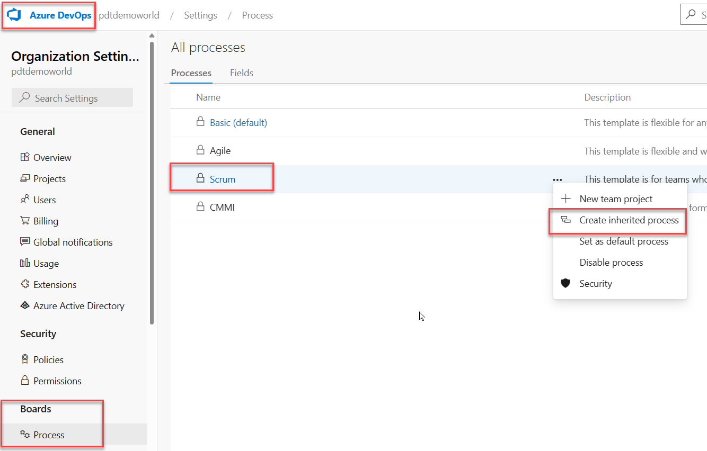
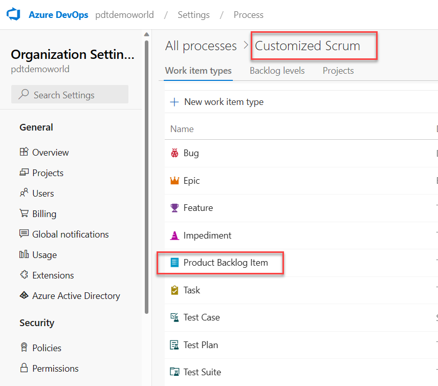
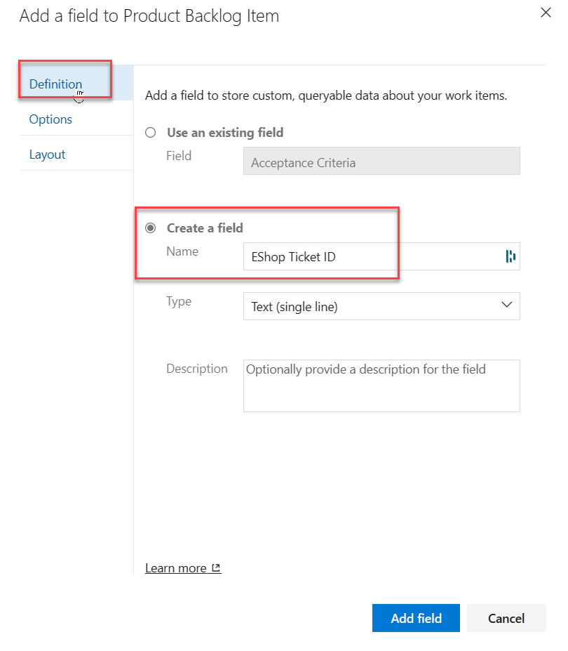
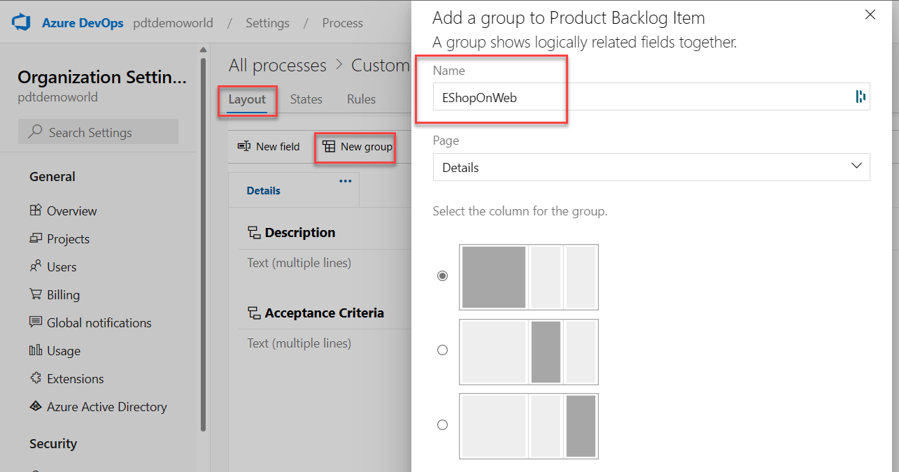
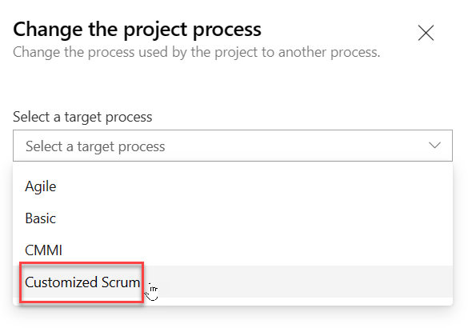

---
demo:
    title: 'Customize team process'
    module: 'Module 01: Implement development for enterprise DevOps'
---

# Customize team process

In this demo we'll create a custom Scrum-based process. The process will include a backlog item field designed to track to a proprietary eShopOnWeb ticket ID.

In Azure DevOps, you customize your work tracking experience through a process. A process defines the building blocks of the work item tracking system as well as other sub-systems you access through Azure DevOps. Whenever you create a team project, you select the process which contains the building blocks you want for your project. Azure DevOps supports two process types. The first, the core system processes (Scrum, Agile, and CMMI) are read-only, so you cannot customize them. The second type, inherited processes, you create based on core system processes, with the option of customizing their settings.

All processes are shared within the same organization. That is, one or more team projects can reference a single process. Instead of customizing a single team project, you customize a process. Changes made to the process automatically update all team projects that reference that process. Once you've created an inherited process, you can customize it, create team projects based on it, and migrate existing team projects to reference it. The Git team project can't be customized until it's migrated to an inherited process.

1. On the Azure DevOps page, click the **Azure DevOps** logo in the top left corner to navigate to the account root page.
1. In the left bottom corner of the page, click **Organization settings**.
1. In the **Organization Settings** vertical menu, in the **Boards** section, select **Process**.
1. On the **All processes** pane, to the right of the **Scrum** entry, select the ellipsis symbol (...) and, in the dropdown menu, select **Create inherited process**.

    

1. In the **Create inherited process from Scrum** panel, in the **Process name (required)** textbox, type **Customized Scrum** and click **Create process**.
1. Back on the **All processes** pane, click the **Customized Scrum** entry.

    > **Note**: You may need to refresh the browser for the new process to become visible.

1. On the **All processes > Customized Scrum** pane, select **Product Backlog Item**.

    

1. On the **All processes > Customized Scrum > Product Backlog Item** pane, click **New field**.
1. On the **Add a field to Product Backlog Item** panel, on the **Definition** tab, in the **Create a field** section, in the **Name** textbox, type **EShop Ticket ID**.

    

1. On the **Add a field to Product Backlog Item** panel, click **Layout**.
1. On the **Add a field to Product Backlog Item** panel, on the **Layout** tab, in the **Label** textbox, type **Ticket ID**, select the **Create a new group** option, in the **Group** textbox, type **eShopOnWeb**, and click **Add field**.

    

    > **Note**: Now that the customized process has been configured, let's switch to the eShopOnWeb project to use it.

1. Return to the **All processes** root using the breadcrumb path at the top of the **All processes > Customized Scrum > Product Backlog Item** pane.
1. On the **All processes** pane, select the **Scrum** entry.

    

    > **Note**: Our current project uses **Scrum**.

1. On the **All processes > Scrum** pane, select the **Projects** tab.
1. In the list of projects, in the row containing the **eShopOnWeb** entry, select the ellipsis symbol (...) and then select **Change process**.
1. On the **Change the project process** pane, in the **Select a target process** dropdown list, select the **Customized Scrum** process, click **Save** and then click **Close**.

    

1. Click the **Azure DevOps** logo in the top left corner to return to the account root page.
1. On the **Projects** tab, select the entry representing the **eShopOnWeb** project.
1. In the vertical menu on the left side of the **eShopOnWeb** page, select **Boards** and ensure that the **Work Items** pane is displayed.
1. In the list of work items, click the first backlog item.
1. Verify that you now have the **Ticket ID** field under the **eShopOnWeb** group, which was defined during the process customization. You can treat this like any other text field.

    

    > **Note**: Once the work item is saved, Azure DevOps will also save the new custom information so that it will be available for queries and through the rest of Azure DevOps.
