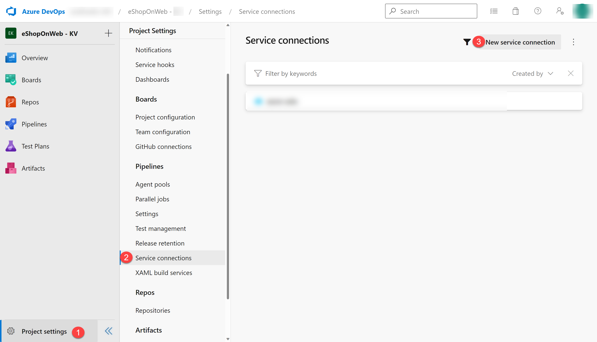

---
lab:
  title: "Validate lab environment"
  module: "Module 0: Welcome"
---

# Validate lab environment

In preparation for the labs, it is crucial to have your environment correctly set up. This page will guide you through the setup process, ensuring all prerequisites are met.

- The labs require **Microsoft Edge** or an [Azure DevOps-supported browser.](https://learn.microsoft.com/azure/devops/server/compatibility?view=azure-devops#web-portal-supported-browsers)

- **Set up an Azure Subscription:** If you don't already have an Azure subscription, create one by following the instructions on this page or visit [https://azure.microsoft.com/free](https://azure.microsoft.com/free) to sign up for a free.

- **Set up an Azure DevOps organization:** If you don't already have an Azure DevOps organization that you can use for the labs, create one by following the instructions on this page, or at [Create an organization or project collection](https://learn.microsoft.com/azure/devops/organizations/accounts/create-organization).
- [Git for Windows download page](https://gitforwindows.org/). This will be installed as part of prerequisites for this lab.

- [Visual Studio Code](https://code.visualstudio.com/). This will be installed as part of prerequisites for this lab.

- [Azure CLI](https://learn.microsoft.com/cli/azure/install-azure-cli). Install the Azure CLI on the self-hosted agent machines.

- [.NET SDK - Latest version](https://dotnet.microsoft.com/download/visual-studio-sdks). Install the .NET SDK on the self-hosted agent machines.

## Instructions to create an Azure DevOps Organization (you only have to do this once)

> **Note**: Start at step 3, if you do already have a **personal Microsoft Account** setup and an active Azure Subscription linked to that account.

1. Use a private browser session to get a new **personal Microsoft Account (MSA)** at `https://account.microsoft.com`.

1. Using the same browser session, sign up for a free Azure subscription at `https://azure.microsoft.com/free`.

1. Open a browser and navigate to Azure portal at `https://portal.azure.com`, then search at the top of the Azure portal screen for **Azure DevOps**. In the resulting page, click **Azure DevOps organizations**.

1. Next, click on the link labelled **My Azure DevOps Organizations** or navigate directly to `https://aex.dev.azure.com`.

1. On the **We need a few more details** page, select **Continue**.

1. In the drop-down box on the left, choose **Default Directory**, instead of **Microsoft Account**.

1. If prompted (_"We need a few more details"_), provide your name, e-mail address, and location and click **Continue**.

1. Back at `https://aex.dev.azure.com` with **Default Directory** selected click the blue button **Create new organization**.

1. Accept the _Terms of Service_ by clicking **Continue**.

1. If prompted (_"Almost done"_), leave the name for the Azure DevOps organization at default (it needs to be a globally unique name) and pick a hosting location close to you from the list.

1. Once the newly created organization opens in **Azure DevOps**, select **Organization settings** in the bottom left corner.

1. At the **Organization settings** screen select **Billing** (opening this screen takes a few seconds).

1. Select **Setup billing** and on the right-hand side of the screen, select your **Azure Subscription** and then select **Save** to link the subscription with the organization.

1. Once the screen shows the linked Azure Subscription ID at the top, change the number of **Paid parallel jobs** for **MS Hosted CI/CD** from 0 to **1**. Then select **SAVE** button at the bottom.

   > **Note**: You may **wait a couple of minutes before using the CI/CD capabilities** so that the new settings are reflected in the backend. Otherwise, you will still see the message _"No hosted parallelism has been purchased or granted"_.

1. In **Organization Settings**, go to section **Pipelines** and click **Settings**.

1. Toggle the switch to **Off** for **Disable creation of classic build pipelines** and **Disable creation of classic release pipelines**

   > **Note**: The **Disable creation of classic release pipelines** switch sets to **On** hides classic release pipeline creation options such as the **Release** menu in the **Pipeline** section of DevOps projects.

1. In **Organization Settings**, go to section **Security** and click **Policies**.

1. Toggle the switch to **On** for **Allow public projects**

   > **Note**: Extensions used in some labs might require a public project to allow using the free version.

## Instructions to create and configure the Azure DevOps project (you only have to do this once)

> **Note**: make sure you completed the steps to create your Azure DevOps Organization before continuing with these steps.

To follow all lab instructions, you'll need set up a new Azure DevOps project, create a repository that's based on the [eShopOnWeb](https://github.com/MicrosoftLearning/eShopOnWeb) application, and create a service connection to your Azure subscription.

### Create the team project

First, you'll create an **eShopOnWeb** Azure DevOps project to be used by several labs.

1. Open your browser and navigate to your Azure DevOps organization.

1. Select the **New Project** option and use the following settings:

   - name: **eShopOnWeb**
   - visibility: **Private**
   - Advanced: Version Control: **Git**
   - Advanced: Work Item Process: **Scrum**

1. Select **Create**.

   

### Import eShopOnWeb git repository

Now, you'll import the eShopOnWeb into your git repository.

1. Open your browser and navigate to your Azure DevOps organization.

1. Open the previously created **eShopOnWeb** project.

1. Select the **Repos > Files**, **Import a Repository** and then select **Import**.

1. On the **Import a Git Repository** window, paste the following URL `https://github.com/MicrosoftLearning/eShopOnWeb` and select **Import**:

   

1. The repository is organized the following way:

   - **.ado** folder contains Azure DevOps YAML pipelines.
   - **.devcontainer** folder container setup to develop using containers (either locally in VS Code or GitHub Codespaces).
   - **.azure** folder contains Bicep & ARM infrastructure as code templates.
   - **.github** folder container YAML GitHub workflow definitions.
   - **src** folder contains the .NET 8 website used on the lab scenarios.

1. Leave the web browser window open.

1. Go to **Repos > Branches**.

1. Hover on the **main** branch then click the ellipsis on the right of the column.

1. Click on **Set as default branch**.

### Create a service connection to access Azure resources

You will need to create a service connection in Azure DevOps which will allow you to deploy and access resources in your Azure subscription.

1. Start a web browser, navigate to the Azure DevOps portal `https://aex.dev.azure.com`.

1. Sign in to the Azure DevOps organization.

   > **Note**: If this is the first time you are signing in to the Azure DevOps organization, you will be prompted create your profile and accept the terms of service, and then select **Continue**.

1. Open **eShopOnWeb** project, and select **Project settings** in the bottom left corner of the portal.

1. Select the **Service connections** under Pipelines, and then select **Create service connection** button.

   

1. On the **New service connection** blade, select **Azure Resource Manager** and **Next** (you may need to scroll down).

1. Select **App registration (automatic)** from the **Identity type** dropbox.

1. Select **Workload Identity federation** and **Subscription** under the **Scope level**.

   > **Note**: You can also use **App registration or managed identity (manual)** if you prefer to manually configure the service connection. Follow the steps in the [Azure DevOps documentation](https://learn.microsoft.com/azure/devops/pipelines/library/connect-to-azure) to create the service connection manually.

1. Fill in the empty fields using the information:

   - **Subscription**: Select your Azure subscription.
   - **Resource group**: Select the resource group where you want to deploy resources. If you don't have a resource group, you can create one in the Azure portal following the instructions in [Manage Azure resource groups by using the Azure portal](https://learn.microsoft.com/azure/azure-resource-manager/management/manage-resource-groups-portal).
   - **Service connection name**: Type **`azure subs`**. This name will be referenced in YAML pipelines to access your Azure subscription.

1. Make sure the **Grant access permission to all pipelines** option is unchecked and select **Save**.

   > **Important:** The **Grant access permission to all pipelines** option is not recommended for production environments. It is only used in this lab to simplify the configuration of the pipeline.

   > **Note**: If you see an error message indicating you don't have the necessary permissions to create a service connection, try again, or configure the service connection manually.

You have now completed the necessary prerequisite steps to continue with the labs.
