---
lab:
    title: 'Lab 01: Agile Planning and Portfolio Management with Azure Boards'
    module: 'Module 01: Get started on a DevOps transformation journey'
---

# Lab 01: Agile Planning and Portfolio Management with Azure Boards

# Student lab manual

## Lab requirements

- This lab requires **Microsoft Edge** or an [Azure DevOps supported browser.](https://docs.microsoft.com/en-us/azure/devops/server/compatibility?view=azure-devops#web-portal-supported-browsers)

- **Set up an Azure DevOps organization:** If you don't already have an Azure DevOps organization that you can use for this lab, create one by following the instructions available at [Create an organization or project collection](https://docs.microsoft.com/en-us/azure/devops/organizations/accounts/create-organization?view=azure-devops).

## Lab overview

In this lab, you'll learn about the agile planning and portfolio management tools and processes provided by Azure Boards and how they can help you quickly plan, manage, and track work across your entire team. You'll explore the product backlog, sprint backlog, and task boards that can track the flow of work during an iteration. We'll also look at the enhanced tools in this release to scale for larger teams and organizations.

## Objectives

After you complete this lab, you will be able to:

- Manage teams, areas, and iterations.
- Manage work items.
- Manage sprints and capacity.
- Customize Kanban boards.
- Define dashboards.
- Customize team process.

## Estimated timing: 60 minutes

## Instructions

### Exercise 0: Configure the lab prerequisites

In this exercise, you will set up the prerequisite for the lab, which consists of the preconfigured Parts Unlimited team project based on an Azure DevOps Demo Generator template.

#### Task 1: Configure the team project

In this task, you will use Azure DevOps Demo Generator to generate a new project based on the **Parts Unlimited** template.

1. On your lab computer, start a web browser and navigate to <[Azure DevOps Demo Generator](https://azuredevopsdemogenerator.azurewebsites.net). This utility site will automate the process of creating a new Azure DevOps project within your account that is prepopulated with content (work items, repos, etc.) required for the lab.

    > **Note**: For more information on the site, see <https://docs.microsoft.com/en-us/azure/devops/demo-gen>.

1. Click **Sign in** and sign in using the Microsoft account associated with your Azure DevOps subscription.

    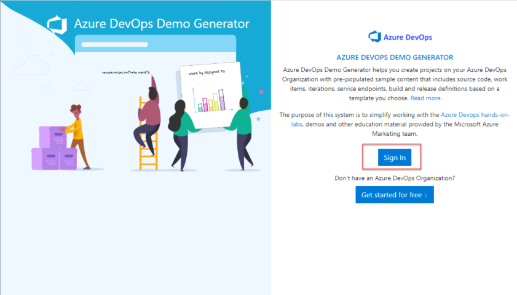

1. If required, on the **Azure DevOps Demo Generator** page, click **Accept** to accept the permission requests for accessing your Azure DevOps subscription.
1. On the **Create New Project** page, in the **New Project Name** textbox, type **Agile Planning and Portfolio Management with Azure Boards**, in the **Select organization** dropdown list, select your Azure DevOps organization, and then click **Choose template**.
1. In the list of templates, locate the **PartsUnlimited** template and click **Select Template**.

    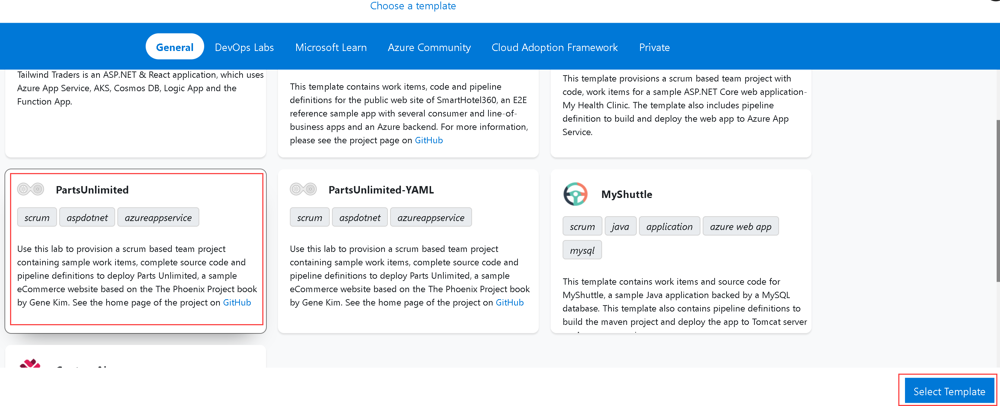

1. Back on the **Create New Project** page, click **Create Project**

    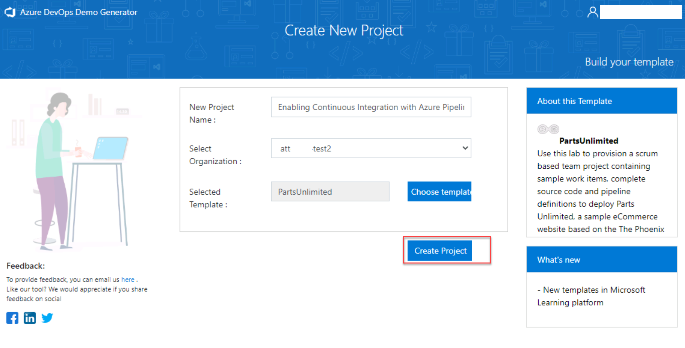

    > **Note**: Wait for the process to complete. This should take about 2 minutes. In case the process fails, navigate to your Azure DevOps organization, delete the project, and try again.

1. On the **Create New Project** page, click **Navigate to project**.

    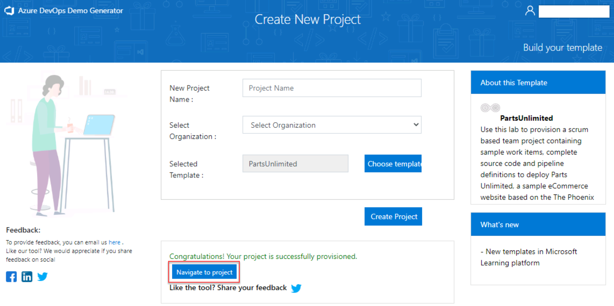

### Exercise 1: Manage Agile project

In this exercise, you will use Azure Boards to perform a number of common agile planning and portfolio management tasks, including management of teams, areas, iterations, work items, sprints and capacity, customizing Kanban boards, defining dashboards, and customizing team processes.

#### Task 1: Manage teams, areas, and iterations

In this task, you will create a new team and configure its area and iterations.

Each new project is configured with a default team, which name matches the project name. You have the option of creating additional teams. Each team can be granted access to a suite of Agile tools and team assets. The ability to create multiple teams gives you the flexibility to choose the proper balance between autonomy and collaboration across the enterprise.

1. Verify that the web browser displays your Azure DevOps organization with the **Agile Planning and Portfolio Management with Azure Boards** project you generated in the previous exercise.

    > **Note**: Alternatively, you can access the project page directly by navigating to the [<https://dev.azure.com/>`<your-Azure-DevOps-account-name>`/Agile%20Planning%20and%20Portfolio%20Management%20with%20Azure%20Boards) URL, where the `<your-Azure-DevOps-account-name>` placeholder, represents your account name.

1. Click the cogwheel icon labeled **Project settings** located in the lower left corner of the page to open the **Project settings** page.

    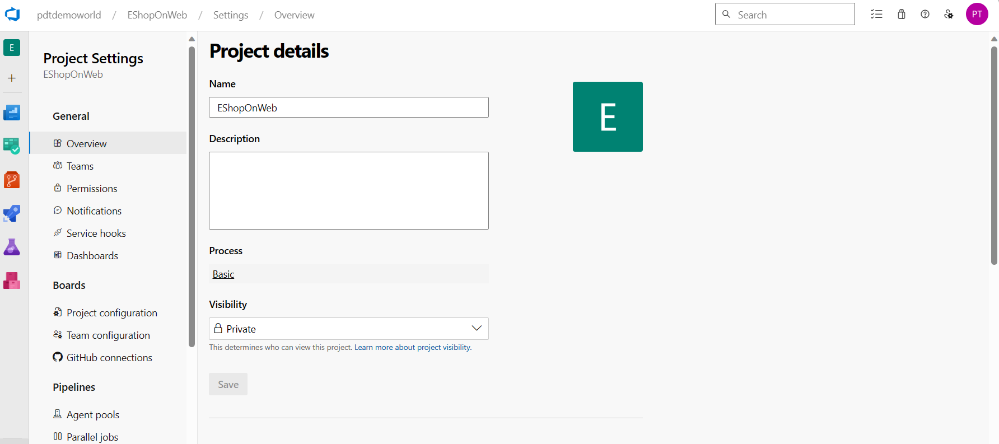

1. In the **General** section, select the **Teams** tab. There are already a few teams in this project, but you'll create a new one for this lab. Click **New Team**.

    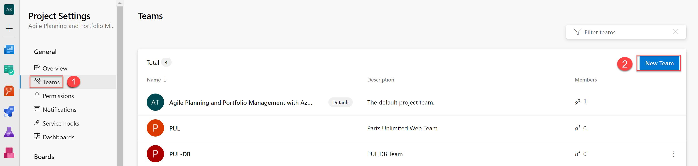

1. On the **Create a new team** pane, in the **Team name** textbox, type **PUL-Web**, leave other settings with their default values, and click **Create**.

    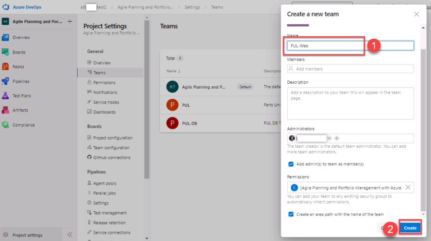

1. In the list of **Teams**, select the newly created team to view its details.

    > **Note**: By default, the new team has only you as its member. You can use this view to manage such functionality as team membership, notifications, and dashboards.

1. Click **Iterations and Area Paths** link at the top of the **PUL-Web** page to start defining the schedule and scope of the team.

    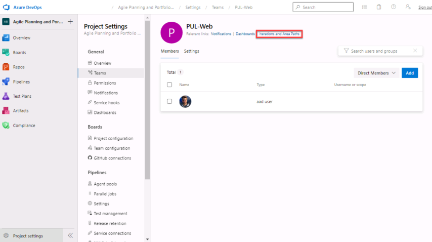

1. At the top of the **Boards** pane, select the **Iterations** tab and then click **+ Select iteration(s)**.

    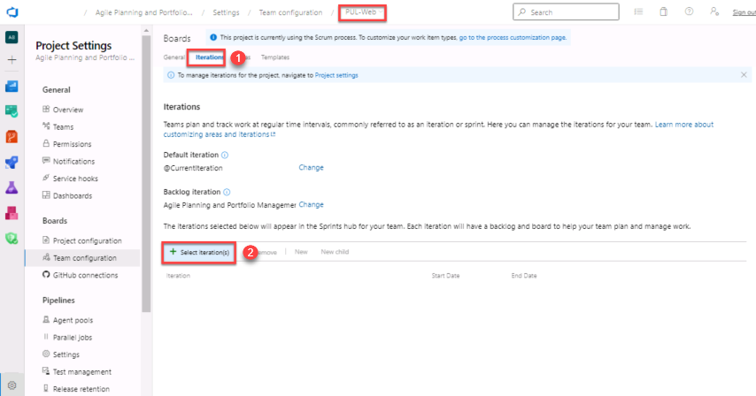

1. Select **Agile Planning and Portfolio Management with Azure Boards\Sprint 1** and click **Save and close**. Note that this first sprint has already passed. This is because the demo data generator is designed to build out project history so that this sprint occurs in the past.

    > **Note**: The new team will use the same iteration schedule that's already in place for the other teams, but you could create a custom one if that is more suitable for your organization.

1. Repeat the previous step to add **Sprint 2** and **Sprint 3**. The second sprint is our current iteration, and the third is in the near future.

    

1. Back on the **Boards** pane, at the top of the pane, select the **Areas** tab. You will find there an automatically generated area with the name matching the name of the team.
1. Click the ellipsis symbol next to the **default area** entry and, in the dropdown list, select **Include sub areas**.

    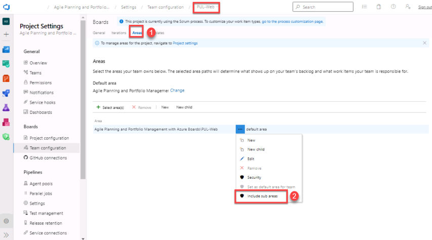

    > **Note**: The default setting for all teams is to exclude sub-area paths. We will change it to include sub-areas so that the team gets visibility into all of the work items from all teams. Optionally, the management team could also choose to not include sub-areas, which automatically removes work items from their view as soon as they are assigned to one of the teams.

#### Task 2: Manage work items

In this task, you will step through common work item management tasks.

Work items play a prominent role in Azure DevOps. Whether describing work to be done, impediments to release, test definitions, or other key items, work items are the workhorse of modern projects. In this task you'll focus on using various work items to set up the plan to extend the Parts Unlimited site with a product training section. While it can be daunting to build out such a substantial part of a company's offering, Azure DevOps and the Scrum process make it very manageable.

> **Note**: This task is designed to illustrate a variety of ways you can create different kinds of work items, as well as to demonstrate the breadth of features available on the platform. As a result, these steps should not be viewed as prescriptive guidance for project management. The features are intended to be flexible enough to fit your process needs, so explore and experiment as you go.

1. In the vertical navigational pane of the Azure DevOps portal, select the **Boards** icon and, select **Work Items**.

    > **Note**: There are many ways to create work items in Azure DevOps, and we'll explore a few of them. Sometimes it's as simple as firing one off from a dashboard.

1. On the **Work Items** window, click on **+ New Work Item > Epic**.

    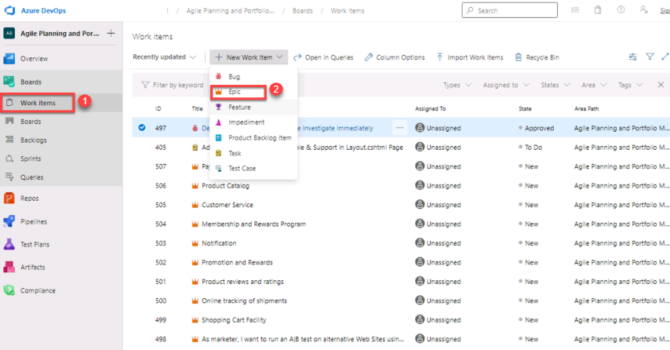

1. In the **Enter title** textbox, type **Product training**.
1. In the upper left corner, select the **Unassigned** entry and, in the dropdown list, select your user account in order to assign the new work item to yourself.
1. Next to the **Area** entry, select the **Agile Planning and Portfolio Management with Azure Boards** entry and, in the dropdown list, select **PUL-Web**. This will set the **Area** to **Agile Planning and Portfolio Management with Azure Boards\PUL-Web**.
1. Next to the **Iteration** entry, select the **Agile Planning and Portfolio Management with Azure Boards** entry and, in the dropdown list, select **Sprint 2**. This will set the **Iteration** to **Agile Planning and Portfolio Management with Azure Boards\Sprint 2**.
1. Click **Save** to finalize your changes. **Do not close it**.

    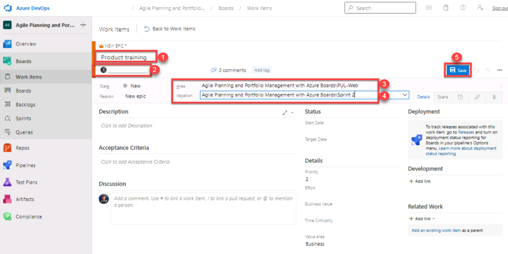

    > **Note**: Ordinarily you would want to fill out as much information as possible, but this is sufficient for the purposes of this lab.

    > **Note**: The work item form includes all of the relevant work item settings. This includes details about who it's assigned to, its status across many parameters, and all the associated information and history for how it has been handled since creation. One of the key areas to focus on is the **Related Work**. We will explore one of the ways to add a feature to this epic.

1. In the **Related work** section on the lower right-side, select the **Add link** entry and, in the dropdown list, select **New item**.
1. On the **Add link** panel, in the **Work item type** dropdown list, select **Feature**, in the **Title** textbox, type **Training dashboard** and click **OK**.

    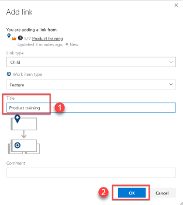

    > **Note**: On the **Training dashboard** panel, note that the assignment, **Area**, and **Iteration** are already set to the same values as the epic that the feature is based on. In addition, the feature is automatically linked to the parent item it was created from.

1. On the **Training dashboard** panel, click **Save & Close**.

    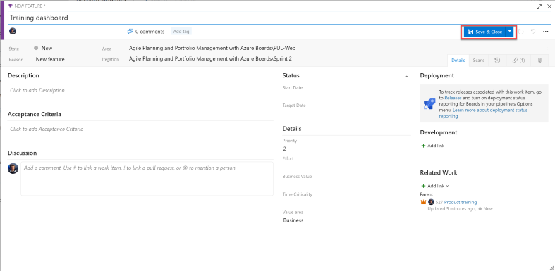

1. In the vertical navigational pane of the Azure DevOps portal, in the list of the **Boards** items, select **Boards**.
1. On the **Boards** panel, select the **PUL-Web boards** entry. This will open the board for that particular team.

    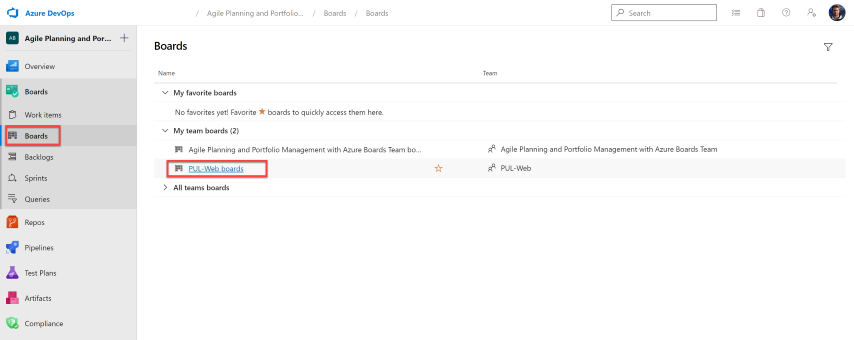

1. On the **Boards** panel, in the upper right corner, select the **Backlog items** entry and, in the dropdown list, select **Features**.

    > **Note**: This will make it easy to add tasks and other work items to the features.

1. Hover with the mouse pointer over the rectangle representing the **Training dashboard** feature. This will reveal the ellipsis  symbol in its upper right corner.
1. Click the ellipsis  icon and, in the dropdown list, select **Add Product Backlog Item**.

    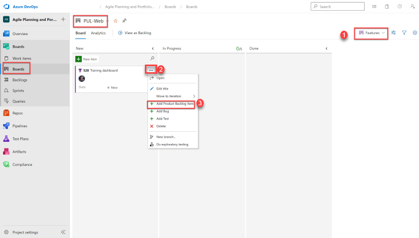

1. In the textbox of the new product backlog item, type **As a customer, I want to view new tutorials** and press the **Enter** key to save the entry.

    > **Note**: This creates a new product backlog item (PBI) work item that is a child of the feature and shares its area and iteration.

1. Repeat the previous step to add two more PBIs designed to enable the customer to see their recently viewed tutorials and to request new tutorials named, respectively, **As a customer, I want to see tutorials I recently viewed** and **As a customer, I want to request new tutorials**.

    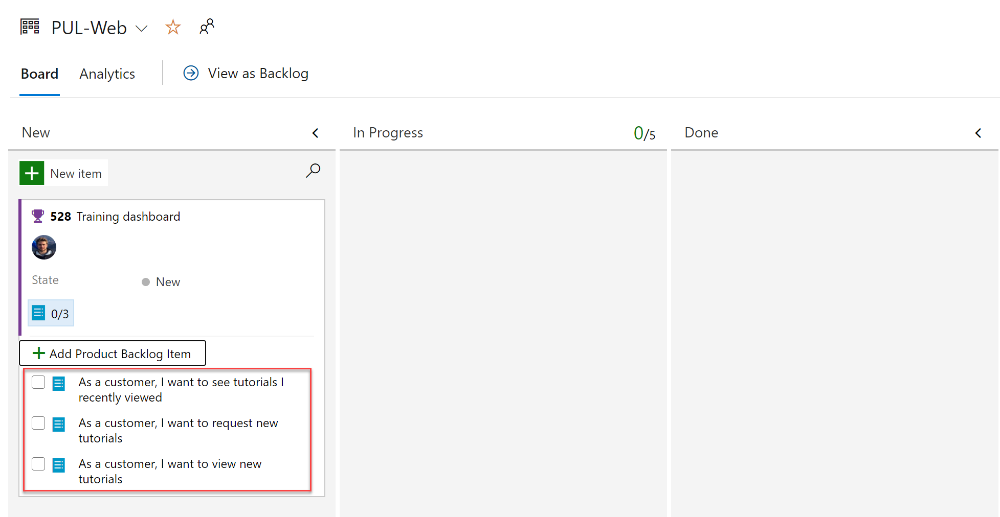

1. On the **Boards** panel, in the upper right corner, select the **Features** entry and, in the dropdown list, select **Backlog items**.

    > **Note**: Backlog items have a state that defines where they are relative to being completed. While you could open and edit the work item using the form, it's easier to just drag cards on the board.

1. On the **Board** tab of the **PUL-Web** panel, drag the first work item named **As a customer, I want to view new tutorials** from the **New** to **Approved** stage.

    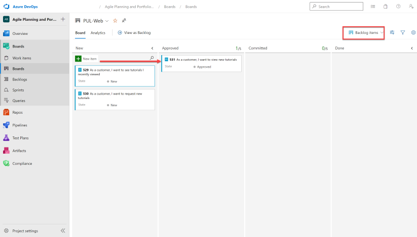

    > **Note**: You can also expand work item cards to get to conveniently editable details.

1. Hover with the mouse pointer over the rectangle representing the work item you moved to the **Approved** stage. This will reveal the down facing caret symbol.
1. Click the down facing caret symbol to expand the work item card, select the **Unassigned** entry, and in the list of user accounts, select your account to assign the moved PBI to yourself.
1. On the **Board** tab of the **PUL-Web** panel, drag the second work item named **As a customer, I want to see tutorials I recently viewed** from the **New** to the **Committed** stage.
1. On the **Board** tab of the **PUL-Web** panel, drag the third work item named **As a customer,  I want to request new tutorials** from the **New** to the **Done** stage.

    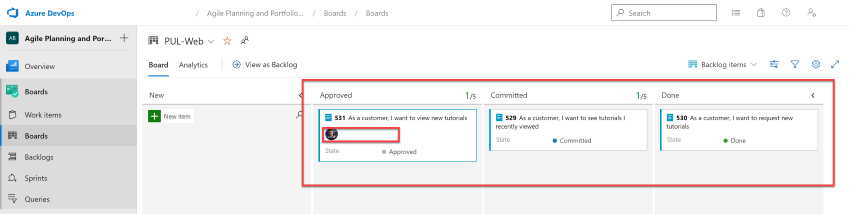

    > **Note**: The task board is one view into the backlog. You can also use the tabular view.

1. On the **Board** tab of the **PUL-Web** pane, at the top of the pane, click **View as Backlog** to display the tabular form.

    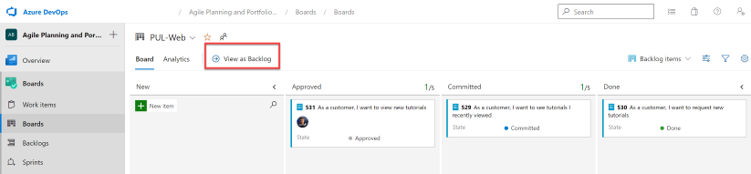

    > **Note**: You can use the plus sign directly under the **Backlog** tab label of the **PUL-Web** panel to view nested tasks under these work items.

    > **Note**: You can use the second plus sign directly left to the first backlog item to add a new task to it.

1. On the **Backlog** tab of the **PUL-Web** pane, in the upper left corner of the pane, click the second plus sign from the top, the one next to the first work item. This will display the **NEW TASK** panel.

    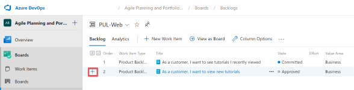

1. At the top of the **NEW TASK** panel, in the **Enter title** textbox, type **Add page for most recent tutorials**.
1. On the **NEW TASK** panel, in the **Remaining Work** textbox, type **5**.
1. On the **NEW TASK** panel, in the **Activity** dropdown list, select **Development**.
1. On the **NEW TASK** panel, click **Save & Close**.

    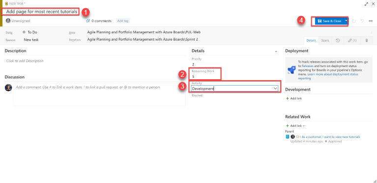

1. Repeat the last five steps to add another task named **Optimize data query for most recent tutorials**. Set its **Remaining Work** to **3** and its **Activity** to **Design**. Click **Save & Close** once completed.

#### Task 3: Manage sprints and capacity

In this task, you will step through common sprint and capacity management tasks.

Teams build the sprint backlog during the sprint planning meeting, typically held on the first day of the sprint. Each sprint corresponds to a time-boxed interval which supports the team's ability to work using Agile processes and tools. During the planning meeting, the product owner works with the team to identify those stories or backlog items to complete in the sprint.

Planning meetings typically consist of two parts. In the first part, the team and product owner identify the backlog items that the team feels it can commit to completing in the sprint, based on experience with previous sprints. These items get added to the sprint backlog. In the second part, the team determines how it will develop and test each item. They then define and estimate the tasks required to complete each item. Finally, the team commits to implementing some or all the items based on these estimates.

The sprint backlog should contain all the information the team needs to successfully plan and complete work within the time allotted without having to rush at the end. Before planning the sprint, you'd want to have created, prioritized, and estimated the backlog and defined the sprints.

1. In the vertical navigational pane of the Azure DevOps portal, select the **Boards** icon and, in the list of the **Boards** items, select **Sprints**.
1. On the **Taskboard** tab of the **Sprints** view, in the toolbar, on the right hand side, select the **View options** symbol (directly to the left of the funnel icon) and, in the **View options** dropdown list, select the **Work details** entry.

    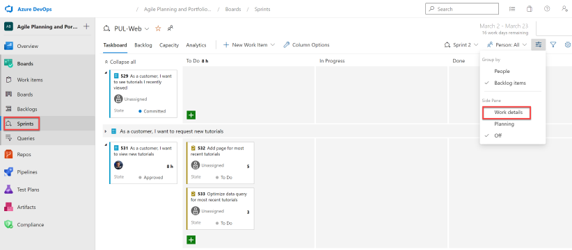

    > **Note**: The current sprint has a pretty limited scope. There are two tasks in the **To do** stage. At this point, neither task has been assigned. Both show a numeric value to the right of **Unassigned** entry representing the remaining work estimate.

1.  In the rectangle representing the **Add page for most recent tutorials**, click the **Unassigned** entry and, in the list of user accounts, select your account to assign the task to yourself.
1.  Assign the **Add page for most recent tutorial** task to yourself. 

    > **Note**: This automatically updates the **Work By: Assigned To** section of the **Work details** pane.

1. Select the **Capacity** tab of the **Sprints** view.

    > **Note**: This view enables you to define what activities a user can take on and at what level of capacity.

1. On the **Capacity** tab of the **Sprints** view, directly under the **Activity** label, in the **Unassigned** dropdown list, select **Development** and, in the **Capacity per day** textbox, type **1**.

    > **Note**: This represents 1 hour of development work per day. Note that you can add additional activities per user in the case they do more than just development.

    > **Note**: Let's assume you're going to take some vacation.

1. On the **Capacity** tab of the **Sprints** view, directly next to the entry representing your user account, in the **Days off** column, click the **0 days** entry. This will display a panel where you can set your days off.
1. In the displayed panel, use the calendar view to set your vacation to span five work days during the current sprint (within the next three weeks) and, once completed, click **OK**.

    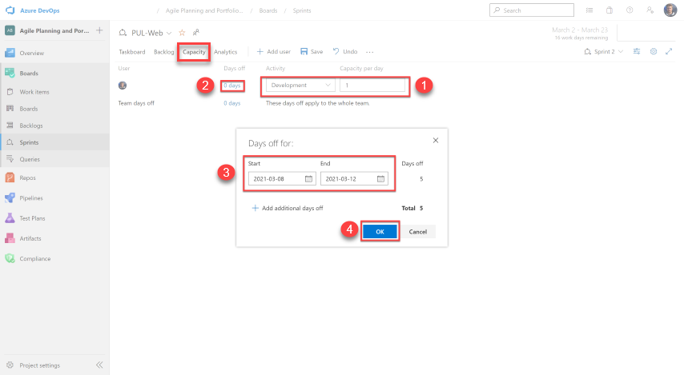

1. Back on the **Capacity** tab of the **Sprints** view, click **Save**.
1. Select the **Taskboard** tab of the **Sprints** view.

    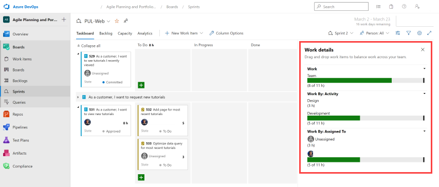

    > **Note**: Note that the **Work details** panel has been updated to reflect your available bandwidth. The actual number displayed in the **Work details** panel might vary, but your total sprint capacity will be equal to the number of working days remaining till the end of the sprint, since you allocated 1 hour per day. Take a note of this value since you will use it in the upcoming steps.

    > **Note**: One convenient feature of the boards is that you can easily update key data in-line. It's a good practice to regularly update the **Remaining Work** estimate to reflect the amount of time expected for each task. Let's say you've reviewed the work for the **Add page for most recent tutorials** task and found that it will actually take longer than originally expected. 

1.  On the **Taskboard** tab of the **Sprints** view, in the square box representing the **Add page for most recent tutorials**, set the estimated number of hours to match your total capacity for this sprint, which you identified in the previous step.

    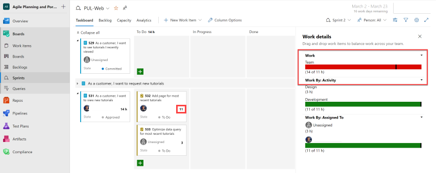

    > **Note**: This automatically expands the **Development** and your personal capacities to their maximum. Since they're large enough to cover the assigned tasks, they stay green. However, the overall **Team** capacity is exceeded due to the additional 3 hours required by the **Optimize data query for most recent tutorials** task.

    > **Note**: One way to resolve this capacity issue would be to move the task to a future iteration. There are a few ways this could be done. You could, for example, open the task here and edit it within the panel providing access to the task details. Another approach would be to use the **Backlog** view, which provides an in-line menu option to move it. At this point though, don't move the task yet.

1. On the **Taskboard** tab of the **Sprints** view, in the toolbar, on the right hand side, select the **View options** symbol (directly to the left of the funnel icon) and, in the **View options** dropdown list, select the **People** entry.

    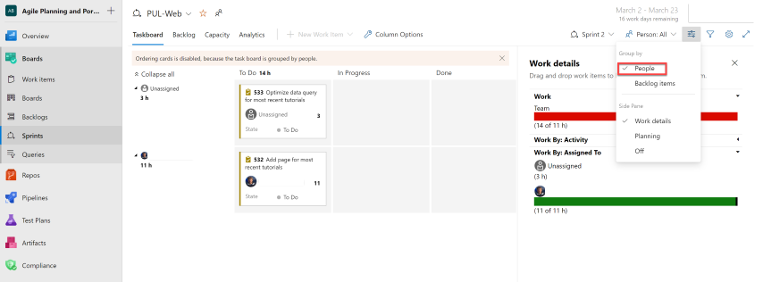

    > **Note**: This adjusts your view such that you can review the progress of tasks by person instead of by backlog item.

    > **Note**: There is also a lot of customization available.

1. Click the **Configure team settings** cogwheel icon (directly to the right of the funnel icon).
1. On the **Settings** panel, select the **Styles** tab, click **+ Styling rule**, under the **Rule name** label, in the **Name** textbox, type **Development**, and, in the **Card color** dropdown list, select the green rectangle.

    > **Note**: This will color all cards green if they meet the rule criteria set directly below, in the **Rule criteria** section.

1. In the **Rule criteria** section, in the **Field** dropdown list, select **Activity**, in the **Operator** dropdown list, select **=**, and, in the **Value** dropdown list, select **Development**.

    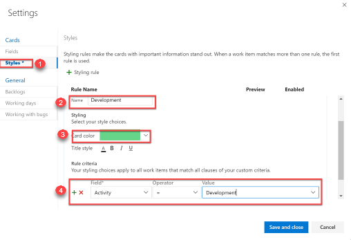

    > **Note**: This will set all cards assigned to **Development** activities green.

1. On the **Settings** panel, select the **Backlogs** tab.

    > **Note**: Entries on this tab allow you to set the levels available for navigation. Epics are not included by default, but you could change that.

1. On the **Settings** panel, select the **Working days** tab.

    > **Note**: Entries on this tab allow you to specify the **Working days** the team follows. This applies to capacity and burndown calculations.

1. On the **Settings** panel, select the **Working with bugs** tab.

    > **Note**: Entries on this tab allow you to specify how bugs are presented on the board.

1. On the **Settings** panel, click **Save and close** to save the styling rule.

    > **Note**: The task associated with **Development** is now green and very easy to identify.

#### Task 4: Customize Kanban boards

In this task, you will step through the process of customizing Kanban boards.

To maximize a team's ability to consistently deliver high quality software, Kanban emphasizes two main practices. The first, visualizing the flow of work, requires that you map your team's workflow stages and configure a Kanban board to match. The second, constraining the amount of work in progress, requires that you set work-in-progress (WIP) limits. You're then ready to track progress on your Kanban board and monitor key metrics to reduce lead or cycle time. Your Kanban board turns your backlog into an interactive signboard, providing a visual flow of work. As work progresses from idea to completion, you update the items on the board. Each column represents a work stage, and each card represents a user story (blue cards) or a bug (red cards) at that stage of work. However, every team develops its own process over time, so the ability to customize the Kanban board to match the way your team works is critical for the successful delivery.

1. In the vertical navigational pane of the Azure DevOps portal, in the list of the **Boards** items, select **Boards**.
1. On the **Boards** panel, click the **Configure team settings** cogwheel icon (directly to the right of the funnel icon).

    > **Note**: The team is emphasizing work done with data, so there is special attention paid to any task associated with accessing or storing data.

1. On the **Settings** panel, select the **Tag colors** tab, click **+ Tag color**, in the **Tag** textbox, type **data** and leave the default color in place.

    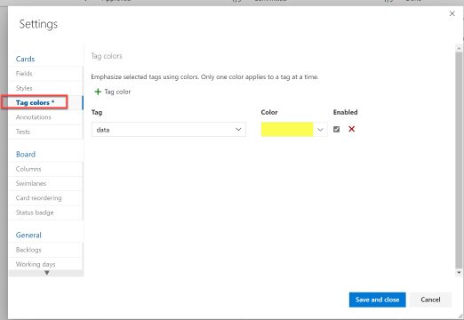

    > **Note**: Whenever a backlog item or bug is tagged with **data**, that tag will be highlighted.

1. On the **Settings** panel, select the **Annotations** tab.

    > **Note**: You can specify which **Annotations** you would like included on cards to make them easier to read and navigate. When an annotation is enabled, the child work items of that type are easily accessible by clicking the visualization on each card.

1. On the **Settings** panel, select the **Tests** tab.

    > **Note**: The **Tests** tab enables you to configure how tests appear and behave on the cards.

1. On the **Settings** panel, click **Save and close** to save the styling rule.
1. On the **Board** tab of the **PUL-Web** panel, right-click the rectangle representing the **As a customer, I want to view new tutorials** backlog item and select **Open**.
1. On the **As a customer, I want to view new tutorials** panel, at the top of the panel, to the right of the **0 comments** entry, click **Add tag**.
1. In the resulting textbox, type **data** and press the **Enter** key.
1. Repeat the previous step to add the **ux** tag.
1. On the **As a customer, I want to view new tutorials** panel, click **Save & Close**.

    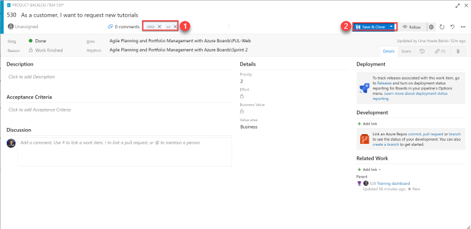

    > **Note**: The two tags are now visible on the card, with the **data** tag highlighted in yellow as configured.

1. On the **Boards** panel, click the **Configure team settings** cogwheel icon (directly to the right of the funnel icon).
1. On the **Settings** panel, select the **Columns** tab.

    > **Note**: This section allows you to add new stages to the workflow.

1. Click **+ Column**, under the **Column name** label, in the **Name** textbox, type **QA Approved** and, in the **WIP limit** textbox, type **1**

    > **Note**: The Work in progress limit of 1 indicates that only one work item should be in this stage at a time. You would ordinarily set this higher, but there are only two work items to demonstrate the feature.

1. On the **Settings** panel, on the **Columns** tab, drag and drop the newly created tab between **Committed** and **Done**.
1. On the **Settings** panel, click **Save and close**.

    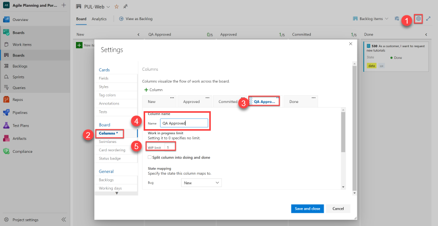

    > **Note**: Verify that you now see the new stage in the workflow.

1. Drag the **As a customer, I want to see tutorials I recently viewed** work item from the **Committed** stage into the **QA Approved** stage.
1. Drag the **As a customer, I want to view new tutorials** work item from the **QA Approved** stage into the **Done** stage.

    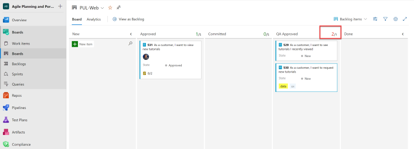

    > **Note**: The stage now exceeds its **WIP** limit and is colored red as a warning.

1. Move the **As a customer, I want to see tutorials I recently viewed** backlog item back to **Committed**.
1. On the **Boards** panel, click the **Configure team settings** cogwheel icon (directly to the right of the funnel icon).
1. On the **Settings** panel, return to the **Columns** tab and select the **QA Approved** tab.

    > **Note**: A lag often exists between when work gets moved into a column and when work starts. To counter that lag and reveal the actual state of work in progress, you can turn on split columns. When split, each column contains two sub-columns: **Doing** and **Done**. Split columns let your team implement a pull model. Without split columns, teams push work forward, to signal that they've completed their stage of work. However, pushing it to the next stage doesn't necessarily mean that a team member immediately starts work on that item.

1. On the **QA Approved** tab, enable the **Split column into doing and done** checkbox to create two separate columns.

    > **Note**: As your team updates the status of work as it progresses from one stage to the next, it helps that they agree on what **done** means. By specifying the **Definition of done** criteria for each Kanban column, you help share the essential tasks to complete before moving an item into a downstream stage.

1. On the **QA Approved** tab, at the bottom of the panel, in the **Definition of done** textbox, type **Passes \*\*all\*\* tests**.
1. On the **Settings** panel, click **Save and close**.

    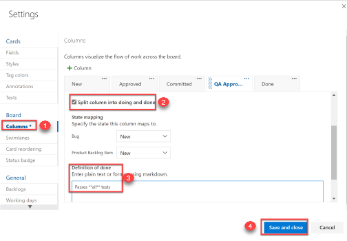

    > **Note**: The **QA Approved** stage now has **Doing** and **Done** columns. You can also click the informational symbol (with letter **i** in a circle) next to the column header to read the **Definition of done**.

1. On the **Boards** panel, click the **Configure team settings** cogwheel icon (directly to the right of the funnel icon).

    > **Note**: Your Kanban board supports your ability to visualize the flow of work as it moves from new to done. When you add **swimlanes**, you can also visualize the status of work that supports different service-level classes. You can create a swimlane to represent any other dimension that supports your tracking needs.

1. On the **Settings** panel, select the **Swimlanes** tab.
1. On the **Swimlanes** tab, click **+ Swimlane**, directly under the **Swimlane name** label, in the **Name** textbox, type **Expedite**.
1. On the **Settings** panel, click **Save and close**.

    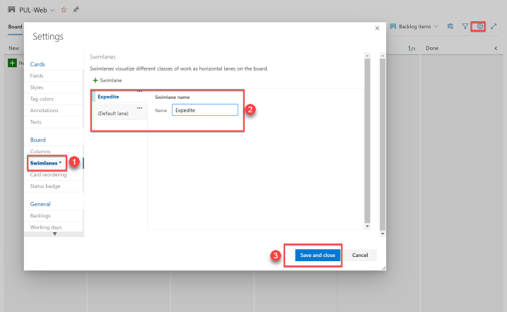

1. Back on the **Board** tab of the **Boards** panel, drag and drop the **Committed** work item onto the **QA Approved \| Doing** stage of the **Expedite** swimlane so that it gets recognized as having priority when QA bandwidth becomes available.

    > **Note**: If you would like to review a more sophisticated board with many more work items, on the **Board** tab of the **Boards** panel, in the upper left corner, select **PUL-Web** and, in the dropdown list of teams, select the **Agile Planning and Portfolio Management with Azure Boards Team**. This board provides a playground for you to experiment with and review the results.

#### Task 5: Customize team process

In this task we'll create a custom Scrum-based process. The process will include a backlog item field designed to track to a proprietary PartsUnlimited ticket ID.

In Azure DevOps, you customize your work tracking experience through a process. A process defines the building blocks of the work item tracking system as well as other sub-systems you access through Azure DevOps. Whenever you create a team project, you select the process which contains the building blocks you want for your project. Azure DevOps supports two process types. The first, the core system processes (Scrum, Agile, and CMMI) are read-only, so you cannot customize them. The second type, inherited processes, you create based on core system processes, with the option of customizing their settings.

All processes are shared within the same organization. That is, one or more team projects can reference a single process. Instead of customizing a single team project, you customize a process. Changes made to the process automatically update all team projects that reference that process. Once you've created an inherited process, you can customize it, create team projects based on it, and migrate existing team projects to reference it. The Git team project can't be customized until it's migrated to an inherited process.

1. On the Azure DevOps page, click the **Azure DevOps** logo in the top left corner to navigate to the account root page.
1. In the left bottom corner of the page, click **Organization settings**.

    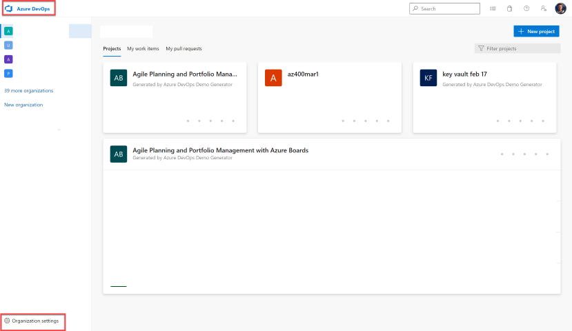

1. In the **Organization Settings** vertical menu, in the **Boards** section, select **Process**.
1. On the **All processes** pane, to the right of the **Scrum** entry, select the ellipsis symbol and, in the dropdown menu, select **Create inherited process**.

    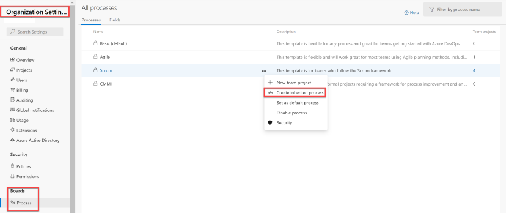

1. In the **Create inherited process from Scrum** panel, in the **Process name (required)** textbox, type **Customized Scrum** and click **Create process**.
1. Back on the **All processes** pane, click the **Customized Scrum** entry.

    > **Note**: You may need to refresh the browser for the new process to become visible.

1. On the **All processes > Customized Scrum** pane, select **Product Backlog Item**.

    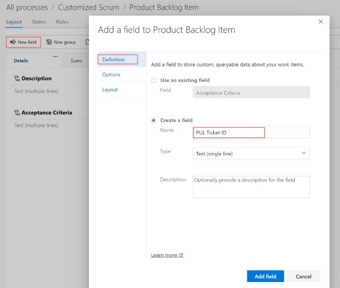

1. On the **All processes > Customized Scrum > Product Backlog Item** pane, click **New field**.
1. On the **Add a field to Product Backlog Item** panel, on the **Definition** tab, in the **Create a field** section, in the **Name** textbox, type **PUL Ticket ID**.

    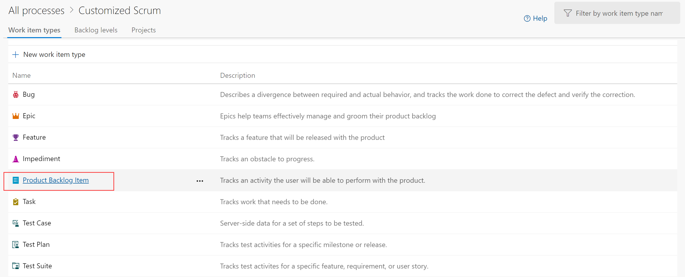

1. On the **Add a field to Product Backlog Item** panel, click **Layout**.
1. On the **Add a field to Product Backlog Item** panel, on the **Layout** tab, in the **Label** textbox, type **Ticket ID**, select the **Create a new group** option, in the **Group** textbox, type **PartsUnlimited**, and click **Add field**.

    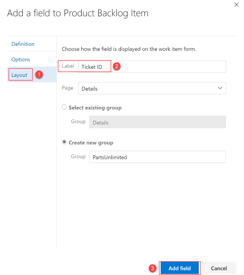

    > **Note**: Now that the customized process has been configured, let's switch to the Agile Planning and Portfolio Management with Azure Boards project to use it.

1. Return to the **All processes** root using the breadcrumb path at the top of the **All processes > Customized Scrum > Product Backlog Item** pane.
1. On the **All processes** pane, select the **Scrum** entry.

    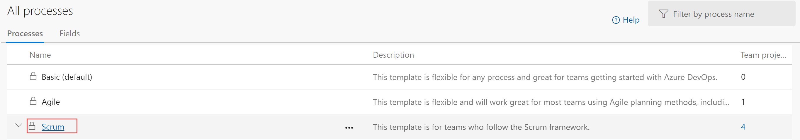

    > **Note**: Our current project uses **Scrum**.

1. On the **All processes > Scrum** pane, select the **Projects** tab.
1. In the list of projects, in the row containing the **Agile Planning and Portfolio Management with Azure Boards** entry, select the ellipsis  symbol and then select **Change process**.
1. On the **Change the project process** pane, in the **Select a target process** dropdown list, select the **Customized Scrum** process, click **Save** and then click **Close**.

    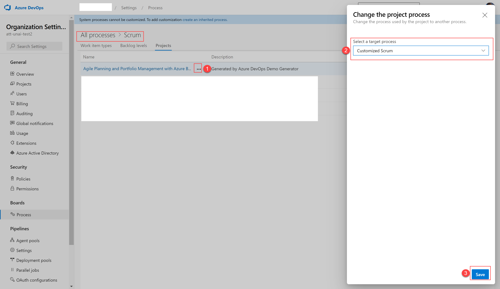

1. Click the **Azure DevOps** logo in the top left corner to return to the account root page.
1. On the **Projects** tab, select the entry representing the **Agile Planning and Portfolio Management with Azure Boards** project.
1. In the vertical menu on the left side of the **Agile Planning and Portfolio Management with Azure Boards** page, select **Boards** and ensure that the **Work Items** pane is displayed.
1. In the list of work items, click the first backlog item.
1. Verify that you now have the **Ticket ID** field under the **PartsUnlimited** group, which was defined during the process customization. You can treat this like any other text field.

    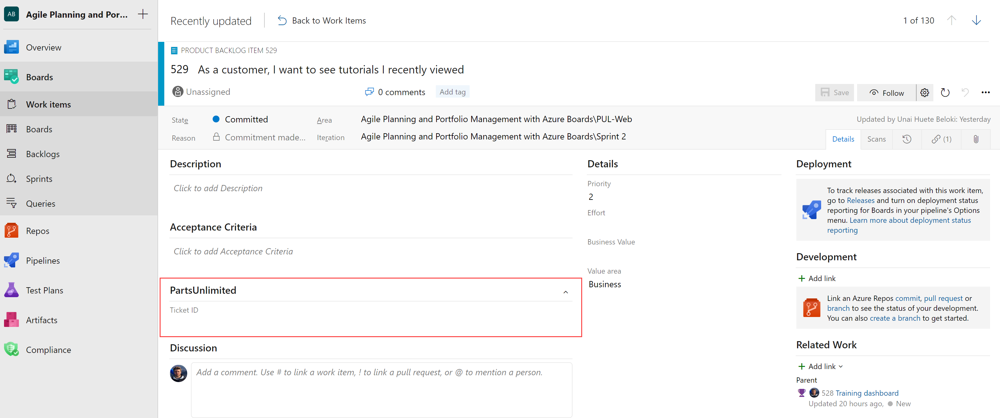

    > **Note**: Once the work item is saved, Azure DevOps will also save the new custom information so that it will be available for queries and through the rest of Azure DevOps.

### Exercise 2 (optional) : Define dashboards

In this task, you will step through the process of creating dashboards and their core components.

Dashboards allow teams to visualize status and monitor progress across the project. At a glance, you can make informed decisions without having to drill down into other parts of your team project site. The Overview page provides access to a default team dashboard which you can customize by adding, removing, or rearranging the tiles. Each tile corresponds to a widget that provides access to one or more features or functions.

1. In the vertical navigational pane of the Azure DevOps portal, select the **Overview** icon and, in the list of the **Overview** items, select **Dashboards**.
1. If necessary, on the **Dashboards** pane, in the upper left corner, in the **Agile Planning and Portfolio Management with Azure Boards Team** section, select **Agile Planning and Portfolio Management with Azure Boards Team - Overview** and review the existing dashboard.

    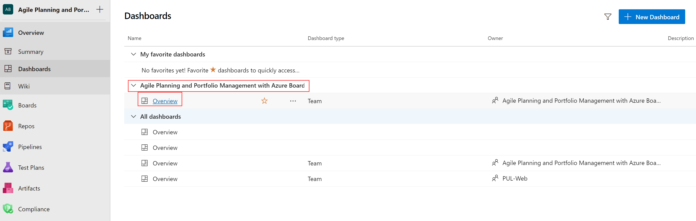

1. On the **Dashboards** pane, select the drop-down menu next to the **Agile Planning and Portfolio Management with Azure Boards Team - Overview** title, and select **+ New dashboard**.

    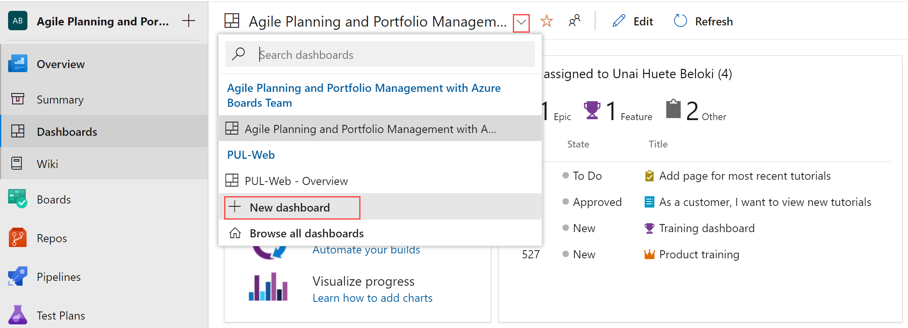

1. On the **Create a dashboard** pane, in the **Name** textbox, type **Product training**, in the **Team** dropdown list, select the **PUL-Web** team, and click **Create**.

    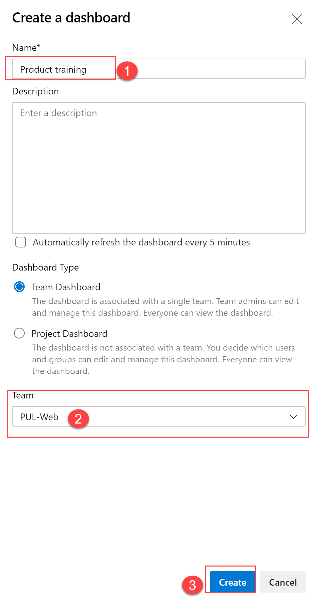

1. On the new dashboard pane, click **Add a widget**.
1. On the **Add Widget** panel, in the **Search** textbox, type **sprint** to find existing widgets that focus on sprints. In the list of results, select **Sprint Overview** and click **Add**.
1. In the rectangle representing the newly added widget, click the **Settings** cogwheel icon and review the **Configuration** pane.

    > **Note**: The customization level will vary by widget.

1. On the **Configuration** pane, click **Close** without making any changes.
1. Back on the **Add Widget** pane, in the **Search** textbox, type **sprint** again to find existing widgets that focus on sprints. In the list of results, select **Sprint Capacity** and click **Add**.
1. In the **Dashboard** view, at the top of the pane, click **Done Editing**.

    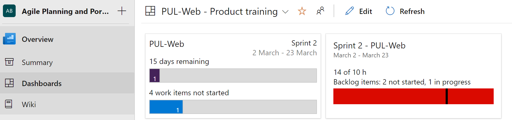

    > **Note**: You can now review two important aspects of your current sprint on your custom dashboard.

    > **Note**: Another way of customizing dashboards is to generate charts based on work item queries, which you can share to a dashboard.

1. In the vertical navigational pane of the Azure DevOps portal, select the **Boards** icon and, in the list of the **Boards** items, select **Queries**.
1. On the **Queries** pane, click **+ New query**.
1. On the **Editor** tab of **Queries > My Queries** pane, in the **Value** dropdown list of the **Work Item Type** row, select **Task**.
1. On the **Editor** tab of **Queries > My Queries** pane, in the second row, in the **Field** column, select **Area Path** and, in the corresponding **Value** dropdown list, select **Agile Planning and Portfolio Management with Azure Boards\\PUL-Web**.
1. Click **Save query**.

    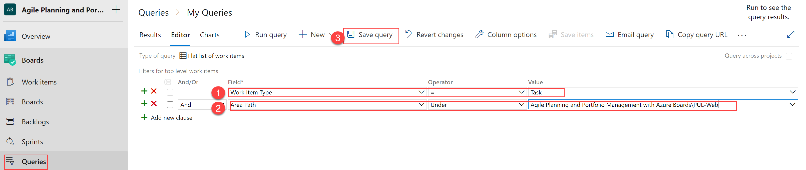

1. In the **New query** panel, in the **Enter name** textbox, type **Web tasks**, in the **Folder** dropdown list, select **Shared Queries**, and click **OK**.
1. Select the **Charts** tab and click **+ New chart**.
1. On the **Configure Chart** panel, in the **Name** textbox, type **Web tasks - By assignment**, in the **Group by** dropdown list, select **Assigned To**, and click **OK** to save the changes.

    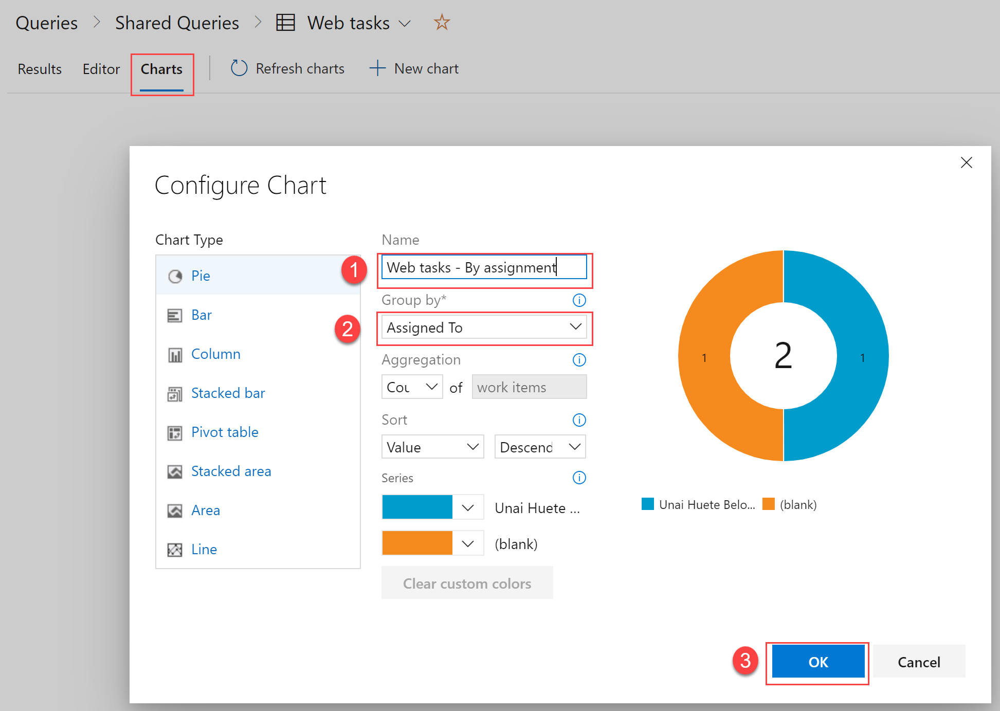

    > **Note**: You can now add this chart to a dashboard.

## Review

In this lab you used Azure Boards to perform a number of common agile planning and portfolio management tasks, including management of teams, areas, iterations, work items, sprints and capacity, customizing Kanban boards, defining dashboards, and customizing team processes.
