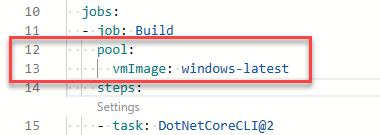

---
lab:
    title: 'Configure agent pools and understand pipeline styles'
    module: 'Module 02: Implement CI with Azure Pipelines and GitHub Actions'
---

# Configure agent pools and understanding pipeline styles

## Student lab manual

## Lab requirements

- This lab requires **Microsoft Edge** or an [Azure DevOps supported browser.](https://docs.microsoft.com/azure/devops/server/compatibility)

- **Set up an Azure DevOps organization:** If you don't already have an Azure DevOps organization that you can use for this lab, create one by following the instructions available at [Create an organization or project collection](https://docs.microsoft.com/azure/devops/organizations/accounts/create-organization).

- [Git for Windows download page](https://gitforwindows.org/). This will be installed as part of prerequisites for this lab.

- [Visual Studio Code](https://code.visualstudio.com/). This will be installed as part of prerequisites for this lab.

## Lab overview

YAML-based pipelines allow you to fully implement CI/CD as code, in which pipeline definitions reside in the same repository as the code that is part of your Azure DevOps project. YAML-based pipelines support a wide range of features that are part of the classic pipelines, such as pull requests, code reviews, history, branching, and templates.

Regardless of the choice of the pipeline style, to build your code or deploy your solution by using Azure Pipelines, you need an agent. An agent hosts compute resources that run one job at a time. Jobs can be run directly on the host machine of the agent or in a container. You have an option to run your jobs using Microsoft-hosted agents, which are managed for you, or implementing a self-hosted agent that you set up and manage on your own.

In this lab, you will learn how to implement and use self-hosted agents with YAML pipelines.

## Objectives

After you complete this lab, you will be able to:

- Implement YAML-based pipelines.
- Implement self-hosted agents.

## Estimated timing: 45 minutes

## Instructions

### Exercise 0: Configure the lab prerequisites

In this exercise, you will set up the prerequisites for the lab, which consist of a new Azure DevOps project with a repository based on the [eShopOnWeb](https://github.com/MicrosoftLearning/eShopOnWeb).

#### Task 1:  (skip if done) Create and configure the team project

In this task, you will create an **eShopOnWeb** Azure DevOps project to be used by several labs.

1. On your lab computer, in a browser window open your Azure DevOps organization. Click on **New Project**. Give your project the name **eShopOnWeb** and leave the other fields with defaults. Click on **Create**.

#### Task 2:  (skip if done) Import eShopOnWeb Git Repository

In this task you will import the eShopOnWeb Git repository that will be used by several labs.

1. On your lab computer, in a browser window open your Azure DevOps organization and the previously created **eShopOnWeb** project. Click on **Repos>Files** , **Import a Repository**. Select **Import**. On the **Import a Git Repository** window, paste the following URL <https://github.com/MicrosoftLearning/eShopOnWeb.git> and click **Import**:

1. The repository is organized the following way:
    - **.ado** folder contains Azure DevOps YAML pipelines.
    - **.devcontainer** folder container setup to develop using containers (either locally in VS Code or GitHub Codespaces).
    - **infra** folder contains Bicep & ARM infrastructure as code templates used in some lab scenarios.
    - **.github** folder contains YAML GitHub workflow definitions.
    - **src** folder contains the .NET 8 website used in the lab scenarios.

#### Task 3: (skip if done) Set main branch as default branch

1. Go to **Repos>Branches**.
1. Hover on the **main** branch then click the ellipsis on the right of the column.
1. Click on **Set as default branch**.

### Exercise 1: Author YAML-based Azure Pipelines

In this exercise, you will create an application lifecycle build pipeline, using a YAML-based template.

#### Task 1: Create an Azure DevOps YAML pipeline

In this task, you will create a template-based Azure DevOps YAML pipeline.

1. From the web browser displaying the Azure DevOps portal with the **eShopOnWeb** project open, in the vertical navigational pane on the left side, click **Pipelines**.
1. Click the **Create Pipeline** button - if you don't have any other pipelines created yet or click **New pipeline** to create an additional new one.

1. On the **Where is your code?** pane, click **Azure Repos Git**.
1. On the **Select a repository** pane, click **eShopOnWeb**.
1. On the **Configure your pipeline** pane, click **Existing Azure Pipelines YAML File**.
1. On the **Select an existing YAML file**, select **main** for the Branch, and **/.ado/eshoponweb-ci-pr.yml** for the Path.
1. Click **Continue**.
1. On the **Review your pipeline YAML** pane, review the sample pipeline. This is a rather straight-forward .NET application Build pipeline, which does the following:

   - A single Stage: Build
   - A single Job: Build
   - 3 tasks within the Build Job:
   - Dotnet Restore
   - Dotnet Build
   - Dotnet Publish

1. On the **Review your pipeline YAML** pane, click the down-facing caret symbol next to the **Run** button, click **Save**.

    > Note: we are just creating the pipeline definition for now, without running it. You will first set up an Azure DevOps agent pool and run the pipeline in a later exercise. 

### Exercise 2: Manage Azure DevOps agent pools

In this exercise, you will implement a self-hosted Azure DevOps agent.

#### Task 1: Configure an Azure DevOps self-hosting agent

In this task, you will configure your lab Virtual Machine as an Azure DevOps self-hosting agent and use it to run a build pipeline.

1. Within the Lab Virtual machine (Lab VM) or your own computer, start a web browser, navigate to [the Azure DevOps portal](https://dev.azure.com) and sign in by using the Microsoft account associated with your Azure DevOps organization.

  > **Note**: The Lab Virtual machine should have all necessary prerequisite software installed. If you are installing on your own computer, you will need to install .NET 8 SDKs or higher necessary to build the demo project. See [Download .NET](https://dotnet.microsoft.com/download/dotnet).

1. In the Azure DevOps portal, in the upper right corner of the Azure DevOps page, click the **User settings** icon, depending on whether or not you have preview features turned on, you should either see a **Security** or **Personal access tokens** item in the menu, if you see **Security**, click on that, then select **Personal access tokens**. On the **Personal Access Tokens** pane, and click **+ New Token**.
1. On the **Create a new personal access token** pane, click the **Show all scopes** link and, specify the following settings and click **Create** (leave all others with their default values):

    | Setting | Value |
    | --- | --- |
    | Name | **eShopOnWeb** |
    | Scope (custom defined) | **Agent Pools** (show more scopes option below if needed)|
    | Permissions | **Read and manage** |

1. On the **Success** pane, copy the value of the personal access token to Clipboard.

    > **Note**: Make sure you copy the token. You will not be able to retrieve it once you close this pane.

1. On the **Success** pane, click **Close**.
1. On the **Personal Access Token** pane of the Azure DevOps portal, click **Azure DevOps** symbol in the upper left corner and then click **Organization settings** label in the lower left corner.
1. To the left side of the **Overview** pane, in the vertical menu, in the **Pipelines** section, click **Agent pools**.
1. On the **Agent pools** pane, in the upper right corner, click **Add pool**.
1. On the **Add agent pool** pane, in the **Pool type** dropdown list, select **Self-hosted**, in the **Name** text box, type **az400m03l03a-pool** and then click **Create**.
1. Back on the **Agent pools** pane, click the entry representing the newly created **az400m03l03a-pool**.
1. On the **Jobs** tab of the **az400m03l03a-pool** pane, click the **New agent** button.
1. On the **Get the agent** pane, ensure that the **Windows** and **x64** tabs are selected, and click **Download** to download the zip archive containing the agent binaries to download it into the local **Downloads** folder within your user profile.

    > **Note**: If you receive an error message at this point indicating that the current system settings prevent you from downloading the file, in the Browser window, in the upper right corner, click the gearwheel symbol designating the **Settings** menu header, in the dropdown menu, select **Internet Options**, in the **Internet Options** dialog box, click **Advanced**, on the **Advanced** tab, click **Reset**, in the **Reset Browser Settings** dialog box, click **Reset** again, click **Close**, and try the download again.

1. Start Windows PowerShell as administrator and in the **Administrator: Windows PowerShell** console run the following lines to create the **C:\\agent** directory and extract the content of the downloaded archive into it.

    ```powershell
    cd \
    mkdir agent ; cd agent
    $TARGET = Get-ChildItem "$Home\Downloads\vsts-agent-win-x64-*.zip"
    Add-Type -AssemblyName System.IO.Compression.FileSystem
    [System.IO.Compression.ZipFile]::ExtractToDirectory($TARGET, "$PWD")
    ```

1. In the same **Administrator: Windows PowerShell** console, run the following to configure the agent:

    ```powershell
    .\config.cmd
    ```

1. When prompted, specify the values of the following settings:

    | Setting | Value |
    | ------- | ----- |
    | Enter server URL | the URL of your Azure DevOps organization, in the format **<https://dev.azure.com/>`<organization_name>`**, where `<organization_name>` represents the name of your Azure DevOps organization |
    | Enter authentication type (press enter for PAT) | **Enter** |
    | Enter personal access token | The access token you recorded earlier in this task |
    | Enter agent pool (press enter for default) | **az400m03l03a-pool** |
    | Enter agent name | **az400m03-vm0** |
    | Enter work folder (press enter for _work) | **Enter** |
    | **(Only if shown)** Enter Perform an unzip for tasks for each step. (press enter for N) | **WARNING**: only press **Enter** if the message is shown|
    | Enter run agent as service? (Y/N) (press enter for N) | **Y** |
    | enter enable SERVICE_SID_TYPE_UNRESTRICTED (Y/N) (press enter for N) | **Y** |
    | Enter User account to use for the service (press enter for NT AUTHORITY\NETWORK SERVICE) | **Enter** |
    | Enter whether to prevent service starting immediately after configuration is finished? (Y/N) (press enter for N) | **Enter** |

    > **Note**: You can run self-hosted agent as either a service or an interactive process. You might want to start with the interactive mode, since this simplifies verifying agent functionality. For production use, you should consider either running the agent as a service or as an interactive process with auto-logon enabled, since both persist their running state and ensure that the agent starts automatically if the operating system is restarted.

1. Switch to the browser window displaying the Azure DevOps portal and close the **Get the agent** pane.
1. Back on the **Agents** tab of the **az400m03l03a-pool** pane, note that the newly configured agent is listed with the **Online** status.
1. In the web browser window displaying the Azure DevOps portal, in the upper left corner, click the **Azure DevOps** label.
1. From the list of projects, click the tile representing your **eShopOnWeb** project.
1. On the **eShopOnWeb** pane, in the vertical navigational pane on the left side, in the **Pipelines** section, click **Pipelines**.
1. On the **Recent** tab of the **Pipelines** pane, select **eShopOnWeb** and, on the **eShopOnWeb** pane, select **Edit**.
1. On the **eShopOnWeb** edit pane, in the existing YAML-based pipeline, replace line 13 which says  `vmImage: ubuntu-latest` designating the target agent pool the following content, designating the newly created self-hosted agent pool:

    ```yaml
    name: az400m03l03a-pool
    demands:
    - Agent.Name -equals az400m03-vm0
    ```

    > **WARNING**: Be careful with copy/paste, make sure you have the same indentation shown above.

    

1. On the **eShopOnWeb** edit pane, in the upper right corner of the pane, click **Validate and save**. This will automatically trigger the build based on this pipeline.
1. In the Azure DevOps portal, in the vertical navigational pane on the left side, in the **Pipelines** section, click **Pipelines**. Depending on your lab setup, the pipeline might prompt you for permissions. Click **Permit** to allow the pipeline to run. 
1. On the **Recent** tab of the **Pipelines** pane, click the **eShopOnWeb** entry, on the **Runs** tab of the **eShopOnWeb** pane, select the most recent run, on the **Summary** pane of the run, scroll down to the bottom, in the **Jobs** section, click **Phase 1** and monitor the job until its successful completion.

### Exercise 3: Remove the resources used in the lab

1. Stop and remove the agent service by running `.\config.cmd remove` from the command prompt.
1. Delete the agent pool.
1. Revoke the PAT token.
1. Revert the changes in the **eshoponweb-ci-pr.yml** file by navigating to it from Repos/.ado/eshoponweb-ci-pr.yml, selecting **Edit** and removing lines 13-15 (the agent pool snippet), and changing back to  `vmImage: ubuntu-latest` as it was originally. (This is because you will use the same sample pipeline file in a future lab exercise.)



## Review

In this lab, you learned how to implement and use self-hosted agents with YAML pipelines.
