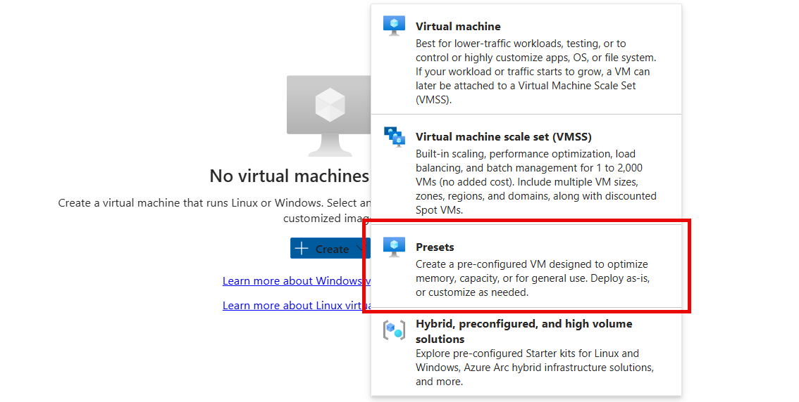
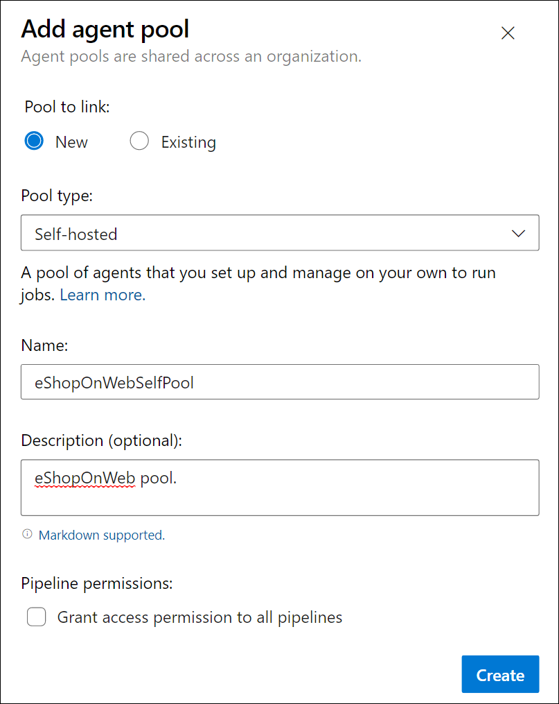
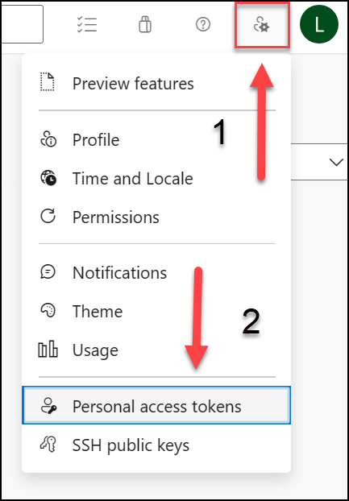
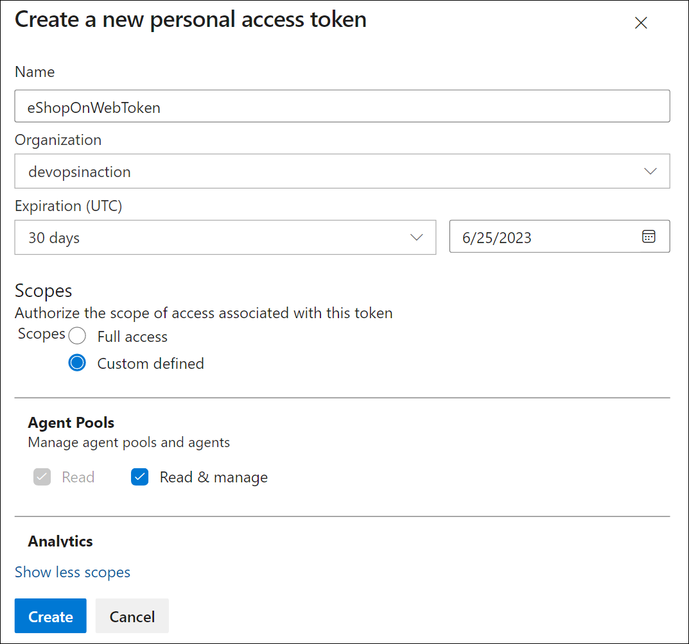
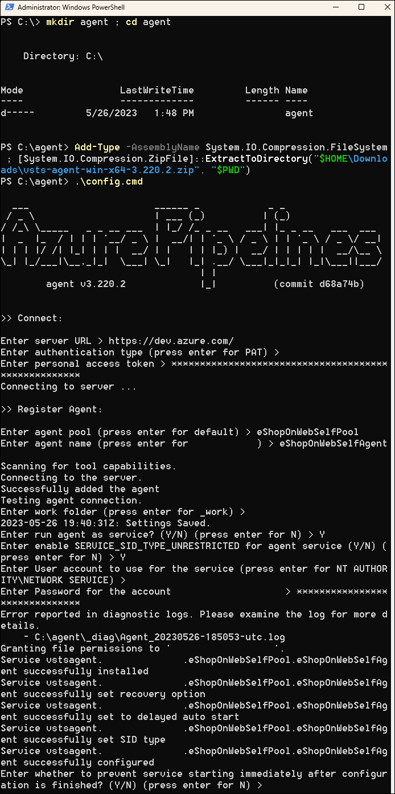
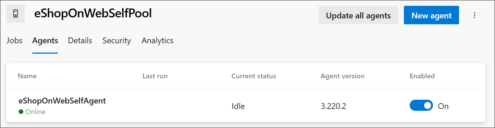
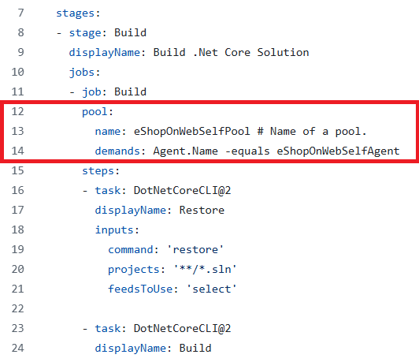

---
lab:
    title: 'Configure agent pools and understand pipeline styles'
    module: 'Module 02: Implement CI with Azure Pipelines and GitHub Actions'
---

# Configure agent pools and understanding pipeline styles

## Lab requirements

- This lab requires **Microsoft Edge** or an [Azure DevOps supported browser.](https://docs.microsoft.com/azure/devops/server/compatibility)

- **Set up an Azure DevOps organization:** If you don't already have an Azure DevOps organization that you can use for this lab, create one by following the instructions available at [Create an organization or project collection](https://docs.microsoft.com/azure/devops/organizations/accounts/create-organization).

- [Git for Windows download page](https://gitforwindows.org/). This will be installed as part of prerequisites for this lab.

- [Visual Studio Code](https://code.visualstudio.com/). This will be installed as part of prerequisites for this lab.

## Lab overview

YAML-based pipelines allow you to fully implement CI/CD as code, in which pipeline definitions reside in the same repository as the code that is part of your Azure DevOps project. YAML-based pipelines support a wide range of features that are part of the classic pipelines, such as pull requests, code reviews, history, branching, and templates.

Regardless of the choice of the pipeline style, to build your code or deploy your solution by using Azure Pipelines, you need an agent. An agent hosts compute resources that run one job at a time. Jobs can be run directly on the host machine of the agent or in a container. You have an option to run your jobs using Microsoft-hosted agents, which are managed for you, or implementing a self-hosted agent that you set up and manage on your own.

In this lab, you will learn how to implement and use self-hosted agents with YAML pipelines.

## Objectives

After you complete this lab, you will be able to:

- Implement YAML-based pipelines.
- Implement self-hosted agents.

## Estimated timing: 30 minutes

## Instructions

### Exercise 0: (skip if done) Configure the lab prerequisites

In this exercise, you will set up the prerequisites for the lab, which consist of a new Azure DevOps project with a repository based on the [eShopOnWeb](https://github.com/MicrosoftLearning/eShopOnWeb).

#### Task 1:  (skip if done) Create and configure the team project

In this task, you will create an **eShopOnWeb** Azure DevOps project to be used by several labs.

1. On your lab computer, in a browser window open your Azure DevOps organization. Click on **New Project**. Give your project the name **eShopOnWeb** and leave the other fields with defaults. Click on **Create**.

#### Task 2:  (skip if done) Import eShopOnWeb Git Repository

In this task you will import the eShopOnWeb Git repository that will be used by several labs.

1. On your lab computer, in a browser window open your Azure DevOps organization and the previously created **eShopOnWeb** project. Click on **Repos > Files** , **Import a Repository**. Select **Import**. On the **Import a Git Repository** window, paste the following URL <https://github.com/MicrosoftLearning/eShopOnWeb.git> and click **Import**:

1. The repository is organized the following way:
    - **.ado** folder contains Azure DevOps YAML pipelines.
    - **.devcontainer** folder container setup to develop using containers (either locally in VS Code or GitHub Codespaces).
    - **infra** folder contains Bicep & ARM infrastructure as code templates used in some lab scenarios.
    - **.github** folder contains YAML GitHub workflow definitions.
    - **src** folder contains the .NET 8 website used in the lab scenarios.

#### Task 3: (skip if done) Set main branch as default branch

1. Go to **Repos > Branches**.
1. Hover on the **main** branch then click the ellipsis on the right of the column.
1. Click on **Set as default branch**.

### Exercise 1: Create agents and configure agent pools

In this exercise, you will create an Azure virtual machine (VM) and use it to create an agent and configure agent pools.

#### Task 1: Create and connect to an Azure VM

1. In your browser, open the Azure Portal at `https://portal.azure.com`. If prompted, sign in by using an account with the Owner role in your Azure subscription.

1. In the **Search resources, services and docs (G+/)** box, type **`Virtual Machines`** and select it from the dropdown list.

1. Select the **Create** button.

1. Select the **Azure virtual machine with preset configuration**.

    

1. Select the **Dev/Test** as the workload environment and the **General purpose** as the workload type.

1. Select the **Continue to create a VM** button, on the **Basics** tab perform the following actions and then select **Management**:

   | Setting | Action |
   | -- | -- |
   | **Subscription** drop-down list | Select your Azure subscription. |
   | **Resource group** section | Create a new resource group named **rg-eshoponweb-agentpool**. |
   | **Virtual machine name** text box | Enter name of your preference, for example, **`eshoponweb-vm`**. |
   | **Region** drop-down list | You can choose your closest [azure](https://azure.microsoft.com/explore/global-infrastructure/geographies) region. For example, “eastus”, “eastasia”, “westus”, etc. |
   | **Availability options** drop-down list | Select **No infrastructure redundancy required**. |
   | **Security type** drop-down list | Select with the **Trusted launch virtual machines** option. |
   | **Image** drop-down list | Select the **Windows Server 2022 Datacenter: Azure Edition - x64 Gen2** image. |
   | **Size** drop-down list | Select the cheapest **Standard** size for testing purposes. |
   | **Username** text box | Enter the username of your preference |
   | **Password** text box | Enter the password of your preference |
   | **Public inbound ports** section | Select **Allow selected ports**. |
   | **Select inbound ports** drop-down list | Select **RDP (3389)**. |

1. On the **Management** tab, in the **Identity** section, select the **Enable system assigned managed identity** checkbox and then select **Review + create**:

1. On the **Review + create** tab, select **Create**.

   > **Note**: Wait for the provisioning process to complete. This should take about 2 minutes.

1. In the Azure portal, navigate to the page displaying configuration of the newly created Azure VM.

1. On the Azure VM page, select **Connect**, in the drop-down menu, select **Connect**, then select **Download RDP file**.

1. Use the downloaded RDP file to establish a Remote Desktop session to the operating system running in the Azure VM.

#### Task 2: Create an agent pool

1. In the Remote Desktop session to the Azure VM, start Microsoft Edge web browser.

1. In the web browser, navigate to the Azure DevOps portal at `https://aex.dev.azure.com` and sign in to access your organization.

   > **Note**: If it is your first time accessing the Azure DevOps portal, you may need to create your profile.

1. Open the **eShopOnWeb** project, and select **Project settings** from the left-side bottom menu.

1. From **Pipelines > Agent Pools**, select the **Add pool** button.

1. Choose the **Self-hosted** pool type.

1. Provide a name for the agent pool, such as **eShopOnWebSelfPool**, and add an optional description.

1. Leave the **Grant access permission to all pipelines** option unchecked.

   

   > **Note**: Granting access permission to all pipelines is not recommended for production environments. It is only used in this lab to simplify the configuration of the pipeline.

1. Select **Create** button to create the agent pool.

#### Task 3: Download and extract the agent installation files

1. In the Azure DevOps portal, select the newly created agent pool and then select the **Agents** tab.

1. Select the **New agent** button and then **Download** button from the **Download agent** in the new pop-up window.

   > **Note**: Follow the installation instructions to install the agent.

1. Start a PowerShell session and run the following commands to create a folder named **agent**.

   ```powershell
   mkdir agent ; cd agent        
   ```

   > **Note**: Make sure you are in the folder where you want to install the agent, for example, C:\agent.

1. Run the following command to extract the content of the downloaded agent installer files:

   ```powershell
   Add-Type -AssemblyName System.IO.Compression.FileSystem ; [System.IO.Compression.ZipFile]::ExtractToDirectory("$HOME\Downloads\vsts-agent-win-x64-3.245.0.zip", "$PWD")
   ```

   > **Note**: If you downloaded the agent to a different location (or the downloaded version differs), adjust the above command accordingly.

#### Task 4: Create a PAT token

> **Note**: Before configuring the agent, you need to create a PAT token (unless you have an existing one). To create a PAT token, follow the steps below:

1. Within the Remote Desktop session to the Azure VM, open another browser window, navigate to the Azure DevOps portal at `https://aex.dev.azure.com`, and access your organization and project.

1. Select **User settings** from the right-side top menu (directly to the left of your user's avatar icon).

1. Select the **Personal access tokens** menu item.

   

1. Select the **New Token** button.

1. Provide a name for the token, such as **eShopOnWebToken**.

1. Select the Azure DevOps organization for you want to use the token.

1. Set the expiration date for the token (only used to configure the agent).

1. Select the custom defined scope.

1. Select to show all scopes.

1. Select the **Agent Pools (Read & Manage)** scope.

1. Select the **Create** button to create the token.

1. Copy the token value and save it in a safe place (you will not be able to see it again. You can only regenerate the token).

   

   > [!IMPORTANT]
   > Use the least privilege option, **Agent Pools (Read & Manage)**, only for the agent configuration. Also, make sure you set the minimum expiration date for the token if that is the only purpose of the token. You can create another token with the same privileges if you need to configure the agent again.

#### Task 5: Configure the agent

1. Within the Remote Desktop session to the Azure VM, switch back to the PowerShell window. If necessary, change the current directory to the one into which you extracted the agent installation files earlier in this exercise.

1. To configure your agent to run unattended, invoke the following command:

   ```powershell
   .\config.cmd
   ```

   > **Note**: If you want to run the agent interactively, use `.\run.cmd` instead.

1. To configure the agent, perform the following actions when prompted:

   - Enter the URL of the Azure DevOps organization (**server URL**) in the format `https://aex.dev.azure.com`{your organization name}.
   - Accept the default authentication type (**`PAT`**).
   - Enter the value of the PAT token you created in the previous step.
   - Enter the agent pool name **`eShopOnWebSelfPool`** you created earlier in this exercise.
   - Enter the agent name **`eShopOnWebSelfAgent`**.
   - Accept the default agent work folder (_work).
   - Enter **Y** to configure the agent to run as service.
   - Enter **Y** to enable SERVICE_SID_TYPE_UNRESTRICTED for the agent service.
   - Enter **`NT AUTHORITY\SYSTEM`** to set the security context for the service.

   > [!IMPORTANT]
   > In general, you should follow the principle of least privilege when configuring the service security context.

   - Accept the default option (**N**) to allow the service to start immediately after configuration is finished.

   

   > **Note**: The agent configuration process will take a few minutes to complete. Once it is done, you will see a message indicating that the agent is running as a service.

   > [!IMPORTANT] If you see an error message indicating that the agent is not running, you may need to start the service manually. To do this, open the **Services** applet in the Windows Control Panel, locate the service named **Azure DevOps Agent (eShopOnWebSelfAgent)**, and start it.

   > [!IMPORTANT] If your agent fails to start, you may need to choose a different folder for the agent work directory. To do this, re-run the agent configuration script and choose a different folder.

1. Check the agent status by switching to the web browser displaying the Azure DevOps portal, navigating to the agent pool and clicking on the **Agents** tab. You should see the new agent in the list.

   

   > **Note**: For more details on Windows agents, see: [Self-hosted Windows agents](https://learn.microsoft.com/azure/devops/pipelines/agents/windows-agent)

   > [!IMPORTANT]
   > In order for the agent to be able to build and deploy Azure resources from the Azure DevOps pipelines (which you will step through in the upcoming labs), you need to install Azure CLI within the operating system of the Azure VM that is hosting the agent.

1. Start a web browser and navigate to the page [Install Azure CLI on Windows](https://learn.microsoft.com/en-us/cli/azure/install-azure-cli-windows?tabs=azure-cli&pivots=msi#install-or-update).

1. Download and install Azure CLI.

1. (Optional) If you prefer, run the following PowerShell command to install Azure CLI:

   ```powershell
   $ProgressPreference = 'SilentlyContinue'; Invoke-WebRequest -Uri https://aka.ms/installazurecliwindows -OutFile .\AzureCLI.msi; Start-Process msiexec.exe -Wait -ArgumentList '/I AzureCLI.msi /quiet'; Remove-Item .\AzureCLI.msi
   ```

   > **Note**: If you are using a different version of the Azure CLI, you may need to adjust the above command accordingly.

1. In the web browser navigate to the page Microsoft .NET 8.0 SDK installer page at `https://dotnet.microsoft.com/en-us/download/dotnet/thank-you/sdk-8.0.403-windows-x64-installer`.

   > [!IMPORTANT]
   > You need to install the .NET 8.0 SDK (or higher) on the Azure VM that is hosting the agent. This is required to build the eShopOnWeb application in the upcoming labs. Any other tools or SDKs required for the application build should also be installed on the Azure VM.

1. Download and install Microsoft .NET 8.0 SDK.

### Exercise 2: Author YAML-based Azure Pipelines

In this exercise, you will create an application lifecycle build pipeline, using a YAML-based template.

#### Task 1: Create an Azure DevOps YAML pipeline

In this task, you will create a YAML-based pipeline for the **eShopOnWeb** project.

1. From the web browser displaying the Azure DevOps portal with the **eShopOnWeb** project open, in the vertical navigational pane on the left side, click **Pipelines**.
1. Click the **Create Pipeline** button - if you don't have any other pipelines created yet or click **New pipeline** to create an additional new one.

1. On the **Where is your code?** pane, click **Azure Repos Git**.
1. On the **Select a repository** pane, click **eShopOnWeb**.
1. On the **Configure your pipeline** pane, click **Existing Azure Pipelines YAML File**.
1. On the **Select an existing YAML file**, select **main** for the Branch, and **/.ado/eshoponweb-ci-pr.yml** for the Path.
1. Click **Continue**.
1. On the **Review your pipeline YAML** pane, review the sample pipeline. This is a rather straight-forward .NET application Build pipeline, which does the following:

   - A single Stage: Build
   - A single Job: Build
   - 4 tasks within the Build Job:
   - Dotnet Restore
   - Dotnet Build
   - Dotnet Test
   - Dotnet Publish

1. On the **Review your pipeline YAML** pane, click the down-facing caret symbol next to the **Run** button, click **Save**.

    > **Note**: We are just creating the pipeline definition for now, without running it. You will first set up an Azure DevOps agent pool and run the pipeline in a later exercise.

#### Task 2: Update the YAML pipeline with the self-hosted agent pool

1. In the Azure DevOps portal, navigate to the **eShopOnWeb** project, and select **Pipelines** from the left-side menu.
1. Click on the **Edit** button for the pipeline you created in the previous task.
1. On the **eShopOnWeb** edit pane, in the existing YAML-based pipeline, remove line 13 which says **vmImage: ubuntu-latest** designating the target agent pool the following content, designating the newly created self-hosted agent pool:

    ```yaml
    pool: 
      name: eShopOnWebSelfPool
      demands: Agent.Name -equals eShopOnWebSelfAgent
    ```

    > **WARNING**: Be careful with copy/paste, make sure you have the same indentation shown above.

    

1. On the **eShopOnWeb** edit pane, in the upper right corner of the pane, click **Validate and save**. Then click **Save**.
1. On the **eShopOnWeb** edit pane, in the upper right corner of the pane, click **Run pipeline**.

    > **Note**: The pipeline will run on the self-hosted agent pool you created in the previous exercise.
1. Open the pipeline run and monitor the job until its successful completion.

    > **Note**: If you receive a permissions prompt, click **Permit** to allow the pipeline to run.

1. Once the pipeline run is complete, review the output and verify that the pipeline ran successfully.

## Review

In this lab, you learned how to implement and use self-hosted agents with YAML pipelines.
