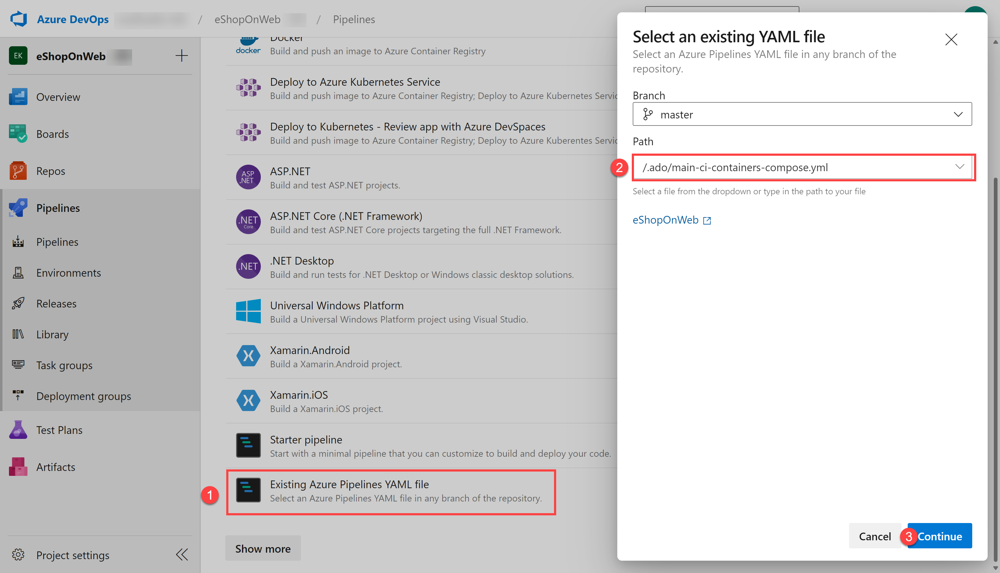
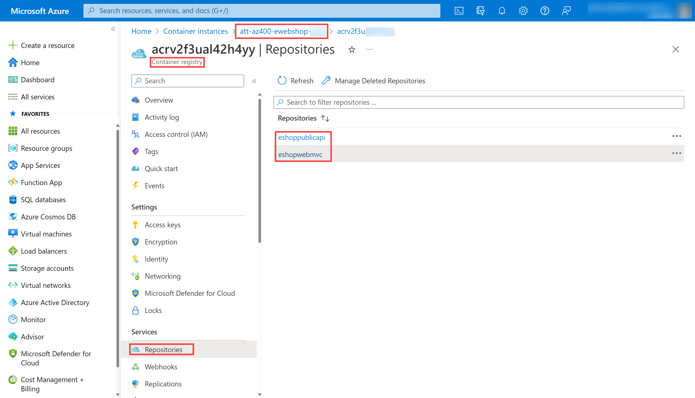
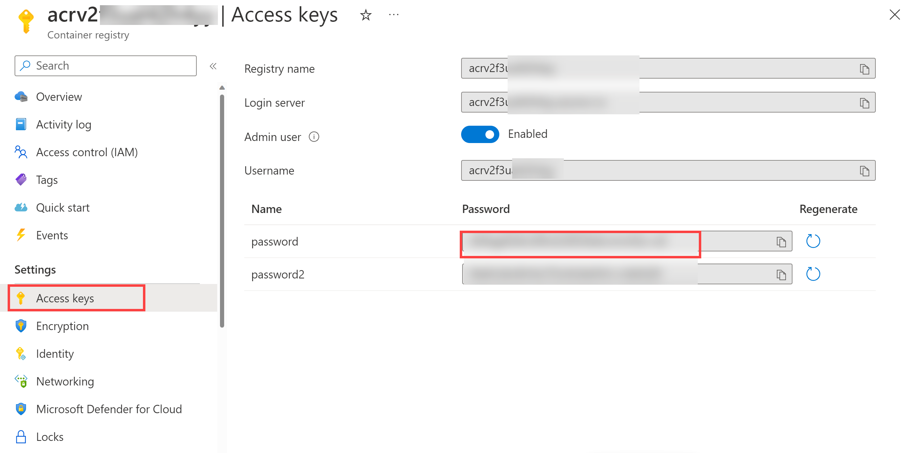
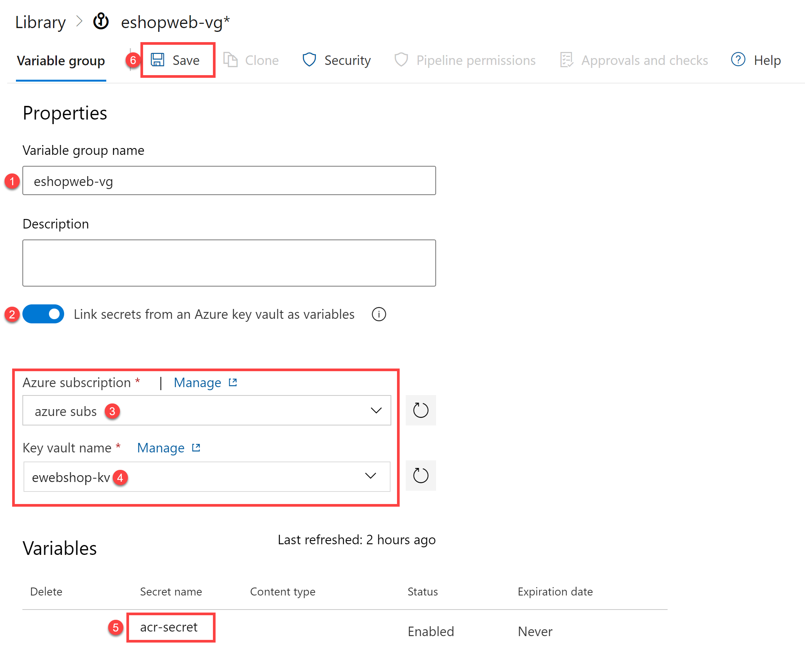

---
lab:
    title: 'Integrate Azure Key Vault with Azure DevOps'
    module: 'Module 04: Implement a secure continuous deployment using Azure Pipelines'
---

# Integrate Azure Key Vault with Azure DevOps

## Lab requirements

- This lab requires **Microsoft Edge** or an [Azure DevOps supported browser.](https://learn.microsoft.com/azure/devops/server/compatibility)

- **Set up an Azure DevOps organization:** If you don't already have an Azure DevOps organization that you can use for this lab, create one by following the instructions available at [Create an organization or project collection](https://learn.microsoft.com/azure/devops/organizations/accounts/create-organization).
- Identify an existing Azure subscription or create a new one.

## Lab overview

Azure Key Vault provides secure storage and management of sensitive data, such as keys, passwords, and certificates. Azure Key Vault includes supports for hardware security modules, as well as a range of encryption algorithms and key lengths. By using Azure Key Vault, you can minimize the possibility of disclosing sensitive data through source code, which is a common mistake made by developers. Access to Azure Key Vault requires proper authentication and authorization, supporting fine grained permissions to its content.

In this lab, you will see how you can integrate Azure Key Vault with an Azure Pipelines by using the following steps:

- Create an Azure Key Vault to store a ACR password as a secret.
- Provide access to secrets in the Azure Key Vault.
- Configure permissions to read the secret.
- Configure pipeline to retrieve the password from the Azure Key Vault and pass it on to subsequent tasks.

## Objectives

After you complete this lab, you will be able to:

- Create an Azure Key Vault.
- Retrieve a secret from Azure Key Vault in an Azure DevOps pipeline.
- Use the secret in a subsequent task in the pipeline.
- Deploy a container image to Azure Container Instance (ACI) using the secret.

## Estimated timing: 40 minutes

## Instructions

### Exercise 0: (skip if done) Configure the lab prerequisites

In this exercise, you will set up the prerequisites for the lab, which consist of a new Azure DevOps project with a repository based on the [eShopOnWeb](https://github.com/MicrosoftLearning/eShopOnWeb).

#### Task 1: (skip if done) Create and configure the team project

In this task, you will create an **eShopOnWeb** Azure DevOps project to be used by several labs.

1. On your lab computer, in a browser window open your Azure DevOps organization. Click on **New Project**. Give your project the name **eShopOnWeb** and leave the other fields with defaults. Click on **Create**.

    

#### Task 2: (skip if done) Import eShopOnWeb Git Repository

In this task you will import the eShopOnWeb Git repository that will be used by several labs.

1. On your lab computer, in a browser window open your Azure DevOps organization and the previously created **eShopOnWeb** project. Click on **Repos > Files** , **Import**. On the **Import a Git Repository** window, paste the following URL <https://github.com/MicrosoftLearning/eShopOnWeb.git>  and click on **Import**:

    

1. The repository is organized the following way:
    - **.ado** folder contains Azure DevOps YAML pipelines.
    - **.devcontainer** folder container setup to develop using containers (either locally in VS Code or GitHub Codespaces).
    - **infra** folder contains Bicep&ARM infrastructure as code templates used in some lab scenarios.
    - **.github** folder container YAML GitHub workflow definitions.
    - **src** folder contains the .NET 8 website used on the lab scenarios.

#### Task 3: (skip if done) Set main branch as default branch

1. Go to **Repos > Branches**.
1. Hover on the **main** branch then click the ellipsis on the right of the column.
1. Click on **Set as default branch**.

### Exercise 1: Setup CI pipeline to build eShopOnWeb container

In this exercise, you will create a CI pipeline that builds and pushes the eShopOnWeb container images to an Azure Container Registry (ACR). The pipeline will use Docker Compose to build the images and push them to the ACR.

#### Task 1: Setup and Run CI pipeline

In this task, you will import an existing CI YAML pipeline definition, modify and run it. It will create a new Azure Container Registry (ACR) and build/publish the eShopOnWeb container images.

1. From the lab computer, start a web browser, navigate to the Azure DevOps **eShopOnWeb** project. Go to **Pipelines > Pipelines** and click on **Create Pipeline** (or **New pipeline**).

1. On the **Where is your code?** window, select **Azure Repos Git (YAML)** and select the **eShopOnWeb** repository.

1. On the **Configure** section, choose **Existing Azure Pipelines YAML file**. Select branch: **main**, provide the following path **/.ado/eshoponweb-ci-dockercompose.yml** and click on **Continue**.

    

1. In the YAML pipeline definition, customize your Resource Group name by replacing **NAME** on **AZ400-EWebShop-NAME** with a unique value and replace **YOUR-SUBSCRIPTION-ID** with the your own Azure subscriptionId.

1. Click on **Save and Run** and wait for the pipeline to execute successfully.

    > **Important**: If you see the message "This pipeline needs permission to access resources before this run can continue to Docker Compose to ACI", click on View, Permit and Permit again. This is needed to allow the pipeline to create the resource.

    > **Note**: The build may take a few minutes to complete. The build definition consists of the following tasks:
    - **AzureResourceManagerTemplateDeployment** uses **bicep** to deploy an Azure Container Registry.
    - **PowerShell** task take the bicep output (acr login server) and creates pipeline variable.
    - **DockerCompose** task builds and pushes the container images for eShopOnWeb to the Azure Container Registry .

1. Your pipeline will take a name based on the project name. Lets **rename** it for identifying the pipeline better. Go to **Pipelines > Pipelines** and click on the recently created pipeline. Click on the ellipsis and **Rename/Remove** option. Name it **`eshoponweb-ci-dockercompose`** and click on **Save**.

1. Once the execution is finished, on the Azure Portal, open previously defined Resource Group, and you should find an Azure Container Registry (ACR) with the created container images **eshoppublicapi** and **eshopwebmvc**. You will only use **eshopwebmvc** on the deploy phase.

    

1. Click on **Access Keys**, enable the **Admin user** if not done already, and copy the **password** value. It will be used in the following task, as we will keep it as secret in Azure Key Vault.

    

#### Task 2: Create an Azure Key Vault

In this task, you will create an Azure Key Vault by using the Azure portal.

For this lab scenario, we will have a Azure Container Instance (ACI) that pulls and runs a container image stored in Azure Container Registry (ACR). We intend to store the password for the ACR as a secret in the key vault.

1. In the Azure portal, in the **Search resources, services, and docs** text box, type **`Key vault`** and press the **Enter** key.
1. Select **Key vault** blade, click on **Create > Key Vault**.
1. On the **Basics** tab of the **Create a key vault** blade, specify the following settings and click on **Next**:

    | Setting | Value |
    | --- | --- |
    | Subscription | the name of the Azure subscription you are using in this lab |
    | Resource group | the name of a new resource group **AZ400-EWebShop-NAME** |
    | Key vault name | any unique valid name, like **ewebshop-kv-NAME** (replace NAME) |
    | Region | an Azure region close to the location of your lab environment |
    | Pricing tier | **Standard** |
    | Days to retain deleted vaults | **7** |
    | Purge protection | **Disable purge protection** |

1. On the **Access configuration** tab of the **Create a key vault** blade, select **Vault access policy** and then in the **Access policies** section, click on **+ Create** to setup a new policy.

    > **Note**: You need to secure access to your key vaults by allowing only authorized applications and users. To access the data from the vault, you will need to provide read (Get/List) permissions to the previously created service principal that you will be using for authentication in the pipeline.

    1. On the **Permission** blade, below **Secret permissions**, check **Get** and **List** permissions. Click on **Next**.
    2. On the **Principal** blade, search for the **previously created Service Principal**, either by using the Id or Name given, and select it from the list. Click on **Next**, **Next**, **Create** (access policy).
    3. On the **Review + create** blade, click on **Create**

1. Back on the **Create a key vault** blade, click on **Review + Create > Create**

    > **Note**: Wait for the Azure Key Vault to be provisioned. This should take less than 1 minute.

1. On the **Your deployment is complete** blade, click on **Go to resource**.
1. On the Azure Key Vault (ewebshop-kv-NAME) blade, in the vertical menu on the left side of the blade, in the **Objects** section, click on **Secrets**.
1. On the **Secrets** blade, click on **Generate/Import**.
1. On the **Create a secret** blade, specify the following settings and click on **Create** (leave others with their default values):

    | Setting | Value |
    | --- | --- |
    | Upload options | **Manual** |
    | Name | **acr-secret** |
    | Value | ACR access password copied in previous task |

#### Task 3: Create a Variable Group connected to Azure Key Vault

In this task, you will create a Variable Group in Azure DevOps that will retrieve the ACR password secret from Key Vault using the Service Connection created previously.

1. On your lab computer, start a web browser and navigate to the Azure DevOps project **eShopOnWeb**.

1. In the vertical navigational pane of the of the Azure DevOps portal, select **Pipelines > Library**. Click on **+ Variable Group**.

1. On the **New variable group** blade, specify the following settings:

    | Setting | Value |
    | --- | --- |
    | Variable Group Name | **eshopweb-vg** |
    | Link secrets from an Azure Key Vault | **enable** |
    | Azure subscription | **Available Azure service connection > Azure subs** |
    | Key vault name | Your key vault name|

1. Under **Variables**, click on **+ Add** and select the **acr-secret** secret. Click on **OK**.
1. Click on **Save**.

    

#### Task 4: Setup CD Pipeline to deploy container in Azure Container Instance (ACI)

In this task, you will import a CD pipeline, customize it, and run it for deploying the container image created before in a Azure Container Instance.

1. From the lab computer, start a web browser, navigate to the Azure DevOps **eShopOnWeb** project. Go to **Pipelines > Pipelines** and click on **New Pipeline**.

1. On the **Where is your code?** window, select **Azure Repos Git (YAML)** and select the **eShopOnWeb** repository.

1. On the **Configure** section, choose **Existing Azure Pipelines YAML file**. Select branch: **main**, provide the following path **/.ado/eshoponweb-cd-aci.yml** and click on **Continue**.

1. In the YAML pipeline definition, customize:

    - **YOUR-SUBSCRIPTION-ID** with your Azure subscription id.
    - **az400eshop-NAME** replace NAME to make it globally unique.
    - **YOUR-ACR.azurecr.io** and **ACR-USERNAME** with your ACR login server (both need the ACR name, can be reviewed on the ACR > Access Keys).
    - **AZ400-EWebShop-NAME** with the resource group name defined before in the lab.

1. Click on **Save and Run**.
1. Open the pipeline and wait to execute successfully.

    > **Important**: If you see the message "This pipeline needs permission to access resources before this run can continue to Docker Compose to ACI", click on View, Permit and Permit again. This is needed to allow the pipeline to create the resource.

    > **Note**: The deployment may take a few minutes to complete. The CD definition consists of the following tasks:
    - **Resources** : it is prepared to automatically trigger based on CI pipeline completion. It also download the repository for the bicep file.
    - **Variables (for Deploy stage)** connects to the variable group to consume the Azure Key Vault secret **acr-secret**
    - **AzureResourceManagerTemplateDeployment** deploys the Azure Container Instance (ACI) using bicep template and provides the ACR login parameters to allow ACI to download the previously created container image from Azure Container Registry (ACR).

1. Your pipeline will take a name based on the project name. Lets **rename** it for identifying the pipeline better. Go to **Pipelines > Pipelines** and click on the recently created pipeline. Click on the ellipsis and **Rename/Remove** option. Name it **eshoponweb-cd-aci** and click on **Save**.

   > [!IMPORTANT]
   > Remember to delete the resources created in the Azure portal to avoid unnecessary charges.

## Review

In this lab, you integrated Azure Key Vault with an Azure DevOps pipeline by using the following steps:

- Created an Azure Key Vault to store an ACR password as a secret.
- Provided access to secrets in the Azure Key Vault.
- Configured permissions to read the secret.
- Configured a pipeline to retrieve the password from the Azure Key Vault and pass it on to subsequent tasks.
- Deployed a container image to Azure Container Instance (ACI) using the secret.
- Created a Variable Group connected to Azure Key Vault.
