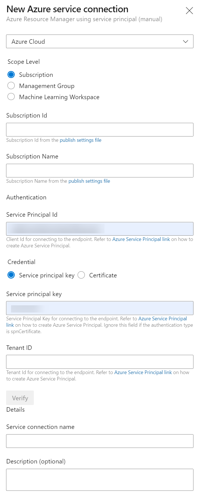

---
lab:
    title: 'Integrating Azure Key Vault with Azure DevOps'
    module: 'Module 05: Implement a secure continuous deployment using Azure Pipelines'
---

# Integrating Azure Key Vault with Azure DevOps

## Student lab manual

## Lab requirements

- This lab requires **Microsoft Edge** or an [Azure DevOps supported browser.](https://learn.microsoft.com/azure/devops/server/compatibility)

- **Set up an Azure DevOps organization:** If you don't already have an Azure DevOps organization that you can use for this lab, create one by following the instructions available at [Create an organization or project collection](https://learn.microsoft.com/azure/devops/organizations/accounts/create-organization).

- Identify an existing Azure subscription or create a new one.

## Lab overview

Azure Key Vault provides secure storage and management of sensitive data, such as keys, passwords, and certificates. Azure Key Vault includes supports for hardware security modules, as well as a range of encryption algorithms and key lengths. By using Azure Key Vault, you can minimize the possibility of disclosing sensitive data through source code, which is a common mistake made by developers. Access to Azure Key Vault requires proper authentication and authorization, supporting fine grained permissions to its content.

In this lab, you will see how you can integrate Azure Key Vault with an Azure Pipelines by using the following steps:

- Create an Azure Key vault to store a ACR password as a secret.
- Create an Azure Service Principal to provide access to secrets in the Azure Key Vault.
- Configure permissions to allow the Service Principal to read the secret.
- Configure pipeline to retrieve the password from the Azure Key Vault and pass it on to subsequent tasks.

## Objectives

After you complete this lab, you will be able to:

- Create an Azure Active Directory (Azure AD) Service Principal.
- Create an Azure Key Vault.

## Estimated timing: 40 minutes

## Instructions

### Exercise 0: Configure the lab prerequisites

In this exercise, you will set up the prerequisites for the lab, which consist of a new Azure DevOps project with a repository based on the [eShopOnWeb](https://github.com/MicrosoftLearning/eShopOnWeb).

#### Task 1: (skip if done) Create and configure the team project

In this task, you will create an **eShopOnWeb** Azure DevOps project to be used by several labs.

1. On your lab computer, in a browser window open your Azure DevOps organization. Click on **New Project**. Give your project the name **eShopOnWeb** and leave the other fields with defaults. Click on **Create**.

    

#### Task 2: (skip if done) Import eShopOnWeb Git Repository

In this task you will import the eShopOnWeb Git repository that will be used by several labs.

1. On your lab computer, in a browser window open your Azure DevOps organization and the previously created **eShopOnWeb** project. Click on **Repos>Files** , **Import**. On the **Import a Git Repository** window, paste the following URL https://github.com/MicrosoftLearning/eShopOnWeb.git  and click on **Import**:

    

2. The repository is organized the following way:
    - **.ado** folder contains Azure DevOps YAML pipelines.
    - **.devcontainer** folder container setup to develop using containers (either locally in VS Code or GitHub Codespaces).
    - **.azure** folder contains Bicep&ARM infrastructure as code templates used in some lab scenarios.
    - **.github** folder container YAML GitHub workflow definitions.
    - **src** folder contains the .NET 6 website used on the lab scenarios.

### Exercise 1: Setup CI pipeline to build eShopOnWeb container

Setup CI YAML pipeline for:

- Creating an Azure Container Registry to keep the container images
- Using Docker Compose to build and push **eshoppublicapi** and **eshopwebmvc** container images. Only **eshopwebmvc** container will be deployed.

#### Task 1: (skip if done) Create a Service Principal

In this task, you will create a Service Principal by using the Azure CLI, which will allow Azure DevOps to:

- Deploy resources on your Azure subscription.
- Have read access on the later created Key Vault secrets.

> **Note**: If you do already have a Service Principal, you can proceed directly to the next task.

You will need a Service Principal to deploy  Azure resources from Azure Pipelines. Since we are going to retrieve secrets in a pipeline, we will need to grant permission to the service when we create the Azure Key Vault.

A Service Principal is automatically created by Azure Pipelines, when you connect to an Azure subscription from inside a pipeline definition or when you create a new Service Connection from the project settings page (automatic option). You can also manually create the Service Principal from the portal or using Azure CLI and re-use it across projects.

1. From the lab computer, start a web browser, navigate to the [**Azure Portal**](https://portal.azure.com), and sign in with the user account that has the Owner role in the Azure subscription you will be using in this lab and has the role of the Global Administrator in the Azure AD tenant associated with this subscription.
2. In the Azure portal, click on the **Cloud Shell** icon, located directly to the right of the search textbox at the top of the page.
3. If prompted to select either **Bash** or **PowerShell**, select **Bash**.

   >**Note**: If this is the first time you are starting **Cloud Shell** and you are presented with the **You have no storage mounted** message, select the subscription you are using in this lab, and select **Create storage**.

4. From the **Bash** prompt, in the **Cloud Shell** pane, run the following commands to retrieve the values of the Azure subscription ID and subscription name attributes:

    ```bash
    az account show --query id --output tsv
    az account show --query name --output tsv
    ```

    > **Note**: Copy both values to a text file. You will need them later in this lab.

5. From the **Bash** prompt, in the **Cloud Shell** pane, run the following command to create a Service Principal (replace the **myServicePrincipalName** with any unique string of characters consisting of letters and digits) and **mySubscriptionID** with your Azure subscriptionId :

    ```bash
    az ad sp create-for-rbac --name myServicePrincipalName \
                         --role contributor \
                         --scopes /subscriptions/mySubscriptionID
    ```

    > **Note**: The command will generate a JSON output. Copy the output to text file. You will need it later in this lab.

6. Next, from the lab computer, start a web browser, navigate to the Azure DevOps **eShopOnWeb** project. Click on **Project Settings>Service Connections (under Pipelines)** and **New Service Connection**.

    

7. On the **New service connection** blade, select **Azure Resource Manager** and **Next** (may need to scroll down).

8. The choose **Service Principal (manual)** and click on **Next**.

9. Fill in the empty fields using the information gathered during previous steps:
    - Subscription Id and Name.
    - Service Principal Id (or clientId), Key (or Password) and TenantId.
    - In **Service connection name** type **azure subs**. This name will be referenced in YAML pipelines when needing an Azure DevOps Service Connection to communicate with your Azure subscription.

    

10. Click on **Verify and Save**.

#### Task 2: Setup and Run CI pipeline

In this task, you will import an existing CI YAML pipeline definition, modify and run it. It will create a new Azure Container Registry (ACR) and build/publish the eShopOnWeb container images.

1. From the lab computer, start a web browser, navigate to the Azure DevOps **eShopOnWeb** project. Go to **Pipelines>Pipelines** and click on **Create Pipeline** (or **New pipeline**).

2. On the **Where is your code?** window, select **Azure Repos Git (YAML)** and select the **eShopOnWeb** repository.

3. On the **Configure** section, choose **Existing Azure Pipelines YAML file**. Provide the following path **/.ado/eshoponweb-ci-dockercompose.yml** and click on **Continue**.

    

4. In the YAML pipeline definition, customize your Resource Group name by replacing **NAME** on **AZ400-EWebShop-NAME** and replace **YOUR-SUBSCRIPTION-ID** with the your own Azure subscriptionId.

5. Click on **Save and Run** and wait for the pipeline to execute successfully.

    > **Note**: The build may take a few minutes to complete. The build definition consists of the following tasks:
    - **AzureResourceManagerTemplateDeployment** uses **bicep** to deploy an Azure Container Registry.
    - **PowerShell** task take the bicep output (acr login server) and creates pipeline variable.
    - **DockerCompose** task builds and pushes the container images for eShopOnWeb to the Azure Container Registry .

6. Your pipeline will take a name based on the project name. Lets **rename** it for identifying the pipeline better. Go to **Pipelines>Pipelines** and click on the recently created pipeline. Click on the elipsis and **Rename/Remove** option. Name it **eshoponweb-ci-dockercompose** and click on **Save**.

7. Once the execution is finished, on the Azure Portal, open previously defined Resource Group, and you should find an Azure Container Registry (ACR) with the created container images **eshoppublicapi** and **eshopwebmvc**. You will only use **eshopwebmvc** on the deploy phase.

    

8. Click on **Access Keys** and copy the **password** value, it will be used in the following task, as we will keep it as a secret  in Azure Key Vault.

    

#### Task 2: Create an Azure Key vault

In this task, you will create an Azure Key vault by using the Azure portal.

For this lab scenario, we will have a Azure Container Instance (ACI) that pull and runs a container image stored in Azure Container Registry (ACR). We intend to store the password for the ACR as a secret in the key vault.

1. In the Azure portal, in the **Search resources, services, and docs** text box, type **Key vault** and press the **Enter** key.
2. Select **Key vault** blade, click on **Create>Key Vault**.
3. On the **Basics** tab of the **Create key vault** blade, specify the following settings and click on **Next**:

    | Setting | Value |
    | --- | --- |
    | Subscription | the name of the Azure subscription you are using in this lab |
    | Resource group | the name of a new resource group **AZ400-EWebShop-NAME** |
    | Key vault name | any unique valid name, like **ewebshop-kv-NAME** (replace NAME) |
    | Region | an Azure region close to the location of your lab environment |
    | Pricing tier | **Standard** |
    | Days to retain deleted vaults | **7** |
    | Purge protection | **Disable purge protection** |

4. On the **Access policy** tab of the **Create key vault** blade, on the **Access Policy** section, click on **+ Create** to setup a new policy.

    > **Note**: You need to secure access to your key vaults by allowing only authorized applications and users. To access the data from the vault, you will need to provide read (Get/List) permissions to the previously created service principal that you will be using for authentication in the pipeline. 

    1. On the **Permission** blade, check **Get** and **List** permissions below **Secret Permission**. Click on **Next**.
    2. on the **Principal** blade, search for the **previously created Service Principal**, either using the Id or Name given. Click on **Next** and **Next** again.
    3. On the **Review + create** blade, click on **Create**

5. Back on the **Create a Key Vault** blade, click on **Review + Create > Create**

    > **Note**: Wait for the Azure Key vault to be provisioned. This should take less than 1 minute.

6. On the **Your deployment is complete** blade, click on **Go to resource**.
7. On the Azure Key vault blade, in the vertical menu on the left side of the blade, in the **Objects** section, click on **Secrets**.
8. On the **Secrets** blade, click on **Generate/Import**.
9. On the **Create a secret** blade, specify the following settings and click on **Create** (leave others with their default values):

    | Setting | Value |
    | --- | --- |
    | Upload options | **Manual** |
    | Name | **acr-secret** |
    | Value | ACR access password copied in previous task |

#### Task 3: Create a Variable Group connected to Azure Key Vault

In this task, you will create a Variable Group in Azure DevOps that will retrieve the ACR password secret from Key Vault using the Service Connection (Service Principal)

1. On your lab computer, start a web browser and navigate to the Azure DevOps project **eShopOnWeb**.

2. In the vertical navigational pane of the of the Azure DevOps portal, select **Pipelines>Library**. Click on **+ Variable Group**.

3. On the **New variable group** blade, specify the following settings:

    | Setting | Value |
    | --- | --- |
    | Variable Group Name | **eshopweb-vg** |
    | Link secrets from Azure KV ... | **enable** |
    | Azure subscription | **Available Azure service connection > Azure subs** |
    | Key vault name | Your key vault name|

4. Under **Variables**, click on **+ Add** and select the **acr-secret** secret. Click on **OK**.
5. Click on **Save**.

    

#### Task 4: Setup CD Pipeline to deploy container in Azure Container Instance(ACI)

In this task, you will import a CD pipeline, customize it and run it for deploying the container image created before in a Azure Container Instance.

1. From the lab computer, start a web browser, navigate to the Azure DevOps **eShopOnWeb** project. Go to **Pipelines>Pipelines** and click on **New Pipeline**.

2. On the **Where is your code?** window, select **Azure Repos Git (YAML)** and select the **eShopOnWeb** repository.

3. On the **Configure** section, choose **Existing Azure Pipelines YAML file**. Provide the following path **/.ado/eshoponweb-cd-aci.yml** and click on **Continue**.

4. In the YAML pipeline definition, customize:

    - **YOUR-SUBSCRIPTION-ID** with your Azure subscription id.
    - **az400eshop-NAME** replace NAME to make it globally unique.
    - **YOUR-ACR.azurecr.io** and **ACR-USERNAME** with your ACR login server (both need the ACR name, can be reviewed on the ACR>Access Keys).
    - **AZ400-EWebShop-NAME** with the resource group name defined before in the lab.

5. Click on **Save and Run** and wait for the pipeline to execute successfully.

    > **Note**: The deployment may take a few minutes to complete. The CD definition consists of the following tasks:
    - **Resources** : it is prepared to automatically trigger based on CI pipeline completion. It also download the repository for the bicep file.
    - **Variables (for Deploy stage)** connects to the variable group to consume the Azure Key Vault secret **acr-secret**
    - **AzureResourceManagerTemplateDeployment** deploys the Azure Container Instance (ACI) using bicep template and provides the ACR login parameters to allow ACI to download the previously created container image from Azure Container Registry (ACR).

6. Your pipeline will take a name based on the project name. Lets **rename** it for identifying the pipeline better. Go to **Pipelines>Pipelines** and click on the recently created pipeline. Click on the ellipsis and **Rename/Remove** option. Name it **eshoponweb-cd-aci** and click on **Save**.

### Exercise 2: Remove the Azure lab resources

In this exercise, you will remove the Azure resources provisioned in this lab to eliminate unexpected charges.

>**Note**: Remember to remove any newly created Azure resources that you no longer use. Removing unused resources ensures you will not see unexpected charges.

#### Task 1: Remove the Azure lab resources

In this task, you will use Azure Cloud Shell to remove the Azure resources provisioned in this lab to eliminate unnecessary charges.

1. In the Azure portal, open the created Resource Group and click on **Delete resource group**.

## Review

In this lab, you integrated Azure Key Vault with an Azure DevOps pipeline by using the following steps:

- Created an Azure service principal to provide access to secrets in the Azure Key vault and authenticate deployment to Azure from Azure DevOps.
- Run 2 YAML pipelines imported from a Git repository.
- Configured pipeline to retrieve the password from the Azure Key vault using ADO Variable Group and use it on subsequent tasks.
