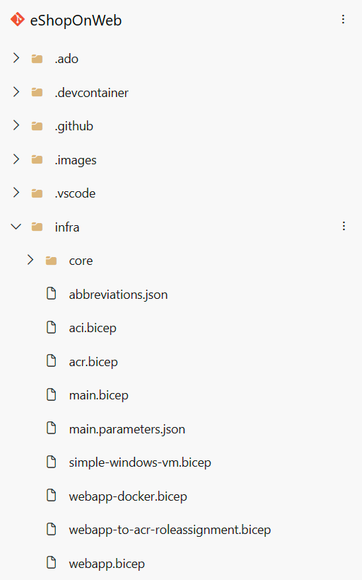
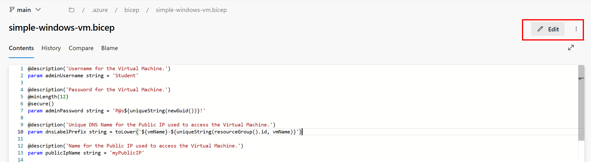
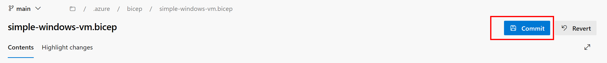
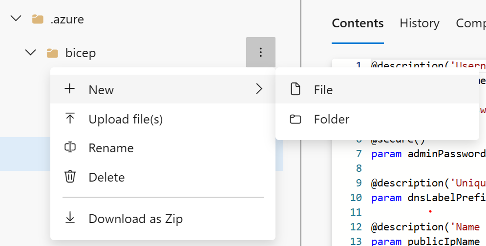
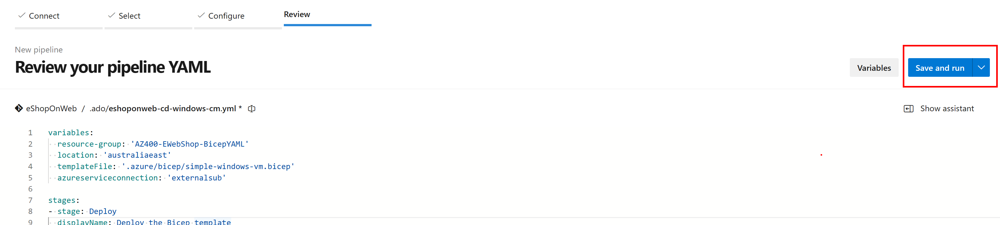
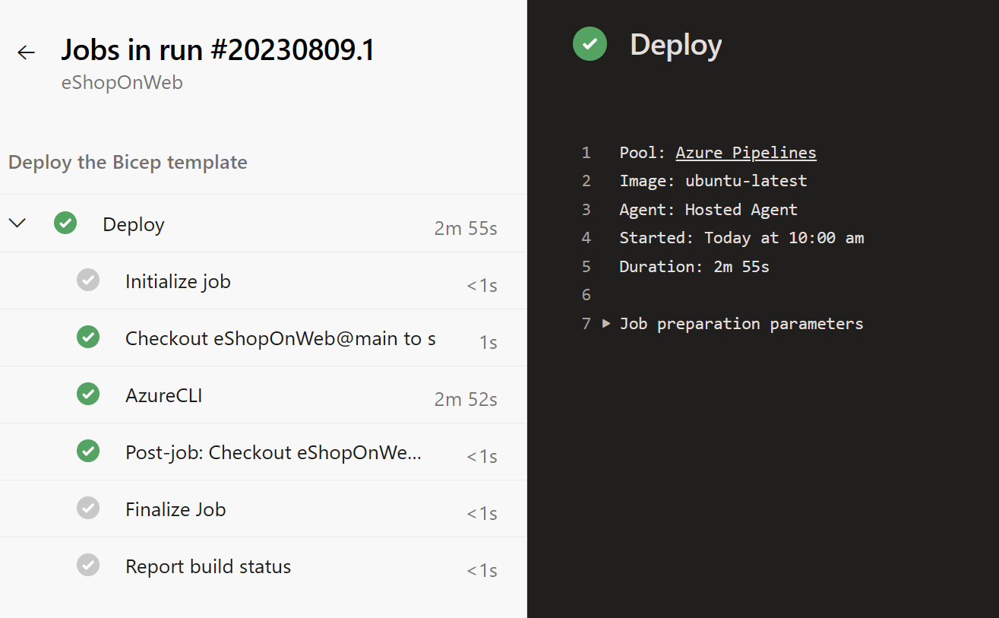

---
lab:
  title: "Deployments using Azure Bicep templates"
  module: "Module 05: Manage infrastructure as code using Azure and DSC"
---

# Deployments using Azure Bicep templates

## Lab requirements

- This lab requires **Microsoft Edge** or an [Azure DevOps supported browser.](https://docs.microsoft.com/azure/devops/server/compatibility)

- **Set up an Azure DevOps organization:** If you don't already have an Azure DevOps organization that you can use for this lab, create one by following the instructions available at [Create an organization or project collection](https://docs.microsoft.com/azure/devops/organizations/accounts/create-organization).

- Identify an existing Azure subscription or create a new one.

- Verify that you have a Microsoft account or a Microsoft Entra account with the Owner role in the Azure subscription and the Global Administrator role in the Microsoft Entra tenant associated with the Azure subscription. For details, refer to [List Azure role assignments using the Azure portal](https://docs.microsoft.com/azure/role-based-access-control/role-assignments-list-portal) and [View and assign administrator roles in Azure Active Directory](https://docs.microsoft.com/azure/active-directory/roles/manage-roles-portal).

## Lab overview

In this lab, you'll create an Azure Bicep template and modularize it using the Azure Bicep Modules concept. You'll then modify the main deployment template to use the module and finally deploy all the resources to Azure.

## Objectives

After you complete this lab, you will be able to:

- Understand an Azure Bicep template's structure.
- Create a reusable Bicep module.
- Modify the main template to use the module
- Deploy all the resources to Azure using Azure YAML pipelines.

## Estimated timing: 45 minutes

## Instructions

### Exercise 0: (skip if done) Configure the lab prerequisites

In this exercise, you will set up the prerequisites for the lab, which consist of a new Azure DevOps project with a repository based on the [eShopOnWeb](https://github.com/MicrosoftLearning/eShopOnWeb).

#### Task 1: (skip if done) Create and configure the team project

In this task, you will create an **eShopOnWeb** Azure DevOps project to be used by several labs.

1. On your lab computer, in a browser window open your Azure DevOps organization. Click on **New Project**. Give your project the name **eShopOnWeb** and leave the other fields with defaults. Click on **Create**.

    

#### Task 2: (skip if done) Import eShopOnWeb Git Repository

In this task you will import the eShopOnWeb Git repository that will be used by several labs.

1. On your lab computer, in a browser window open your Azure DevOps organization and the previously created **eShopOnWeb** project. Click on **Repos > Files** , **Import a Repository**. Select **Import**. On the **Import a Git Repository** window, paste the following URL <https://github.com/MicrosoftLearning/eShopOnWeb.git>  and click **Import**:

    

1. The repository is organized the following way:
    - **.ado** folder contains Azure DevOps YAML pipelines.
    - **.devcontainer** folder container setup to develop using containers (either locally in VS Code or GitHub Codespaces).
    - **infra** folder contains Bicep&ARM infrastructure as code templates used in some lab scenarios.
    - **.github** folder container YAML GitHub workflow definitions.
    - **src** folder contains the .NET 8 website used on the lab scenarios.

#### Task 3: (skip if done) Set main branch as default branch

1. Go to **Repos > Branches**.
1. Hover on the **main** branch then click the ellipsis on the right of the column.
1. Click on **Set as default branch**.

### Exercise 1: Understand an Azure Bicep template and simplify it using a reusable module

In this lab, you will review an Azure Bicep template and simplify it using a reusable module.

#### Task 1: Create Azure Bicep template

In this task, you will use Visual Studio Code to create an Azure Bicep template

1. In the browser tab you have your Azure DevOps project open, navigate to **Repos** and **Files**. Open the `infra` folder and find the `simple-windows-vm.bicep` file.

   

1. Review the template to get a better understanding of its structure. There are some parameters with types, default values and validation, some variables, and quite a few resources with these types:

   - Microsoft.Storage/storageAccounts
   - Microsoft.Network/publicIPAddresses
   - Microsoft.Network/virtualNetworks
   - Microsoft.Network/networkInterfaces
   - Microsoft.Compute/virtualMachines

1. Pay attention to how simple the resource definitions are and the ability to implicitly reference symbolic names instead of explicit `dependsOn` throughout the template.

#### Task 2: Create a bicep module for storage resources

In this task, you will create a storage template module **storage.bicep** which will create a storage account only and will be imported by the main template. The storage template module needs to pass a value back to the main template, **main.bicep**, and this value will be defined in the outputs element of the storage template module.

1. First we need to remove the storage resource from our main template. From the top right corner of your browser window click the **Edit** button:

   

1. Now delete the storage resource:

   ```bicep
   resource storageAccount 'Microsoft.Storage/storageAccounts@2022-05-01' = {
     name: storageAccountName
     location: location
     sku: {
       name: 'Standard_LRS'
     }
     kind: 'Storage'
   }
   ```

1. Commit the file, however, we're not done with it yet.

   

1. Next, hover your mouse over the `Infra` folder and click the ellipsis icon, then select **New**, and **File**. Enter **`storage.bicep`** for the name and click **Create**.

   

1. Now copy the following code snippet into the file and commit your changes:

   ```bicep
   @description('Location for all resources.')
   param location string = resourceGroup().location

   @description('Name for the storage account.')
   param storageAccountName string

   resource storageAccount 'Microsoft.Storage/storageAccounts@2022-05-01' = {
     name: storageAccountName
     location: location
     sku: {
       name: 'Standard_LRS'
     }
     kind: 'Storage'
   }

   output storageURI string = storageAccount.properties.primaryEndpoints.blob
   ```

#### Task 3: Modify the main template to use the template module

In this task, you will modify the main template to reference the template module you created in the previous task.

1. Navigate back to the `simple-windows-vm.bicep` file and click on the **Edit** button once again.

1. Next, add the following code after the variables:

   ```bicep
   module storageModule './storage.bicep' = {
     name: 'linkedTemplate'
     params: {
       location: location
       storageAccountName: storageAccountName
     }
   }
   ```

1. We also need to modify the reference to the storage account blob URI in our virtual machine resource to use the output of the module instead. Find the virtual machine resource and replace the diagnosticsProfile section with the following:

   ```bicep
   diagnosticsProfile: {
     bootDiagnostics: {
       enabled: true
       storageUri: storageModule.outputs.storageURI
     }
   }
   ```

1. Review the following details in the main template:

   - A module in the main template is used to link to another template.
   - The module has a symbolic name called `storageModule`. This name is used for configuring any dependencies.
   - You can only use **Incremental** deployment mode when using template modules.
   - A relative path is used for your template module.
   - Use parameters to pass values from the main template to the template modules.

1. Commit the template.

### Exercise 2: Deploying the templates to Azure using YAML pipelines

In this lab, you will use an Azure DevOps YAML pipeline to deploy your template to your Azure environment.

#### Task 1: Deploy resources to Azure by YAML pipelines

1. Navigate back to the **Pipelines** pane in of the **Pipelines** hub.
1. In the **Create your first Pipeline** window, click **Create pipeline**.

    > **Note**: We will use the wizard to create a new YAML Pipeline definition based on our project.

1. On the **Where is your code?** pane, click **Azure Repos Git (YAML)** option.
1. On the **Select a repository** pane, click **eShopOnWeb**.
1. On the **Configure your pipeline** pane, scroll down and select **Existing Azure Pipelines YAML File**.
1. In the **Selecting an existing YAML File** blade, specify the following parameters:
   - Branch: **main**
   - Path: **.ado/eshoponweb-cd-windows-cm.yml**
1. Click **Continue** to save these settings.
1. In the variables section, choose a name for your resource group, set the desired location and replace the value of the service connection with one of your existing service connections you created earlier.
1. Click the **Save and run** button from the top right corder and when the commit dialog appeared, click **Save and run** again.

   

1. Wait for the deployment to finish and review the results.
   

   > [!IMPORTANT]
   > Remember to delete the resources created in the Azure portal to avoid unnecessary charges.

## Review

In this lab, you learned how to create an Azure Bicep template, modularize it by using a template module, modify the main deployment template to use the module and updated dependencies, and finally deploy the templates to Azure using YAML pipelines.
