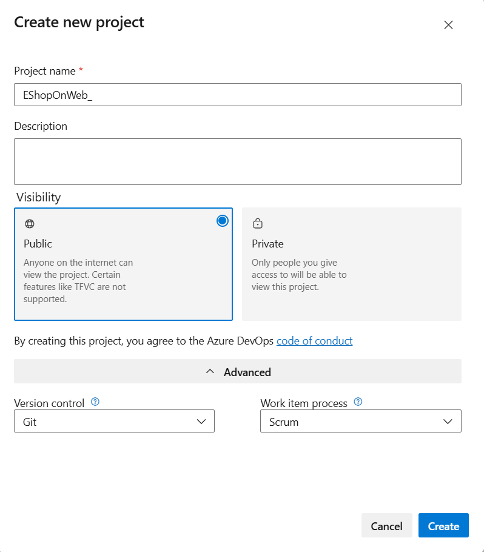

---
lab:
    title: 'Lab 07: Integrating Azure Key Vault with Azure DevOps'
    module: 'Module 7: Managing Application Configuration and Secrets'
---

# Lab 07: Integrating Azure Key Vault with Azure DevOps
# Student lab manual

## Lab overview

Azure Key Vault provides secure storage and management of sensitive data, such as keys, passwords, and certificates. Azure Key Vault includes supports for hardware security modules, as well as a range of encryption algorithms and key lengths. By using Azure Key Vault, you can minimize the possibility of disclosing sensitive data through source code, which is a common mistake made by developers. Access to Azure Key Vault requires proper authentication and authorization, supporting fine grained permissions to its content.

In this lab, you will see how you can integrate Azure Key Vault with an Azure DevOps pipeline by using the following steps:

- create an Azure Key vault to store a MySQL server password as a secret.
- create an Azure service principal to provide access to secrets in the Azure Key vault.
- configure permissions to allow the service principal to read the secret.
- configure pipeline to retrieve the password from the Azure Key vault and pass it on to subsequent tasks.

## Objectives

After you complete this lab, you will be able to:

-   Create an Azure Active Directory (Azure AD) service principal.
-   Create an Azure key vault. 
-   Track pull requests through the Azure DevOps pipeline.

## Lab duration

-   Estimated time: **40 minutes**

## Instructions

### Before you start

#### Sign in to the lab virtual machine

Ensure that you're signed in to your Windows 10 virtual machine by using the following credentials:
    
-   Username: **Student**
-   Password: **Pa55w.rd**

#### Review applications required for this lab

Identify the applications that you'll use in this lab:
    
-   Microsoft Edge

#### Prepare an Azure subscription

-   Identify an existing Azure subscription or create a new one.
-   Verify that you have a Microsoft account or an Azure AD account with the Owner role in the Azure subscription and the Global Administrator role in the Azure AD tenant associated with the Azure subscription. For details, refer to [List Azure role assignments using the Azure portal](https://docs.microsoft.com/en-us/azure/role-based-access-control/role-assignments-list-portal) and [View and assign administrator roles in Azure Active Directory](https://docs.microsoft.com/en-us/azure/active-directory/roles/manage-roles-portal#view-my-roles).

#### Set up an Azure DevOps organization

If you don't already have an Azure DevOps organization that you can use for this lab, create one by following the instructions available at [Create an organization or project collection](https://docs.microsoft.com/en-us/azure/devops/organizations/accounts/create-organization?view=azure-devops).

### Exercise 0: Configure the lab prerequisites

In this exercise, you will set up the prerequisites for the lab, which consist of a new Azure DevOps project with a repository based on the [eShopOnWeb](https://dev.azure.com/unhueteb/_git/eshopweb-az400).

#### Task 1: (skip if done) Create and configure the team project

In this task, you will create an **eShopOnWeb** Azure DevOps project to be used by several labs.

1.  On your lab computer, in a browser window open your Azure DevOps organization. Click on **New Project**. Give your project the name **eShopOnWeb** and leave the other fields with defaults. Click on **Create**.

    

#### Task 2: (skip if done) Import eShopOnWeb Git Repository

In this task you will import the eShopOnWeb Git repository that will be used by several labs.

1.  On your lab computer, in a browser window open your Azure DevOps organization and the previoulsy created **eShopOnWeb** project. Click on **Repos>Files** , **Import**. On the **Import a Git Repository** window, paste the following URL https://github.com/MicrosoftLearning/eShopOnWeb.git  and click **Import**: 

    

1.  The repository is organized the following way:
    - **.ado** folder contains Azure DevOps YAML pipelines
    - **.devcontainer** folder container setup to develop using containers (either locally in VS Code or GitHub Codespaces)
    - **.azure** folder contains Bicep&ARM infrastructure as code templates used in some lab scenarios.
    - **.github** folder container YAML GitHub workflow definitions.
    - **src** folder contains the .NET 6 website used on the lab scenarios.

### Exercise 1: Setup CI pipeline to build eShopOnWeb container 

Setup CI YAML pipeline for:
-  Create an Azure Container Registry to keep the container images
- Use Docker Compose to build and push **eshoppublicapi** and **eshopwebmvc** container images.

#### Task 1: (skip if done) Create a service principal 

In this task, you will create a service principal by using the Azure CLI, which will allow Azure DevOps to:
- Deploy resources on your azure subscription
- Have read access on the later created Key Vault secrets.

> **Note**: If you do already have a service principal, you can proceed directly to the next task.

You will need a service principal to deploy  Azure resources from Azure Pipelines. Since we are going to retrieve secrets in a pipeline, we will need to grant permission to the service when we create the Azure Key vault. 

A service principal is automatically created by Azure Pipeline when you connect to an Azure subscription from inside a pipeline definition or when you create a new service connection from the project settings page (automatic option). You can also manually create the service principal from the portal or using Azure CLI and re-use it across projects. 

1.  From the lab computer, start a web browser, navigate to the [**Azure Portal**](https://portal.azure.com), and sign in with the user account that has the Owner role in the Azure subscription you will be using in this lab and has the role of the Global Administrator in the Azure AD tenant associated with this subscription.
1.  In the Azure portal, click the **Cloud Shell** icon, located directly to the right of the search textbox at the top of the page. 
1.  If prompted to select either **Bash** or **PowerShell**, select **Bash**. 

   >**Note**: If this is the first time you are starting **Cloud Shell** and you are presented with the **You have no storage mounted** message, select the subscription you are using in this lab, and select **Create storage**. 

1.  From the **Bash** prompt, in the **Cloud Shell** pane, run the following commands to retrieve the values of the Azure subscription ID and subscription name attributes: 

    ```
    az account show --query id --output tsv
    az account show --query name --output tsv
    ```

    > **Note**: Copy both values to a text file. You will need them later in this lab.

1.  From the **Bash** prompt, in the **Cloud Shell** pane, run the following command to create a service principal (replace the **myServicePrincipalName** with any unique string of characters consisting of letters and digits) and **mySubscriptionID** with your Azure subscriptionId :

    ```
    az ad sp create-for-rbac --name myServicePrincipalName \
                         --role contributor \
                         --scopes /subscriptions/mySubscriptionID
    ```

    > **Note**: The command will generate a JSON output. Copy the output to text file. You will need it later in this lab.

1. Next, from the lab computer, start a web browser, navigate to the Azure DevOps **eShopOnWeb** project. Click on **Project Settings>Service Connections (under Pipelines)** and **New Service Connection**.

    

1. On the **New service connection** blade, select **Azure Resource Manager** and **Next** (may need to scroll down).

1. The choose **Service principal (manual)** and click on **Next**.

1. Fill in the empty fields using the information gathered during previous steps:
    - Subscription Id and Name
    - Service Principal Id (or clientId), Key (or Password) and TenantId.
    - In **Service connection name** type **azure subs**. This name will be referenced in YAML pipelines when needing an Azure DevOps Service Connection to communicate with your Azure subscription. 

    

1. Click on **Verify and Save**.

#### Task 2: Setup and Run CI pipeline

In this task, you will import an existing CI YAML pipeline definition, modify and run it. It will create a new Azure Container Registry (ACR) and build/publish the eShopOnWeb container images.

From the lab computer, start a web browser, navigate to the Azure DevOps **eShopOnWeb** project. Go to **Pipelines>Pipelines** and click on **Create Pipeline**.

1.  On the **Where is your code?** window, select **Azure Repos Git (YAML)** and select the **eShopOnWeb** repository.

1.  On the **Configure** section, choose **Existing Azure Pipelines YAML file**. Provide the following path **/.ado/main-ci-containers-compose.yml** and click **Continue**.

    

1. In the YAML pipeline definition, customize your Resource Group name by replacing **NAME** on **att-az400-ewebshop-NAME** and replace **YOUR-SUBSCRIPTION-ID** with the your own Azure subscriptionId. 

1. Click on **Save and Run** and wait for the pipeline to execute succesfully.

    > **Note**: The build may take a few minutes to complete. The build definition consists of the following tasks:
    - **AzureResourceManagerTemplateDeployment** uses **bicep** to deploy an Azure Container Registry.
    - **PowerShell** task take the bicep output (acr login server) and creates pipeline variable.
    - **DockerCompose** task builds and pushes the container images for eShopOnWeb.

1. Once the execution is finished, on the Azure Portal and defined Resource Group, you should find an Azure Container Registry with the created container images **eshoppublicapi** and **eshopwebmvc**. You will only use **eshopwebmvc** on the deploy phase.

    


#### Task 2: Create an Azure Key vault

In this task, you will create an Azure Key vault by using the Azure portal.

For this lab scenario, we have an app that connects to a MySQL database. We intend to store the password for the MySQL database as a secret in the key vault.

1.  In the Azure portal, in the **Search resources, services, and docs** text box, type **Key vaults** and press the **Enter** key. 
1.  On the **Key vaults** blade, click **+ Create**. 
1.  On the **Basics** tab of the **Create key vault** blade, specify the following settings and click **Next: Access policy**:

    | Setting | Value |
    | --- | --- |
    | Subscription | the name of the Azure subscription you are using in this lab |
    | Resource group | the name of a new resource group **az400m07l01-RG** |
    | Key vault name | any unique valid name |
    | Region | an Azure region close to the location of your lab environment |
    | Pricing tier | **Standard** |
    | Days to retain deleted vaults | **7** |
    | Purge protection | **Disable purge protection** |

1.  On the **Access policy** tab of the **Create key vault** blade, click **+ Add Access Policy** to setup a new policy.

    > **Note**: You need to secure access to your key vaults by allowing only authorized applications and users. To access the data from the vault, you will need to provide read (Get) permissions to the service principal that you will be using for authentication in the pipeline. 

1.  On the **Add access policy** blade, click the **None selected** link directly under the **Select principal** label. 
1.  On the **Principal** blade, search for the security principal that you created in the previous exercise, select it, and then click **Select**. 

    > **Note**: You can search by name or ID of the principal.

1.  Back on the **Add access policy** blade, in the **Secret permissions** drop down list, select checkboxes next to the **Get** and **List** permissions and then click **Add**. 
1.  Back on the **Access policy** tab of the **Create key vault** blade, click **Review + create** and, on the **Review + create** blade, click **Create**. 

    > **Note**: Wait for the Azure Key vault to be provisioned. This should take less than 1 minute.

1.  On the **Your deployment is complete** blade, click **Go to resource**.
1.  On the Azure Key vault blade, in the vertical menu on the left side of the blade, in the **Settings** section, click **Secrets**. 
1.  On the **Secrets** blade, click **Generate/Import**.
1.  On the **Create a secret** blade, specify the following settings and click **Create** (leave others with their default values):

    | Setting | Value |
    | --- | --- |
    | Upload options | **Manual** |
    | Name | **sqldbpassword** |
    | Value | any valid MySQL password value |


#### Task 3: Check the Azure Pipeline

In this task, you will configure the Azure Pipeline to retrieve the secret from the Azure Key vault.

1.  On your lab computer, start a web browser and navigate to the Azure DevOps project **Integrating Azure Key Vault with Azure DevOps** you created in the previous exercise.
1.  In the vertical navigational pane of the of the Azure DevOps portal, select **Pipelines** and verify that the **Pipelines** pane is displayed.
1.  On the **Pipelines** pane, click the entry representing the **SmartHotel-CouponManagement-CI** pipeline. Click on **Edit**.
2.   On the pipeline definition, make sure  the **Pipeline** > **Agent Specification** is **ubuntu 18.04**. Click **Save and Queue** > **Queue** > **Run** to trigger a build.
3.  In the vertical navigational pane of the of the Azure DevOps portal, in the **Pipelines** section, select **Releases**. 
4.  On the **SmartHotel-CouponManagement-CD** pane, click **Edit** in the upper right corner.
5.  On the **All pipelines > SmartHotel-CouponManagement-CD** pane, select the **Task** tab and, in the dropdown menu, select **Dev**.

    > **Note**: The release definition for **Dev** stage has an **Azure Key Vault** task. This task downloads *Secrets* from an Azure Key Vault. You will need to point to the subscription and the Azure Key Vault resource created earlier in the lab.

    > **Note**: You need to authorize the pipeline to deploy to Azure. Azure pipelines can automatically create a service connection with a new service principal, **but we want to use the one we created earlier**, as it has been authorized to read the secret. 

1.  Select **Run on agent** and modify **Agent pool** field to **Azure Pipelines** and agent specification **ubuntu 18.04**.
1.  Select the **Azure Key Vault** task and, on the right side, in the **Azure Key Vault** task properties, next to the **Azure subscription** label, click **Manage**. 
This will open another browser tab displaying the **Service connections** pane in the Azure DevOps portal.
1.  On the **Service connections** pane, click **New Service connection**. 
1.  On the **New service connection** pane, select the **Azure Resource Manager** option, click **Next**, select **Service Principal (manual)**, and click **Next** again.
1.  On the **New service connection** pane, specify the following settings, using the information you copied to a text file in the first task of this exercise following creation of the service principal by using Azure CLI:

    - Subscription Id: the value you obtained by running `az account show --query id --output tsv`
    - Subscription Name: the value you obtained by running `az account show --query name --output tsv`
    - Service Principal Id: the value labeled **appId** in the output generated by running `az ad sp create-for-rbac --name <service-principal-name>`
    - Service Principal key: the value labeled **password** in the output generated by running `az ad sp create-for-rbac --name <service-principal-name>`
    - TenantId: the value labeled **tenant** in the output generated by running `az ad sp create-for-rbac --name <service-principal-name>`

1.  On the **New service connection** pane, click **Verify** to determine whether the information you provided is valid. 
1.  Once you receive the **Verification Succeeded** response, in the **Service connection name** textbox, type **kv-service-connection** and click **Verify and Save**.
1.  Switch back to the web browser  tab displaying the pipeline definition and the **Azure Key Vault** task.
1.  With the **Azure Key Vault** task selected, on the **Azure Key Vault** pane, click the **Refresh** button, in the **Azure subscription** dropdown list, select the  **kv-service-connection** entry, in the **Key vault** dropdown list, select the entry representing the Azure Key vault you created in the first task, and, in the **Secrets filter** textbox, type **sqldbpassword**. Finally, expand the **Output Variables** section and, in the **Reference name** textbox, type **sqldbpassword**. 

    > **Note**: At runtime, Azure Pipelines will fetch the latest value of the secret and set it as the task variable **$(sqldbpassword)**. The tasks can consumed by the subsequent tasks by referencing that variable.  

1.  To verify this, select the next task, **Azure Deployment**, which deploys an ARM template and review the content of the **Override template parameters** textbox. 

    ```
    -webAppName $(webappName) -mySQLAdminLoginName "azureuser" -mySQLAdminLoginPassword $(sqldbpassword)
    ```

    > **Note**: The **Override template parameters** content references the **sqldbpassword** variable to set the mySQL admin password. This will provision the MySQL database defined in the ARM template using the password that you have specified in the key vault. 

1.  You may complete the pipeline definition by specifying the subscription (if new subscription is used in the project, click on **Authorize** )and location for the task. **Repeat** the same for the last task in the pipeline **Azure App Service Deploy** (choose the subscription from the **Available Azure service connection** section in the dropdown). 

    > **Note**: In the Azure subscription dropdown list, you will see **Available Azure service connections** for those susbcriptions that have already been authorized to be connected to Azure. If you select the authorized subscription again (from **Available Azure subscriptions** list) and try to **Authorize**, the process will fail.

1.  On the **Variables** tab, change the **resourcegroup** variable to plain text (click on lock) and write **az400m07l01-RG** in the value field.
1.  Finally, **Save** and click on **Create a new release** > **Create** (leave defaults) to start the deployment.

1. Make sure your pipeline runs successfully and once finished, review the created resources by opening the resource group **az400m07l01-RG** in the Azure Portal . Open the **App Service** and browse it **(Overview -> Browse)**, to see the published website.

### Exercise 2: Remove the Azure lab resources

In this exercise, you will remove the Azure resources provisione in this lab to eliminate unexpected charges. 

>**Note**: Remember to remove any newly created Azure resources that you no longer use. Removing unused resources ensures you will not see unexpected charges.

#### Task 1: Remove the Azure lab resources

In this task, you will use Azure Cloud Shell to remove the Azure resources provisioned in this lab to eliminate unnecessary charges. 

1.  In the Azure portal, open the **Bash** shell session within the **Cloud Shell** pane.
1.  List all resource groups created throughout the labs of this module by running the following command:

    ```sh
    az group list --query "[?starts_with(name,'az400m07l01-RG')].name" --output tsv
    ```

1.  Delete all resource groups you created throughout the labs of this module by running the following command:

    ```sh
    az group list --query "[?starts_with(name,'az400m07l01-RG')].[name]" --output tsv | xargs -L1 bash -c 'az group delete --name $0 --no-wait --yes'
    ```

    >**Note**: The command executes asynchronously (as determined by the --nowait parameter), so while you will be able to run another Azure CLI command immediately afterwards within the same Bash session, it will take a few minutes before the resource groups are actually removed.

#### Review

In this lab, you integrated Azure Key Vault with an Azure DevOps pipeline by using the following steps:

- created an Azure Key vault to store a MySQL server password as a secret.
- created an Azure service principal to provide access to secrets in the Azure Key vault.
- configured permissions to allow the service principal to read the secret.
- configured pipeline to retrieve the password from the Azure Key vault and pass it on to subsequent tasks.
