---
lab:
    title: 'Managing technical debt with SonarCloud and Azure DevOps'
    module: 'Module 07: Implement security and validate code bases for compliance'
---

# Managing technical debt with SonarCloud and Azure DevOps

## Student lab manual

## Lab requirements

- This lab requires **Microsoft Edge** or an [Azure DevOps supported browser.](https://docs.microsoft.com/azure/devops/server/compatibility)

- **Set up an Azure DevOps organization:** If you don't already have an Azure DevOps organization that you can use for this lab, create one by following the instructions available at [Create an organization or project collection](https://docs.microsoft.com/azure/devops/organizations/accounts/create-organization).

## Lab overview

In the context of Azure DevOps, the term **technical debt** represents suboptimal means of reaching tactical goals, which negatively affects the ability to achieve strategic objectives in software development and deployment. Technical debt affects productivity by making code hard to understand, prone to failures, time-consuming to change, and difficult to validate. Without proper oversight and management, technical debt can accumulate over time and significantly impact the overall quality of the software and the productivity of development teams in the longer term.

[SonarCloud](https://sonarcloud.io/){:target="\_blank"} is a cloud-based code quality and security service. The main features of SonarCloud include:

- Support for 23 programming and scripting languages, including Java, JS, C#, C/C++, Objective-C, TypeScript, Python, ABAP, PLSQL, and T-SQL.
- There are thousands of rules to track down hard-to-find bugs and quality issues based on powerful static code analyzers.
- Cloud-based integrations with popular CI services, including Travis, Azure DevOps, BitBucket, and AppVeyor.
- Deep code analysis for exploring all source files in branches and pull requests, helping reach a green Quality Gate and promote the build.
- Speed and scalability.

In this lab, you'll learn how to integrate Azure DevOps with SonarCloud.

> **Note**: Before you run this lab, ensure that you have the ability to run Azure Pipelines. Due to the change to public projects that took place in February 2021, access to pipelines will need to be requested: <https://devblogs.microsoft.com/devops/change-in-azure-pipelines-grant-for-public-projects/>

## Objectives

After you complete this lab, you will be able to:

- Set up an Azure DevOps project and CI build to integrate with SonarCloud.
- Analyze SonarCloud reports.
- Integrate static analysis into the Azure DevOps pull request process.

## Estimated timing: 60 minutes

## Instructions

### Exercise 0: Configure the lab prerequisites

In this exercise, you will set up the prerequisites for the lab, which consist of a new Azure DevOps project with a repository based on the [eShopOnWeb](https://github.com/MicrosoftLearning/eShopOnWeb).

#### Task 1: (skip if done) Create and configure the team project

In this task, you will create an **eShopOnWeb** Azure DevOps project to be used by several labs.

1. On your lab computer, in a browser window open your Azure DevOps organization. Click on **New Project**. Give your project the name **eShopOnWeb** and choose **Scrum** on the **Work Item process** dropdown. Click on **Create**.

    

#### Task 2: (skip if done) Import eShopOnWeb Git Repository

In this task you will import the eShopOnWeb Git repository that will be used by several labs.

1. On your lab computer, in a browser window open your Azure DevOps organization and the previously created **eShopOnWeb** project. Click on **Repos>Files** , **Import**. On the **Import a Git Repository** window, paste the following URL https://github.com/MicrosoftLearning/eShopOnWeb.git  and click on **Import**:

    

2. The repository is organized the following way:
    - **.ado** folder contains Azure DevOps YAML pipelines.
    - **.devcontainer** folder container setup to develop using containers (either locally in VS Code or GitHub Codespaces).
    - **.azure** folder contains Bicep&ARM infrastructure as code templates used in some lab scenarios.
    - **.github** folder container YAML GitHub workflow definitions.
    - **src** folder contains the .NET 6 website used on the lab scenarios.

### Exercise 1: Configure Sonarcloud Setup

#### Task 1: Change your Azure DevOps Project to Public

In this task you will change the visibility of your Azure DevOps project to public, as Sonarcloud is free for public ADO projects.

1. On the lab computer, in the web browser window displaying the Azure DevOps portal, open your **eShopOnWeb** project, and click on **Project Settings** (bottom left corner). Change **Visibility** to **Public**. Click **Save**

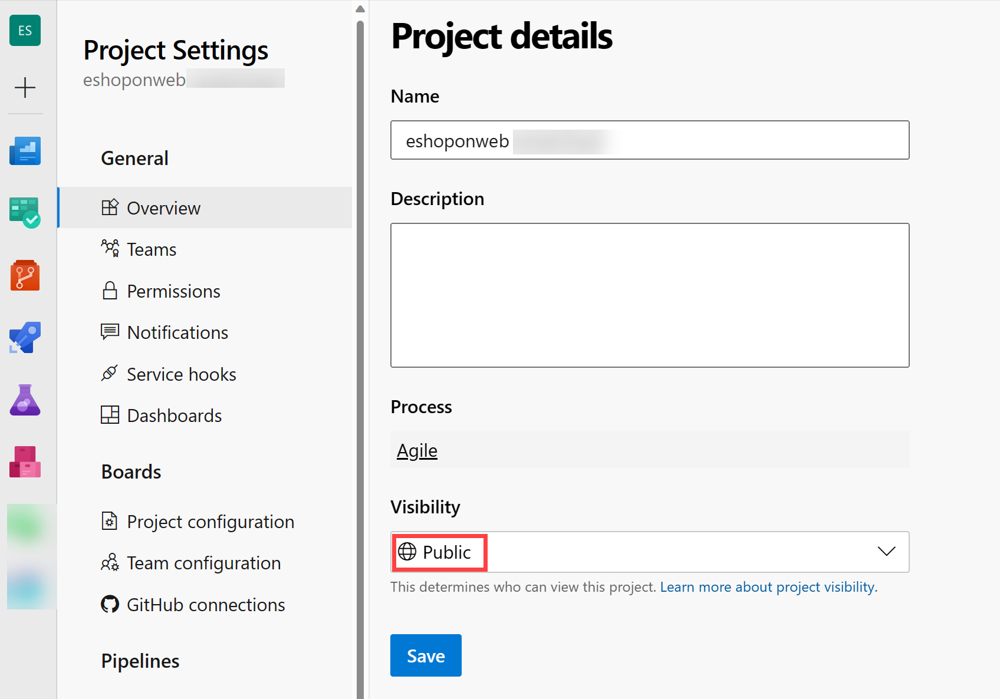

#### Task 2: Generate an Azure DevOps personal access token

In this task, you will generate an Azure DevOps personal access token that will be used to authenticate from the Postman app you will install in the next task of this exercise.

1. On the lab computer, in the web browser window displaying the Azure DevOps portal, in the upper right corner of the Azure DevOps page, click the **User settings** icon, in the dropdown menu, click **Personal access tokens**, on the **Personal Access Tokens** pane, and click **+ New Token**.

    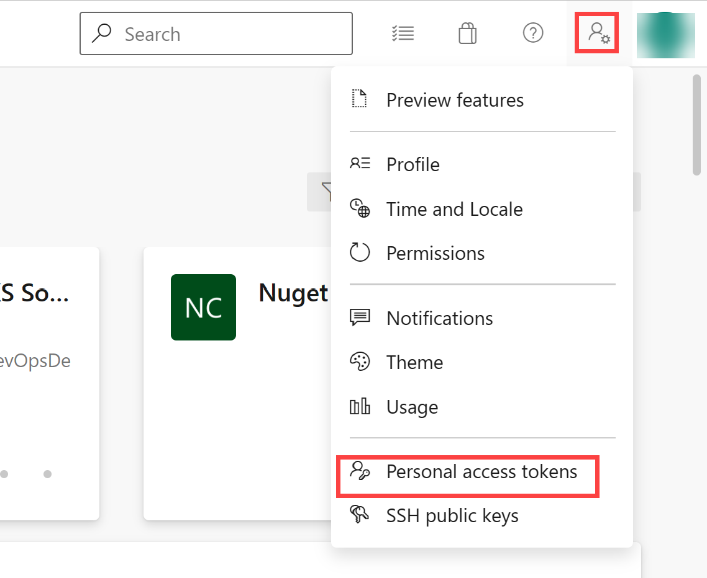

2. On the **Create a new personal access token** pane, click the **Show all scopes** link and, specify the following settings and click **Create** (leave all others with their default values):

     | Setting | Value |
     | --- | --- |
     | Name | **Managing technical debt with SonarCloud and Azure DevOps lab** |
     | Scopes | **Custom defined** |
     | Scope | **Code** |
     | Permissions | **Full** |

3. On the **Success** pane, copy the value of the personal access token to Clipboard.

     > **Note**: Make sure you record the value of the token. You will not be able to retrieve it once you close this pane.

4. On the **Success** pane, click **Close**.

#### Task 3: Install and configure the SonarCloud Azure DevOps extension

In this task, you will install and configure the SonarCloud Azure DevOps extension in your Azure DevOps project.

1. On your lab computer, start a web browser, navigate to the [SonarCloud extension page](https://marketplace.visualstudio.com/items?itemName=SonarSource.sonarcloud) on the Visual Studio Marketplace, click **Get it free**, ensure that the name of your Azure DevOps organization appears in the **Select an Azure Devops organization** dropdown list, and click **Install**.
2. Once the installation completes, click **Proceed to organization**. This will redirect the browser to the Azure DevOps portal displaying your organization's home page.

    > **Note**: If you do not have the appropriate permissions to install an extension from the marketplace, a request will be sent to the account administrator to ask them to approve the installation.

    > **Note**: The SonarCloud extension contains build tasks, build templates and a custom dashboard widget.

3. In the web browser window, navigate to the **SonarCloud home page** [https://sonarcloud.io/](https://sonarcloud.io/).
4. On the SonarCloud home page, click **Log in**.
5. On the **Log in or Sign up to SonarCloud**, click **Azure DevOps** option.
6. If prompted whether to **Let this app access your info?**, click **Yes**. If prompted, select **Consent of behalf of your organization** and **Accept**.

    > **Note**: In SonarCloud, you will create an organization and, within it, a new project. The organization and project you set up in SonarCloud will mirror the organization and project that you set up in Azure DevOps.

7. Click **Import an organization from Azure**.

    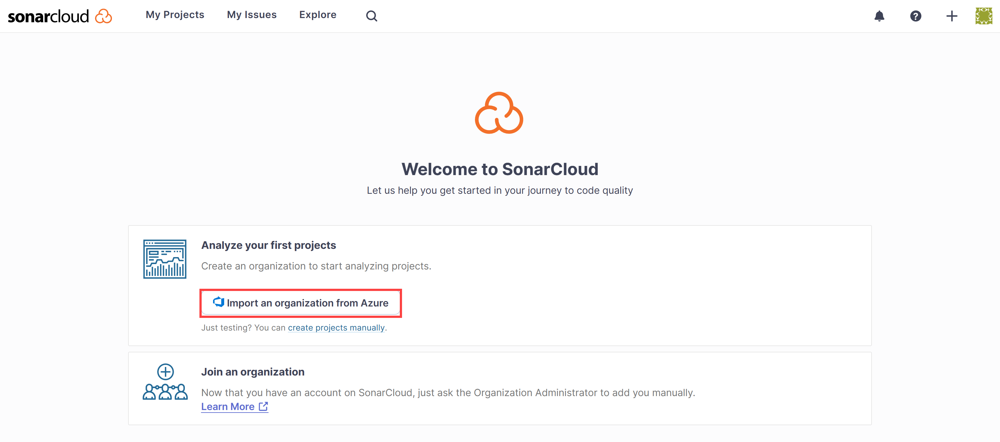

8. On the **Create an organization** page, in the **Azure DevOps organization name** textbox, type the name of your Azure DevOps organization, in the **Personal Access Token** textbox, paste the value of the Azure DevOps token you recorded in the previous task, and click **Continue**. **This token will be used by Sonarcloud to analyze your code hosted in Azure DevOps**

9. In the **Import organization details** section, in the **Key** textbox, type a string of characters that will designate your Sonarcloud organization, give it the same name as your Azure DevOps organization and click **Continue**.

    > **Note**: The key must be unique within the SonarCloud system. Make sure that the green checkmark appears to the right of the **Key** textbox. This indicates that the key satisfies the uniqueness prerequisite.

10. In the **Choose a plan** section, select the plan that you intend to use for this lab (**free** suggested) and click **Create Organization**.

    > **Note**: You have now created the SonarCloud organization that mirrors your Azure DevOps organization.

    > **Note**: Next, within the newly created organization, you will create a SonarCloud project that will mirror the Azure DevOps project **SonarExamples**.

11. On the **Analyze projects - Select repositories** page, in the list of Azure DevOps projects, select the checkbox next to the **eshoponweb / eshoponweb ** entry and click **Set up**.
12. On the **Choose your Analysis Method** page, click **With Azure DevOps Pipelines** tile.

    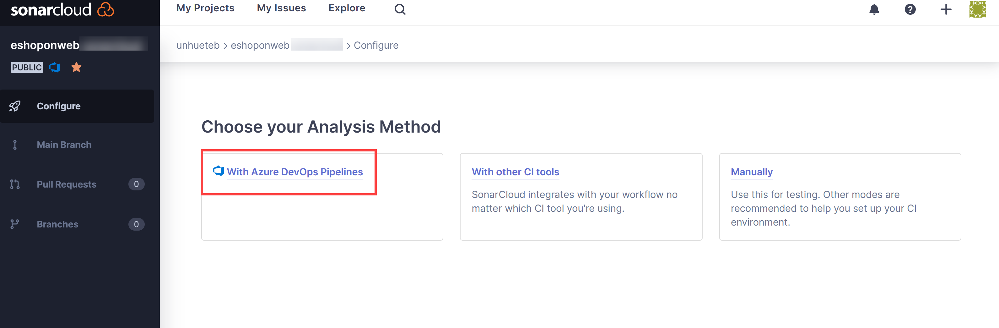

    > **Note**: You can skip extension creation if you have already installed it.

13. On the **Analyze a project with Azure Pipelines** page, on the **Add a new Sonarcloud Service Endpoint**, follow the steps mentioned **on your Azure DevOps project**, give the name **SonarSC** to the service connection, **check** the box for granting access to all pipelines and click **Verify and save**.

    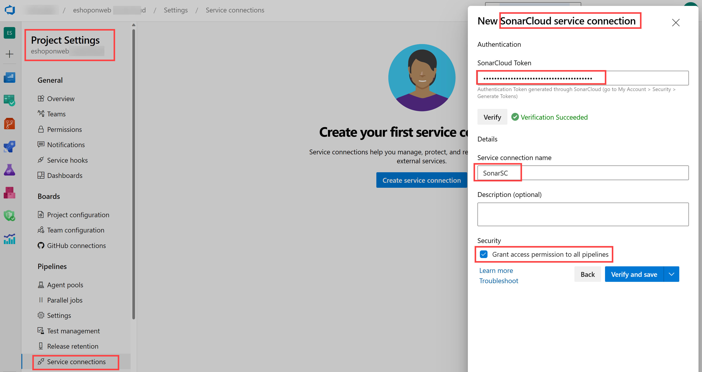

    > **Note**: This step defines how your Azure Pipeline will communicate with Sonarcloud. Sonarcloud gives you a token that is used by your pipelines to talk to the service.

14. On your lab computer, from the **eShopOnWeb** Azure DevOps project, in the vertical menu bar on the left side, navigate to the **Pipelines>Pipelines** section, click **Create Pipeline** (or **New Pipeline**).

15. On the **Where is your code?** window, select **Azure Repos Git (YAML)** and select the **eShopOnWeb** repository.

16. On the **Configure** section, choose **Existing Azure Pipelines YAML file**. Provide the following path **/.ado/eshoponweb-sonar-ci.yml** and click **Continue**. Review the pipeline with details mentioned in next step **(some settings should be replaced)**

17. Back on Sonarcloud website, on the **Analyze a project with Azure Pipelines** page, in the **Configure Azure Pipelines** section, click **.NET**. This will display a sequence of steps required to **Prepare Analysis Configuration**, **Run Code Analysis**, and **Publish Quality Gate Result**. You will need these instructions to **modify the "Prepare Analysis Configuration " task on the YAML Pipeline given in previous step**.

18. Once the pipeline has been modified, click on **Run**.

    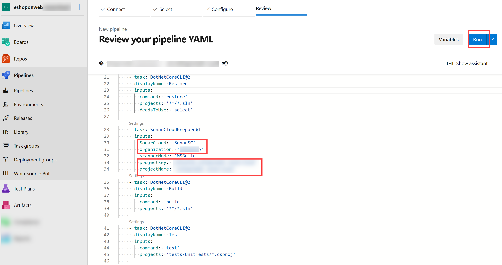

19. You may need to change the Azure DevOps project **Visibility** back to **Private** in order to have agents to run the pipeline (Project Settings > Overview)

20. In Azure DevOps  **Pipelines > Pipelines** and click in recently created pipeline and rename it to **eshoponweb-sonar-ci**.

    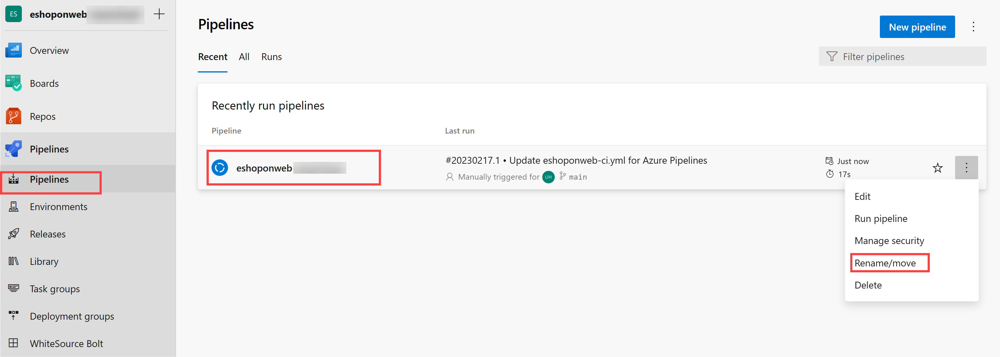

#### Task 3: Check pipeline results

In this task, you will check pipeline results.

1. Wait for the pipeline execution to finish, review the content of the **Summary** tab and then click the **Extensions** tab header.

    > **Note**: you will not have Quality Gate information (None), because we did not set it up in Sonarcloud yet.

2. On the **Extensions** tab, click the **Detailed SonarCloud report**. This will automatically open a new browser tab displaying the report on your SonarCloud project page.

    > **Note**: Alternatively, you could browse to you SonarCloud project.

3. Verify that the report does not include the Quality Gate results and note the reason for its absence.

    > **Note**: To be able to see the Quality gate result, after running he first report we need to set **New Code Definition**. This way, subsequent pipeline runs will include Quality Gate results. **The default quality gate will make sure there is no new vulnerability/bug in the code, ignoring previously existing ones. You can create your own custom quality gates.**

4. Click on **Set New Code Definition** and select **Previous version**.

    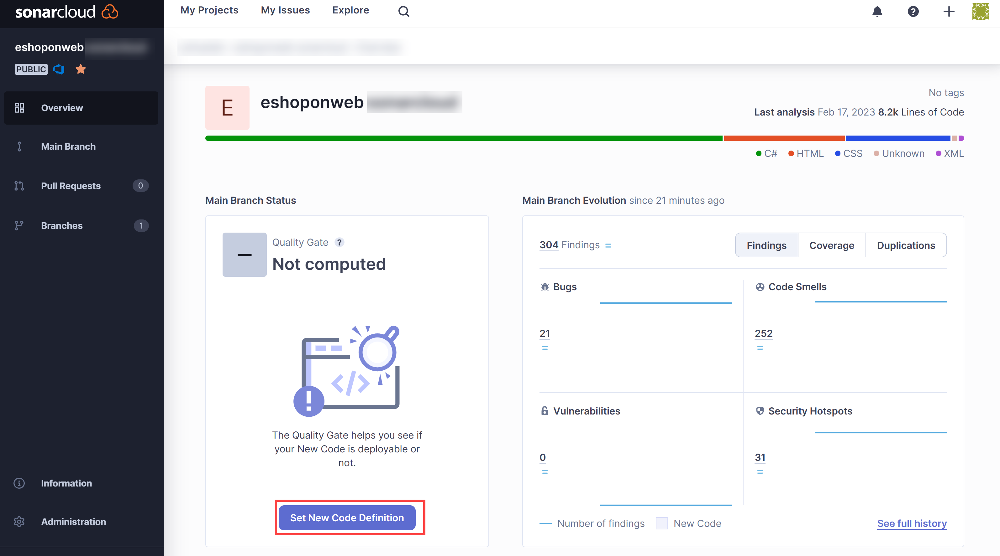

5. Switch to the web browser in the **Azure DevOps portal** with the most recent build run, click **Run new** and, on the **Run pipeline** pane, click **Run**.
6. On the build run pane, review the content of the **Summary** tab and then click the **Extensions** tab header.
7. On the **Extensions** tab, click the **Detailed SonarCloud report**. This will automatically open a new browser tab displaying the report on your SonarCloud project page.
8. Verify that the report and Azure DevOps **extension** tab now **includes the Quality Gate result**.

    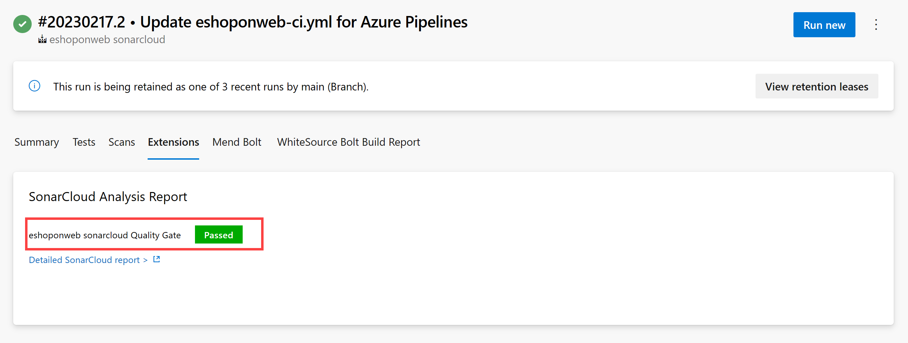

### Exercise 2: Analyze SonarCloud reports

In this exercise, you will analyze SonarCloud reports.

#### Task 1: Analyze SonarCloud reports

In this task, you will analyze SonarCloud reports.

1. On the **Overview** tab of the SonarCloud project, we see a summary for the report about the **main branch evolution** . If you click **Main branch** icon (left column), and choose **Overall Code**, you will see a more detailed report.

    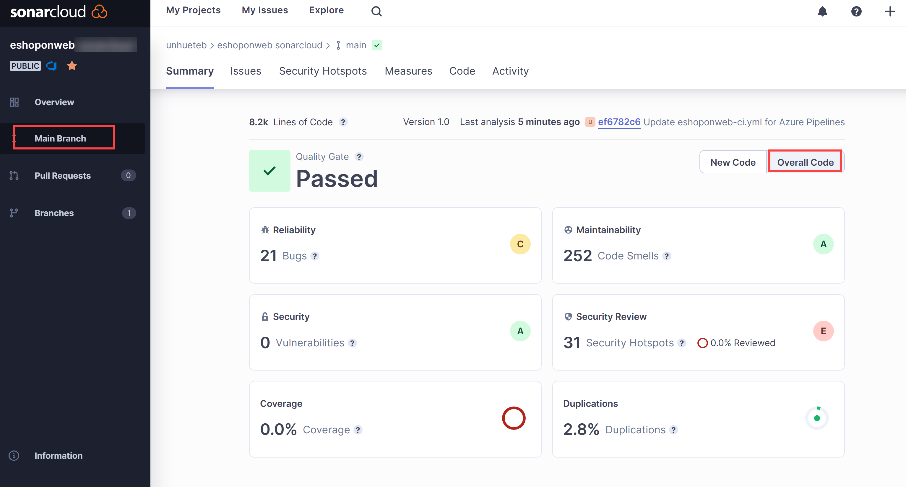

    > **Note**: The page has  metrics such as **Code Smells**, **Coverage**, **Duplications**, and **Size** (lines of code). The following table briefly explains each of these terms.

    | Terms | Description |
    | --- | --- |
    | **Bugs** | An issue that represents an error in code. If this has not broken yet, it will, and probably at the worst possible moment. This needs to be fixed |
    | **Vulnerabilities** | A security-related issue which represents a potential backdoor for attackers |
    | **Code Smells** | A maintainability-related issue in the code. Leaving it as-is means that, at best, maintainers will have a harder time than they should when making subsequent changes. At worst, they'll be so confused by the state of the code that they'll introduce additional errors as they make changes |
    | **Coverage** | An indication of the percentage of code that is being validated by tests such as unit tests. To guard effectively against bugs, these tests should exercise or cover a large portion of your code |
    | **Duplications** | The duplications decoration shows which parts of the source code are duplicated |
    | **Security Hotspots** | Security-sensitive code that requires manual review to assess whether or not a vulnerability exists |

2. Click the number designating the count of **Bugs**. This will automatically display the content of the **Issues** tab.
3. On the right side of the **Issues** tab, click to open of the bugs. Read the description and information given to analyze and solve the bug.

4. Hover with the mouse pointer over vertical red lines between the code  and the line numbers to identify gaps in code coverage.

    > **Note**: Our sample project is very small and has no historical data. However, there are thousands of [public projects on SonarCloud](https://sonarcloud.io/explore/projects) that have more interesting and realistic results.

### Exercise 3: Implement Azure DevOps pull request integration with SonarCloud

In this exercise, you will set up pull request integration between Azure DevOps and SonarCloud.

> **Note**: In order to configure SonarCloud analysis to perform analysis of code included in an Azure DevOps pull request, you need to perform the following tasks:

- Add an Azure DevOps personal access token to a SonarCloud project, which authorizes its access to pull requests (already created in this lab).
- Configure an Azure DevOps branch policy that controls a pull request-triggered build

#### Task 1: Configure pull request integration in SonarCloud

In this task, you will configure pull request integration in SonarCloud by assigning an Azure DevOps personal access token to your SonarCloud project.

1. Switch to the web browser window displaying the **eShopOnWeb** project in  **SonarCloud**.
2. On the project's dashboard page, click the icon for the **Administration** tab and, in the dropdown menu, click **General Settings**.
3. On the **General Settings** page, click **Pull Requests**.
4. In the **General** section of the **Pull Requests** settings, in the **Provider** dropdown list, select **Azure DevOps Services** and click **Save**.
5. In the **Integration with Azure DevOps Services** section of the **Pull Requests** settings, in the **Personal access token** textbox, paste the previously generated Azure DevOps personal access token and click **Save**

    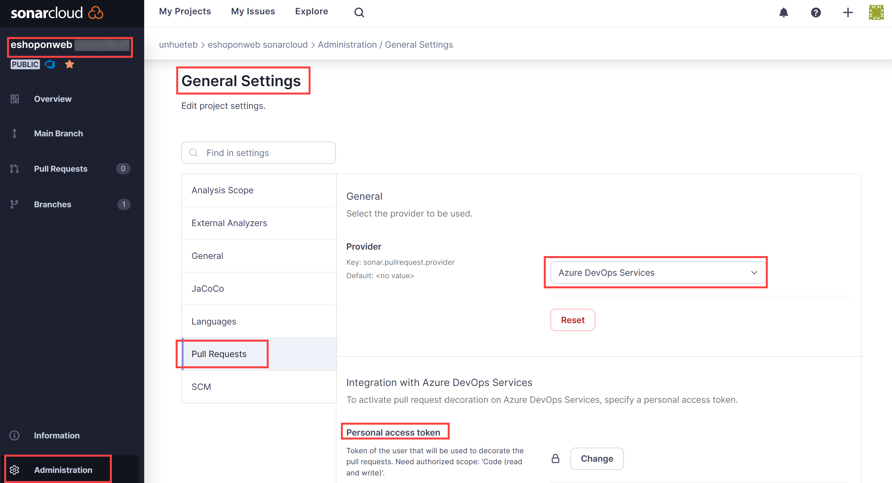

#### Task 2: Configure a branch policy for integration with SonarCloud

In this task, you will configure an Azure DevOps branch policy for integration with SonarCloud.

1. Switch to the web browser window displaying the **eShopOnWeb** project in the **Azure DevOps portal**.
2. In the vertical menu bar at the far left of the Azure DevOps portal, click **Repos** and, in the **Repos** section, click **Branches**.
3. On the **Branches** pane, in the list of branches, hover with the mouse pointer over the right edge of the **main** branch entry to reveal the vertical ellipsis character designating the **More options** menu, click it, and, in the popup menu, click **Branch policies**.
4. On the **main** pane, to the right of the **Build Validation** section, click **+**.
5. On the **Add build policy** pane, in the **Build pipeline** dropdown list, select the pipeline you created earlier in this lab, in the **Display name** textbox, type **SonarCloud analysis** and click **Save**.

    > **Note**: Azure DevOps is now configured to trigger a SonarCloud analysis when any pull request targeting the **main** branch is created.

#### Task 4: Validate pull request integration

In this task, you will validate pull request integration between Azure DevOps and SonarCloud by creating a pull request and reviewing the resulting outcome.

> **Note**: You will make a change to a file in the repository and create a request to trigger SonarCloud analysis.

1. In the Azure DevOps portal, in the vertical menu bar on the left side, click **Repos**. This will display the **Files** pane.
2. In the central pane, in the folder hierarchy, navigate to the file **Program.cs** in the **src/Web/Services/BasketViewModelService.cs** folder and click **Edit**.
3. On the **BasketViewModelService.cs** pane, add the following empty method to the code directly before  the last "}":

    ```csharp
    public void Unused(){

    }
    ```

4. On the **Program.cs** pane, click **Commit**.
5. On the **Commit** pane, in the **Branch name** textbox, type **branch1**, select the **Create a pull request** checkbox, and click **Commit**.

    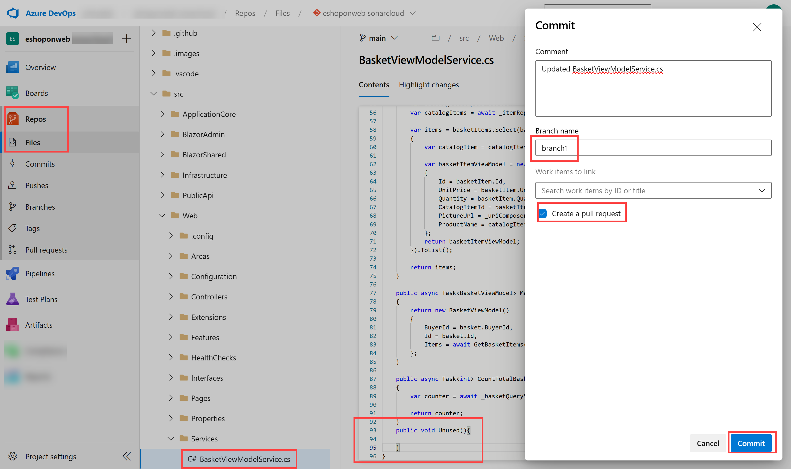

6. On the **New pull request** pane, select **Create**.
7. On the **Overview** tab of the **Updated Program.cs** pane, monitor the progress of the build process to its completion.
8. The pipeline will be successful, but 1 optional check will fail.
9. Sonarcloud will also decorate your PR with comments for your recent not recommended practices. You can also review the full report in Sonarcloud for details.

    
    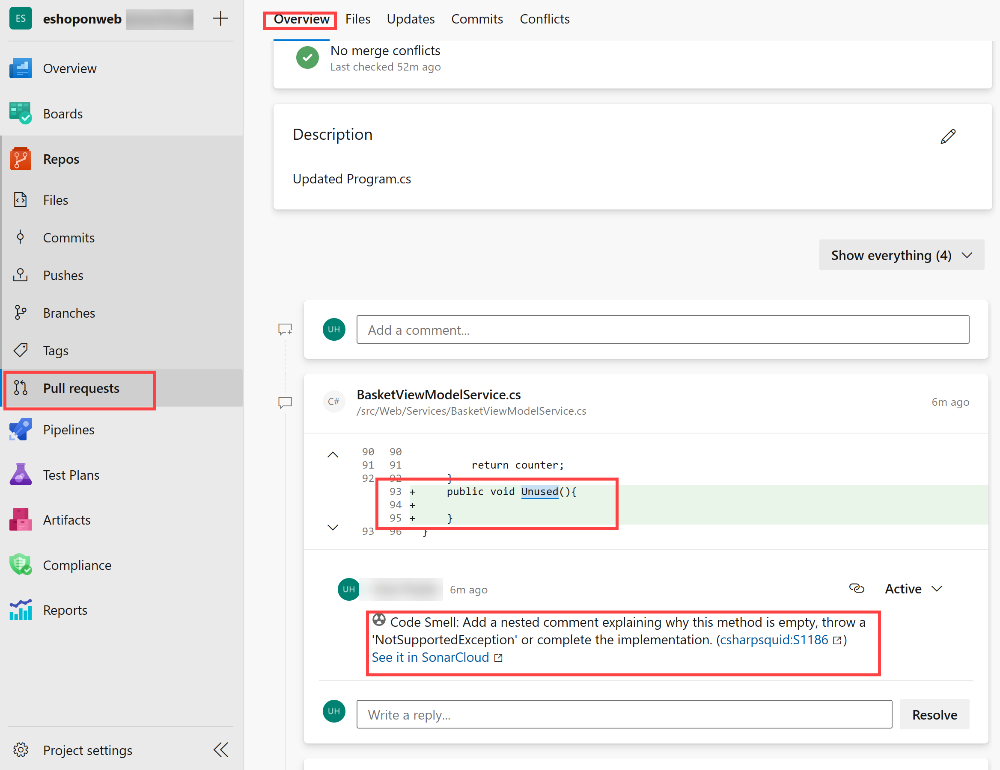

#### Task 4: Block pull requests in response to failing Code Quality checks

In this task, you will configure blocking of pull requests in response to failing Code Quality checks.

> **Note**: At this point, it is still possible to complete the pull request and commit the corresponding changes even though Code Quality checks fail. You will modify Azure DevOps configuration to block the commit unless the relevant Code Quality checks pass.

1. In the Azure DevOps portal,in the lower left corner, click **Project Settings**.
2. In the **Project Settings** vertical menu, in the **Repos** section, click **Repositories**.
3. On the **All repositories** pane, click **eShopOnWeb**.
4. On the **eShopOnWeb** pane, click the **Policies** tab header.
5. On the listing of **Policies** scroll down to the listing of branches and click the entry representing the **main** branch.
6. On the **main** pane, scroll down to the **Status Checks** section and click **+**.
7. On the **Add status policy** pane, in the **Status to check** dropdown list, select the **SonarCloud/quality gate** entry, ensure that the **Policy requirement** option is set to **Required**, and click **Save**

    > **Note**: At this point, users **will not be able to merge pull request until the Code Quality check is successful**. This, in turn, requires that all issues identified by SonarCloud have been either fixed or marked as **confirmed** or **resolved** in the corresponding SonarCloud project.

## Review

In this lab, you learned how to integrate Azure DevOps Services with SonarCloud.
