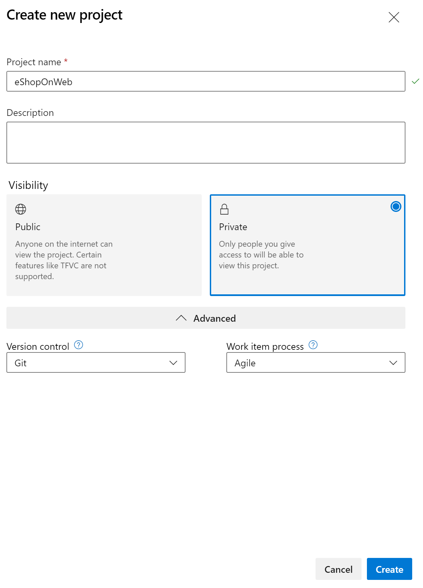
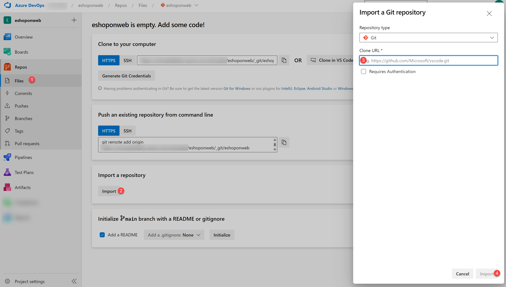
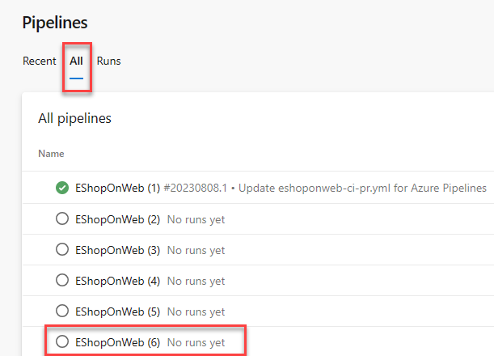

---
lab:
  title: "Monitor Application Performance with Azure Load Testing"
  module: "Module 08: Implement continuous feedback"
---

# Monitor Application Performance with Azure Load Testing

## Lab requirements

- This lab requires **Microsoft Edge** or an [Azure DevOps supported browser.](https://docs.microsoft.com/azure/devops/server/compatibility)

- **Set up an Azure DevOps organization:** If you don't already have an Azure DevOps organization that you can use for this lab, create one by following the instructions available at [Create an organization or project collection](https://docs.microsoft.com/azure/devops/organizations/accounts/create-organization).

- Identify an existing Azure subscription or create a new one.

- Verify that you have a Microsoft account or a Microsoft Entra account with the Owner role in the Azure subscription and the Global Administrator role in the Microsoft Entra tenant associated with the Azure subscription. For details, refer to [List Azure role assignments using the Azure portal](https://docs.microsoft.com/azure/role-based-access-control/role-assignments-list-portal) and [View and assign administrator roles in Azure Active Directory](https://docs.microsoft.com/azure/active-directory/roles/manage-roles-portal#view-my-roles).

## Lab overview

**Azure Load Testing** is a fully managed load-testing service that enables you to generate high-scale load. The service simulates traffic for your applications, regardless of where they're hosted. Developers, testers, and quality assurance (QA) engineers can use it to optimize application performance, scalability, or capacity.
Quickly create a load test for your web application by using a URL, and without prior knowledge of testing tools. Azure Load Testing abstracts the complexity and infrastructure to run your load test at scale.
For more advanced load testing scenarios, you can create a load test by reusing an existing Apache JMeter test script, a popular open-source load and performance tool. For example, your test plan might consist of multiple application requests, you want to call non-HTTP endpoints, or you're using input data and parameters to make the test more dynamic.

In this lab, you'll learn about how you can use Azure Load Testing to simulate performance testing against a live-running web application with different load scenarios. Lastly, you'll learn how to integrate Azure Load Testing into your CI/CD pipelines.

## Objectives

After you complete this lab, you will be able to:

- Deploy Azure App Service web apps.
- Compose and Run a YAML-based CI/CD pipeline.
- Deploy Azure Load Testing.
- Investigate Azure web app performance by using Azure Load Testing.
- Integrate Azure Load Testing into your CI/CD pipelines.

## Estimated timing: 60 minutes

## Instructions

### Exercise 0: Configure the lab prerequisites

In this exercise, you will set up the prerequisites for the lab.

#### Task 1: (skip if done) Create and configure the team project

In this task, you will create an **eShopOnWeb** Azure DevOps project to be used by several labs.

1. On your lab computer, in a browser window open your Azure DevOps organization. Click on **New Project**. Give your project the name **eShopOnWeb** and choose **Scrum** on the **Work Item process** dropdown. Click on **Create**.

   

#### Task 2: (skip if done) Import eShopOnWeb Git Repository

In this task you will import the eShopOnWeb Git repository that will be used by several labs.

1. On your lab computer, in a browser window open your Azure DevOps organization and the previously created **eShopOnWeb** project. Click on **Repos > Files** , **Import**. On the **Import a Git Repository** window, paste the following URL <https://github.com/MicrosoftLearning/eShopOnWeb.git> and click on **Import**:

   

1. The repository is organized the following way:
   - **.ado** folder contains Azure DevOps YAML pipelines
   - **.devcontainer** folder container setup to develop using containers (either locally in VS Code or GitHub Codespaces)
   - **infra** folder contains Bicep&ARM infrastructure as code templates used in some lab scenarios.
   - **.github** folder container YAML GitHub workflow definitions.
   - **src** folder contains the .NET 8 website used on the lab scenarios.

#### Task 3: (skip if done) Set main branch as default branch

1. Go to **Repos > Branches**.
1. Hover on the **main** branch then click the ellipsis on the right of the column.
1. Click on **Set as default branch**.

#### Task 4: Create Azure resources

In this task, you will create an Azure web app by using the cloud shell in Azure portal.

1. From the lab computer, start a web browser, navigate to the [**Azure Portal**](https://portal.azure.com), and sign in.
1. In the Azure portal, in the toolbar, click the **Cloud Shell** icon located directly to the right of the search text box.
1. If prompted to select either **Bash** or **PowerShell**, select **Bash**.

   > **Note**: If this is the first time you are starting **Cloud Shell** and you are presented with the **You have no storage mounted** message, select the subscription you are using in this lab, and select **Create storage**.

1. From the **Bash** prompt, in the **Cloud Shell** pane, run the following command to create a resource group (replace the `<region>` placeholder with the name of the Azure region closest to you such as 'eastus').

   ```bash
   RESOURCEGROUPNAME='az400m08l14-RG'
   LOCATION='<region>'
   az group create --name $RESOURCEGROUPNAME --location $LOCATION
   ```

1. To create a Windows App service plan by running the following command:

   ```bash
   SERVICEPLANNAME='az400l14-sp'
   az appservice plan create --resource-group $RESOURCEGROUPNAME \
       --name $SERVICEPLANNAME --sku B3
   ```

1. Create a web app with a unique name.

   ```bash
   WEBAPPNAME=az400eshoponweb$RANDOM$RANDOM
   az webapp create --resource-group $RESOURCEGROUPNAME --plan $SERVICEPLANNAME --name $WEBAPPNAME
   ```

   > **Note**: Record the name of the web app. You will need it later in this lab.

### Exercise 1: Configure CI/CD Pipelines as Code with YAML in Azure DevOps

In this exercise, you will configure CI/CD Pipelines as code with YAML in Azure DevOps.

#### Task 1: Add a YAML build and deploy definition

In this task, you will add a YAML build definition to the existing project.

1. Navigate back to the **Pipelines** pane in of the **Pipelines** hub.
1. Click **New pipeline** (or Create Pipeline if this is the first one you create).

   > **Note**: We will use the wizard to create a new YAML Pipeline definition based on our project.

1. On the **Where is your code?** pane, click **Azure Repos Git (YAML)** option.
1. On the **Select a repository** pane, click **eShopOnWeb**.
1. On the **Configure your pipeline** pane, scroll down and select **Starter Pipeline**.
1. **Select** all lines from the Starter Pipeline, and delete them.
1. **Copy** the full template pipeline from below, knowing you will need to make parameter modifications **before saving** the changes:

   ```yml
   #Template Pipeline for CI/CD
   # trigger:
   # - main

   resources:
     repositories:
       - repository: self
         trigger: none

   stages:
     - stage: Build
       displayName: Build .Net Core Solution
       jobs:
         - job: Build
           pool:
             vmImage: ubuntu-latest
           steps:
             - task: DotNetCoreCLI@2
               displayName: Restore
               inputs:
                 command: "restore"
                 projects: "**/*.sln"
                 feedsToUse: "select"

             - task: DotNetCoreCLI@2
               displayName: Build
               inputs:
                 command: "build"
                 projects: "**/*.sln"

             - task: DotNetCoreCLI@2
               displayName: Publish
               inputs:
                 command: "publish"
                 publishWebProjects: true
                 arguments: "-o $(Build.ArtifactStagingDirectory)"

             - task: PublishBuildArtifacts@1
               displayName: Publish Artifacts ADO - Website
               inputs:
                 pathToPublish: "$(Build.ArtifactStagingDirectory)"
                 artifactName: Website

     - stage: Deploy
       displayName: Deploy to an Azure Web App
       jobs:
         - job: Deploy
           pool:
             vmImage: "windows-2019"
           steps:
             - task: DownloadBuildArtifacts@1
               inputs:
                 buildType: "current"
                 downloadType: "single"
                 artifactName: "Website"
                 downloadPath: "$(Build.ArtifactStagingDirectory)"
   ```

1. Set the cursor on a new line at the end of the YAML definition. **Make sure you position the cursor at the indentation of the previous task level**.

   > **Note**: This will be the location where new tasks are added.

1. Click **Show Assistant** from the right hand side of the portal. In the list of tasks, search for and select the **Azure App Service Deploy** task.
1. In the **Azure App Service deploy** pane, specify the following settings and click **Add**:

   - in the **Azure subscription** drop-down list, select the service connection you just created.
   - Validate **App Service Type** points to Web App on Windows.
   - in the **App Service name** dropdown list, select the name of the web app you deployed earlier in the lab (\*\*az400eshoponweb...).
   - in the **Package or folder** text box, **update** the Default Value to `$(Build.ArtifactStagingDirectory)/**/Web.zip`.
   - Expand **Application and Configuration Settings**, and in the App settings text box, add the following key-value pairs: `-UseOnlyInMemoryDatabase true -ASPNETCORE_ENVIRONMENT Development`.

1. Confirm the settings from the Assistant pane by clicking the **Add** button.

   > **Note**: This will automatically add the deployment task to the YAML pipeline definition.

1. The snippet of code added to the editor should look similar to below, reflecting your name for the azureSubscription and WebappName parameters:

   ```yml
   - task: AzureRmWebAppDeployment@4
     inputs:
       ConnectionType: "AzureRM"
       azureSubscription: "SERVICE CONNECTION NAME"
       appType: "webApp"
       WebAppName: "az400eshoponWeb369825031"
       packageForLinux: "$(Build.ArtifactStagingDirectory)/**/Web.zip"
       AppSettings: "-UseOnlyInMemoryDatabase true -ASPNETCORE_ENVIRONMENT Development"
   ```

   > **Note**: The **packageForLinux** parameter is misleading in the context of this lab, but it is valid for Windows or Linux.

1. Before saving the updates to the yml-file, give it a more clear name. On top of the yaml-editor window, it shows **EShopOnweb/azure-pipelines-#.yml**. (where # is a number, typically 1 but could be different in your setup.) Select **that filename**, and rename it to **m08l14-pipeline.yml**

1. Click **Save**, on the **Save** pane, click **Save** again to commit the change directly into the main branch.

   > **Note**: Since our original CI-YAML was not configured to automatically trigger a new build, we have to initiate this one manually.

1. From the Azure DevOps left menu, navigate to **Pipelines** and select **Pipelines** again. Next, select **All** to open all pipeline definitions, not just the Recent ones.

   > **Note**: if you kept all previous pipelines from previous lab exercises, this new pipeline might have reused a default **eShopOnWeb (#)** sequence name for the pipeline as shown in below screenshot. Select a pipeline (most probably the one with the highest sequence number, select Edit and validate it points to the m08l14-pipeline.yml code file).

   

1. Confirm to run this pipeline by clicking **Run** from the appearing pane and confirm by clicking **Run** once more.
1. Notice the 2 different Stages, **Build .Net Core Solution** and **Deploy to Azure Web App** appearing.
1. Wait for the pipeline to kick off.

1. **Ignore** any Warnings showing up during the Build Stage. Wait until it completes the Build Stage successfully. (You can select the actual Build stage to see more details from the logs.)

1. Once the Deploy Stage wants to start, you are prompted with **Permissions Needed**, as well as an orange bar saying:

   ```text
   This pipeline needs permission to access a resource before this run can continue to Deploy to an Azure Web App
   ```

1. Click on **View**
1. From the **Waiting for Review** pane, click **Permit**.
1. Validate the message in the **Permit popup** window, and confirm by clicking **Permit**.
1. This sets off the Deploy Stage. Wait for this to complete successfully.

#### Task 2: Review the deployed site

1. Switch back to web browser window displaying the Azure portal and navigate to the blade displaying the properties of the Azure web app.
1. On the Azure web app blade, click **Overview** and, on the overview blade, click **Browse** to open your site in a new web browser tab.
1. Verify that the deployed site loads as expected in the new browser tab, showing the eShopOnWeb E-commerce website.

### Exercise 2: Deploy and Setup Azure Load Testing

In this exercise, you will deploy an Azure Load Testing Resource in Azure, and configure different Load Testing scenarios for your live-running Azure App Service.

> **Important**: Azure Load Testing is a **paid service**. You will incur costs for running load tests. Make sure to clean up resources after you have completed the lab to avoid incurring additional costs. For each 'Load Testing Resource' that is active during any part of a month you will be charged the monthly fee, and have access to the included 50 VUH. See the [Azure Load Testing pricing page](https://azure.microsoft.com/pricing/details/load-testing) for more information.

#### Task 1: Deploy Azure Load Testing

In this task, you will deploy an Azure Load Testing Resource into your Azure subscription.

1. From the Azure Portal (<https://portal.azure.com>), navigate to **Create Azure Resource**.
1. In the 'Search Services and marketplace' search field, enter **`Azure Load Testing`**.
1. Select **Azure Load Testing** (published by Microsoft), from the search results.
1. From the Azure Load Testing Page, click **Create** to start the deployment process.
1. From the 'Create a Load Testing Resource' page, provide the necessary details for the resource deployment:

   - **Subscription**: select your Azure Subscription
   - **Resource Group**: select the Resource Group you used for deploying the Web App Service in the earlier exercise
   - **Name**: `eShopOnWebLoadTesting`
   - **Region**: Select a region that is close to your region

   > **Note**: Azure Load Testing service is not available in all Azure Regions.

1. Click **Review and Create**, to have your settings validated.
1. Click **Create** to confirm, and get the Azure Load Testing resource deployed.
1. You are switched to the 'Deployment is in progress' page. Wait for a few minutes, until the deployment completes successfully.
1. Click **Go to Resource** from the deployment progress page, to navigate to the **eShopOnWebLoadTesting** Azure Load Testing resource.

   > **Note**: If you closed the blade or closed the Azure Portal during the deployment of the Azure Load Testing Resource, you can find it again from the Azure Portal Search field, or from the Resources / Recent list of resources.

#### Task 2: Create Azure Load Testing tests

In this task, you will create different Azure Load Testing tests, using different load configuration settings.

1. From within the **eShopOnWebLoadTesting** Azure Load Testing Resource blade, navigate to **Tests** under **Tests**. Click the **+ Create** menu option, and select **Create a URL-based test**.
1. Uncheck the **Enable advanced settings** checkbox, to display the advanced settings.
1. Complete the following parameters and settings to create a load test:

   - **Test URL**: Enter the URL from the Azure App Service you deployed in the previous exercise (az400eshoponweb...azurewebsites.net), **including https://**
   - **Specify Load**: Virtual Users
   - **Number of Virtual Users**: 50
   - **Test Duration (minutes)**: 5
   - **Ramp-up time (minutes)**: 1

1. Confirm the configuration of the test, by clicking **Review and Create**, (Don't make any changes in the other tabs). Click **Create** once more.
1. This kicks off the Load Testing tests, which will run The test will run for 5 minutes.
1. With the test running, navigate back to the **eShopOnWebLoadTesting** Azure Load Testing Resource page, and navigate to **Tests**, select **Tests** and see a test **Get_eshoponweb...**
1. From the top menu, click **Create**, **Create a URL-based test**, to create a 2nd Load test.
1. Complete the following parameters and settings to create another load test:

   - **Test URL**: Enter the URL from the Azure App Service you deployed in the previous exercise (eShopOnWeb...azurewebsites.net), **including https://**
   - **Specify Load**: Requests per Second (RPS)
   - **Requests per second (RPS)**: 100
   - **Response time (milliseconds)**: 500
   - **Test Duration (minutes)**: 5
   - **Ramp-up time (minutes)**: 1

1. Confirm the configuration of the test, by clicking **Review + create**, and **Create** once more.
1. The test will run for about 5 minutes.

#### Task 3: Validate Azure Load Testing results

In this task, you will validate the outcome of an Azure Load Testing TestRun.

With both quick tests complete, let's make a few changes to them, and validate the results.

1. From **Azure Load Testing**, navigate to **Tests**. Select either of the test definitions, to open a more detailed view, by **clicking** on one of the tests. This redirects you to the more detailed test page. From here, you can validate the details of the actual runs, by selecting the **TestRun_mm/dd/yy-hh:hh** from the resulting list.
1. From the detailed **TestRun** page, identify the actual outcome of the Azure Load Testing simulation. Some of the values are:

   - Load / Total Requests
   - Duration
   - Response Time (shows the outcome in seconds, reflecting the 90th percentile response time - this means that, for 90% of the requests, the response time will be within the given results)
   - Throughput in requests per second

1. More below, several of these values are represented using dashboard graph line and chart views.
1. Take a few minutes to **compare the results** of both simulated tests with each other, and **identify the impact** of more users on the App Service performance.

### Exercise 3: Automate a Load Test with CI/CD in Azure Pipelines

Get started with automating load tests in Azure Load Testing by adding it to a CI/CD pipeline. After running a load test in the Azure portal, you export the configuration files, and configure a CI/CD pipeline in Azure Pipelines (similar capability exists for GitHub Actions).

After you complete this exercise, you have a CI/CD workflow that is configured to run a load test with Azure Load Testing.

#### Task 1: Identify Azure DevOps Service Connection details

In this task, you will grant the required permissions to the Azure DevOps Service Connection.

1. From the **Azure DevOps Portal**(<https://aex.dev.azure.com>), navigate to the **eShopOnWeb** Project.
1. From the down left corner, select **Project Settings**.
1. Under the **Pipelines** section, select **Service Connections**.
1. Notice the Service Connection, having the name of your Azure Subscription you used to deploy Azure Resources at the start of the lab exercise.
1. **Select the Service Connection**. From the **Overview** tab, navigate to **Details** and select **Manage service connection roles**.
1. This redirects you to the Azure Portal, from where it opens the resource group details in the access control (IAM) blade.

#### Task 2: Grant permissions to the Azure Load Testing resource

Azure Load Testing uses Azure RBAC to grant permissions for performing specific activities on your load testing resource. To run a load test from your CI/CD pipeline, you grant the **Load Test Contributor** role to the Azure DevOps service connection.

1. Select **+ Add** and **Add role assignment**.
1. In the **Role tab**, select **Load Test Contributor** in the list of job function roles.
1. In the **Members tab**, select **Select members**, and then find and select your user account and click **Select**.
1. In the **Review + assign tab**, select **Review + assign** to add the role assignment.

You can now use the service connection in your Azure Pipelines workflow definition to access your Azure load testing resource.

#### Task 3: Export load test input files and Import to Azure Repos

To run a load test with Azure Load Testing in a CI/CD workflow, you need to add the load test configuration settings and any input files in your source control repository. If you have an existing load test, you can download the configuration settings and all input files from the Azure portal.

Perform the following steps to download the input files for an existing load testing in the Azure portal:

1. In the **Azure portal**, go to your **Azure Load Testing** resource.
1. On the left pane, select **Tests** to view the list of load tests, and then select **your test**.
1. Selecting the **ellipsis (...)** next to the test run you're working with, and then select **Download input file**.
1. The browser downloads a zipped folder that contains the load test input files.
1. Use any zip tool to extract the input files. The folder contains the following files:

   - _config.yaml_: the load test YAML configuration file. You reference this file in the CI/CD workflow definition.
   - _quick_test.jmx_: the JMeter test script

1. Commit all extracted input files to your source control repository. To do this, navigate to the **Azure DevOps Portal**(<https://aex.dev.azure.com/>), and navigate to the **eShopOnWeb** DevOps Project.
1. Select **Repos**. In the source code folder structure, notice the **tests** subfolder. Notice the ellipsis (...), and select **New > Folder**.
1. specify **jmeter** as folder name, and **placeholder.txt** for the file name (Note: a Folder cannot be created as empty)
1. Click **Commit** to confirm the creation of the placeholder file and jmeter folder.
1. From the **Folder structure**, navigate to the new created **jmeter** subfolder. Click the **ellipsis(...)** and select **Upload File(s)**.
1. Using the **Browse** option, navigate to the location of the extracted zip-file, and select both **config.yaml** and **quick_test.jmx**.
1. Click **Commit** to confirm the file upload into source control.

#### Task 4: Update the CI/CD workflow YAML definition file

1. To create and run a load test, the Azure Pipelines workflow definition uses the **Azure Load Testing task extension** from the Azure DevOps Marketplace. Open the [Azure Load Testing task extension](https://marketplace.visualstudio.com/items?itemName=AzloadTest.AzloadTesting) in the Azure DevOps Marketplace, and select **Get it free**.
1. Select your Azure DevOps organization, and then select **Install** to install the extension.
1. From within the Azure DevOps Portal and Project, navigate to **Pipelines** and select the pipeline created at the start of this exercise. Click **Edit**.
1. In the YAML script, navigate to **line 56** and press ENTER/RETURN, to add a new empty line. (this is right before the Deploy Stage of the YAML file).
1. At line 57, select the Tasks Assistant to the right-hand side, and search for **Azure Load Testing**.
1. Complete the graphical pane with the correct settings of your scenario:

   - Azure Subscription: Select the subscription which runs your Azure Resources
   - Load Test File: '$(Build.SourcesDirectory)/tests/jmeter/config.yaml'
   - Load Test Resource Group: The Resource Group which holds your Azure Load Testing Resources
   - Load Test Resource Name: `eShopOnWebLoadTesting`
   - Load Test Run Name: ado_run
   - Load Test Run Description: load testing from ADO

1. Confirm the injection of the parameters as a snippet of YAML by clicking **Add**
1. If the indentation of the YAML snippet is giving errors (red squiggly lines), fix them by adding 2 spaces or tab to position the snippet correctly.
1. The below sample snippet shows what the YAML code should look like

   ```yml
        - task: AzureLoadTest@1
         inputs:
           azureSubscription: 'AZURE DEMO SUBSCRIPTION'
           loadTestConfigFile: '$(Build.SourcesDirectory)/tests/jmeter/config.yaml'
           resourceGroup: 'az400m08l14-RG'
           loadTestResource: 'eShopOnWebLoadTesting'
           loadTestRunName: 'ado_run'
           loadTestRunDescription: 'load testing from ADO'
   ```

1. below the inserted YAML snippet, add a new empty line by pressing ENTER/RETURN.
1. below this empty line, add a snippet for the Publish task, showing the results of the Azure Load testing task during the pipeline run:

   ```yml
   - publish: $(System.DefaultWorkingDirectory)/loadTest
     artifact: loadTestResults
   ```

1. If the indentation of the YAML snippet is giving errors (red squiggly lines), fix them by adding 2 spaces or tab to position the snippet correctly.
1. With both snippets added to the CI/CD pipeline, **Save** the changes.
1. Once saved, click **Run** to trigger the pipeline.
1. Confirm the branch (main) and click the **Run** button to start the pipeline run.
1. From the pipeline status page, click the **Build** stage to open the verbose logging details of the different tasks in the pipeline.
1. Wait for the pipeline to kick off the Build Stage, and arrive at the **AzureLoadTest** task in the flow of the pipeline.
1. While the task is running, browse to the **Azure Load Testing** in the Azure Portal, and see how the pipeline creates a new RunTest, named **adoloadtest1**. You can select it to show the outcome values of the TestRun job.
1. Navigate back to the Azure DevOps CI/CD Pipeline Run view, where the **AzureLoadTest task** completed successfully. From the verbose logging output, the resulting values of the load test will be visible as well:

   ```text
   Task         : Azure Load Testing
   Description  : Automate performance regression testing with Azure Load Testing
   Version      : 1.2.30
   Author       : Microsoft Corporation
   Help         : https://docs.microsoft.com/azure/load-testing/tutorial-cicd-azure-pipelines#azure-load-testing-task
   ==============================================================================
   Test '0d295119-12d0-482d-94be-a7b84787c004' already exists
   Uploaded test plan for the test
   Creating and running a testRun for the test
   View the load test run in progress at: https://portal.azure.com/#blade/Microsoft_Azure_CloudNativeTesting/NewReport//resourceId/%2fsubscriptions%4b75-a1e0-27fb2ea7f9f4%2fresourcegroups%2faz400m08l14-RG%2fproviders%2fmicrosoft.loadtestservice%2floadtests%2feshoponwebloadtesting/testId/0d295119-12d0-787c004/testRunId/161046f1-d2d3-46f7-9d2b-c8a09478ce4c
   TestRun completed

   -------------------Summary ---------------
   TestRun start time: Mon Jul 24 2023 21:46:26 GMT+0000 (Coordinated Universal Time)
   TestRun end time: Mon Jul 24 2023 21:51:50 GMT+0000 (Coordinated Universal Time)
   Virtual Users: 50
   TestStatus: DONE

   ------------------Client-side metrics------------

   Homepage
   response time 		 : avg=1359ms min=59ms med=539ms max=16629ms p(90)=3127ms p(95)=5478ms p(99)=13878ms
   requests per sec 	 : avg=37
   total requests 		 : 4500
   total errors 		 : 0
   total error rate 	 : 0
   Finishing: AzureLoadTest

   ```

1. You have now performed an automated Load Test as part of a pipeline run. In the last task, you will specify conditions for failure, meaning, we will not allow our deploy Stage to start, if the performance of the web app is below a certain threshold.

#### Task 5 : Add failure/success criteria to Load Testing Pipeline

In this task, You'll use load test fail criteria to get alerted (have a failed pipeline run as result) when the application doesn't meet your quality requirements.

1. From Azure DevOps, navigate to the eShopOnWeb Project, and open **Repos**.
1. Within Repos, browse to the **/tests/jmeter** subfolder created and used earlier.
1. Open the Load Testing \*config.yaml** file. Click **Edit\*\* to allow editing of the file.
1. Replace `failureCriteria: []` with the following snippet of code:

   ```text
   failureCriteria:
     - avg(response_time_ms) > 300
     - percentage(error) > 50
   ```

1. Save the changes to the config.yaml by clicking **Commit** and Commit once more.
1. Navigate back to **Pipelines** and run the **eShopOnWeb** pipeline again. After a few minutes, it will complete the run with a **failed** status for the **AzureLoadTest** task.
1. Open the verbose logging view for the pipeline, and validate the details of the **AzureLoadtest**. A similar sample output is below:

   ```text
   Creating and running a testRun for the test
   View the load test run in progress at: https://portal.azure.com/#blade/Microsoft_Azure_CloudNativeTesting/NewReport//resourceId/%2fsubscriptions%2fb86d9ae1-7552-47fb2ea7f9f4%2fresourcegroups%2faz400m08l14-RG%2fproviders%2fmicrosoft.loadtestservice%2floadtests%2feshoponwebloadtesting/testId/0d295119-12d0-a7b84787c004/testRunId/f4bec76a-8b49-44ee-a388-12af34f0d4ec
   TestRun completed

   -------------------Summary ---------------
   TestRun start time: Mon Jul 24 2023 23:00:31 GMT+0000 (Coordinated Universal Time)
   TestRun end time: Mon Jul 24 2023 23:06:02 GMT+0000 (Coordinated Universal Time)
   Virtual Users: 50
   TestStatus: DONE

   -------------------Test Criteria ---------------
   Results			 :1 Pass 1 Fail

   Criteria					 :Actual Value	      Result
   avg(response_time_ms) > 300                       1355.29               FAILED
   percentage(error) > 50                                                  PASSED


   ------------------Client-side metrics------------

   Homepage
   response time 		 : avg=1355ms min=58ms med=666ms max=16524ms p(90)=2472ms p(95)=5819ms p(99)=13657ms
   requests per sec 	 : avg=37
   total requests 		 : 4531
   total errors 		 : 0
   total error rate 	 : 0
   ##[error]TestResult: FAILED
   Finishing: AzureLoadTest

   ```

1. Notice how the last line of the Load testing output says **##[error]TestResult: FAILED**; since we defined a **FailCriteria** having an avg response time of > 300, or having an error percentage of > 20, now seeing an avg response time which is more than 300, the task will be flagged as failed.

   > **Note**: Imagine in a real-life scenario, you would validate the performance of your App Service, and if the performance is below a certain threshold - typically meaning there is more load on the Web App, you could trigger a new deployment to an additional Azure App Service. As we can't control the response time for Azure lab environments, we decided to revert the logic to guarantee the failure.

1. The FAILED status of the pipeline task, actually reflects a SUCCESS of the Azure Load Testing requirement criteria validation.

   > [!IMPORTANT]
   > Remember to delete the resources created in the Azure portal to avoid unnecessary charges.

## Review

In this exercise, you deployed a web app to Azure App Service by using Azure Pipelines, as well as deploying an Azure Load Testing Resource with TestRuns. Next, you integrated the JMeter load testing config.yaml file to Azure Repos source control, and extending your CI/CD pipeline with the Azure Load Testing. In the last exercise, you learned how to define the success criteria of the LoadTest.
